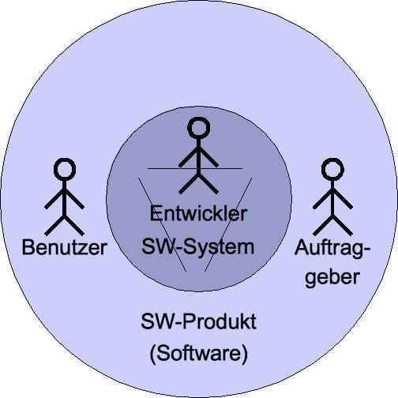
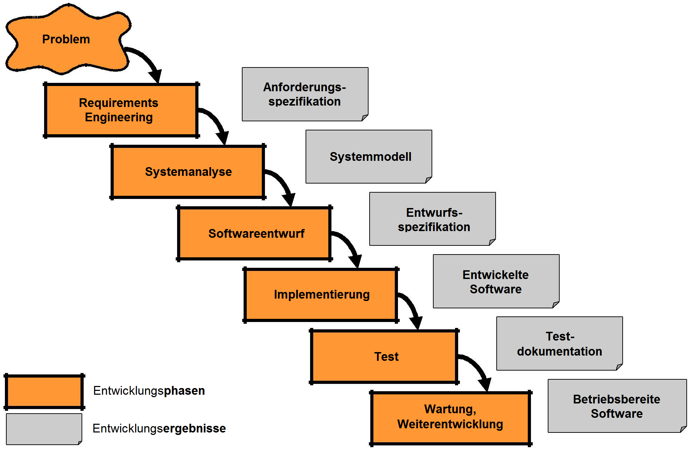
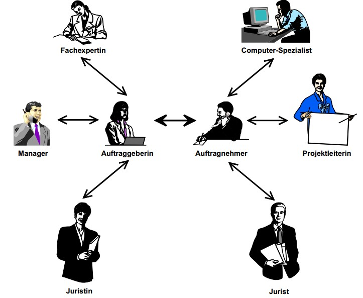
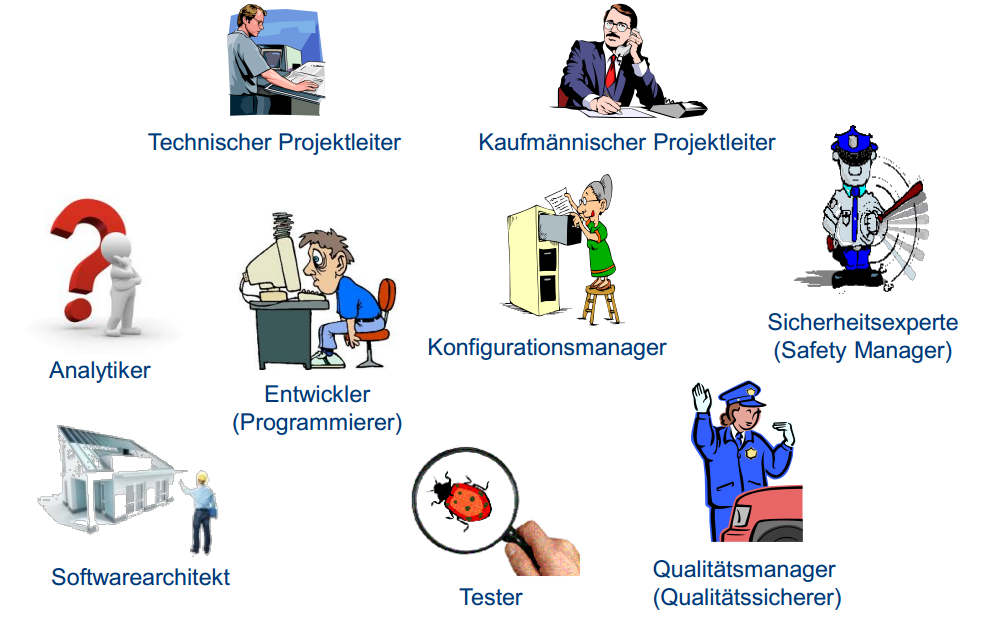
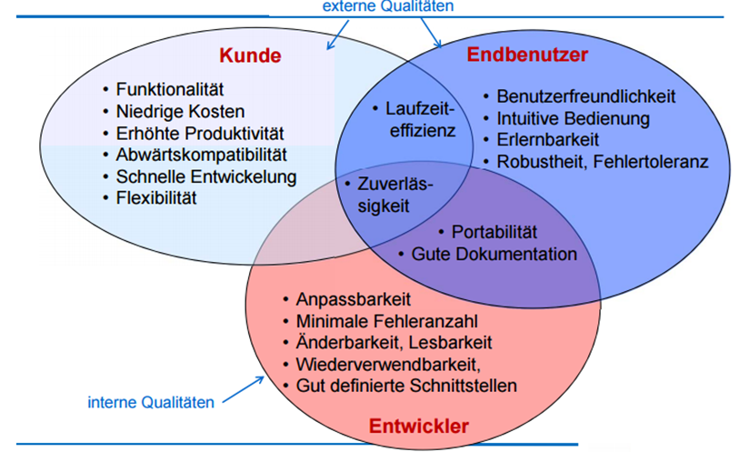
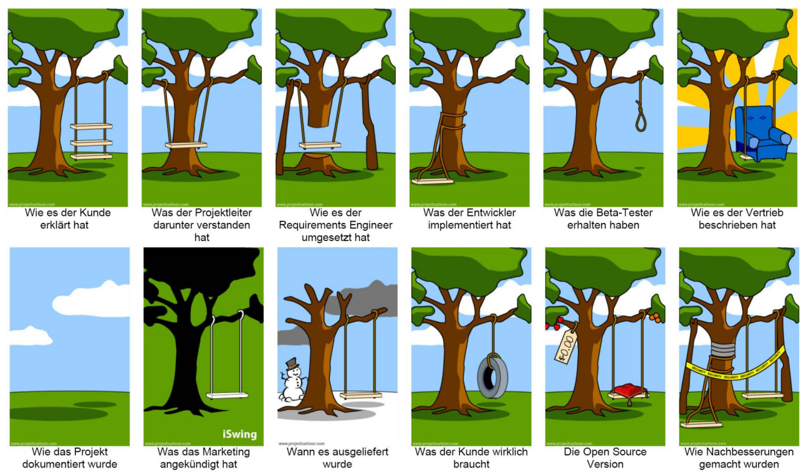
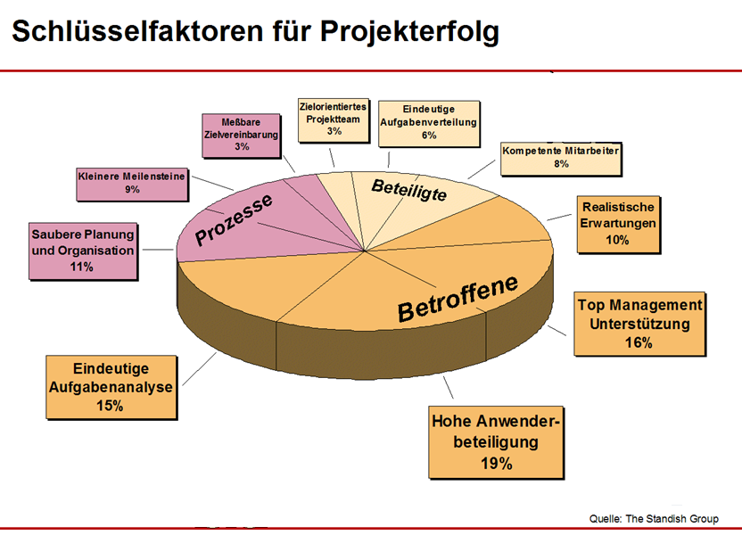
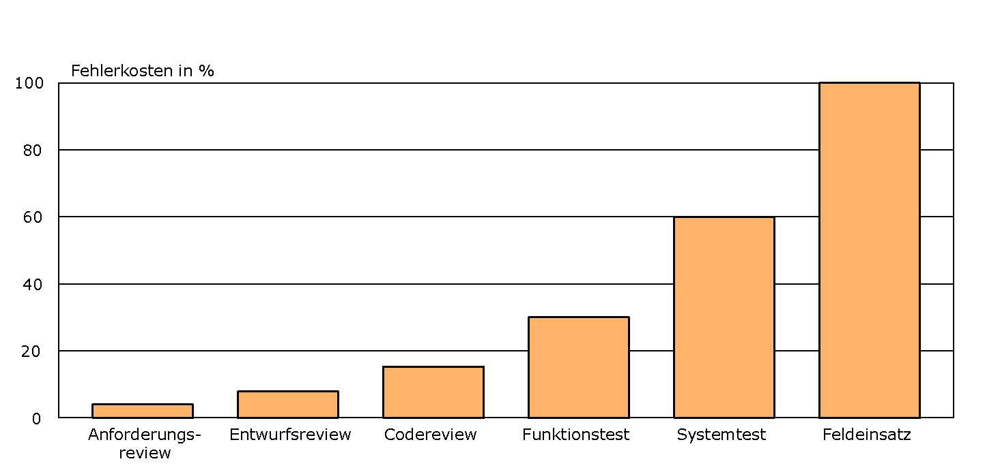
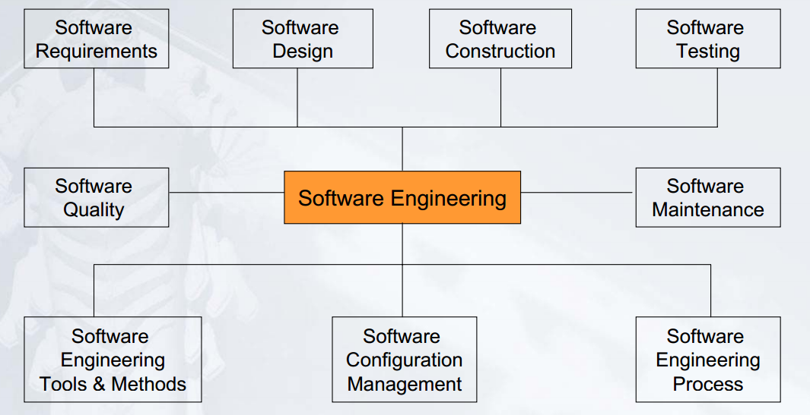
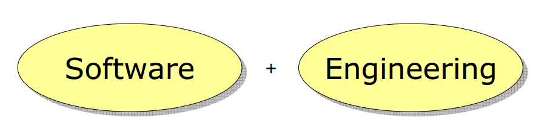

---
title: "Vorlesung 1: Einleitung"
authors: "Jonas Posselt"
date: "21/10/2017"
---

## Vorlesung 1: Einleitung

### Begriffe/Lernziele
**„Software Engineering“ = „Softwaretechnik“**

Lernziel für heute:
* Verstehen, warum Software schwer zu entwickeln ist
* Erklären können, warum Softwaretechnik notwendig ist
* Unterschiedliche Arten von Software kennen
* Wissen, welche typischen Phasen in einem Softwareprojekt existieren
* Verständnis für Rollen in einem Softwareprojekt entwickeln
* Verstehen, dass zur Softwareentwicklung mehr gehört als die reine Programmierung

### Was ist Software?

__Software ist ein umfassenderer Begriff als "Programm"__

* Software besteht ebenfalls aus der zugehörigen Dokumentation
* Software enthält alle Elemente, die für den Betrieb notwendig sind. z.B. Datenbankskripte, Dokumentation, Betriebshandbücher, usw.
* „Programme, zugehörige Daten und Dokumentationen, die es zusammengefasst erlauben, mit Hilfe eines Computers Aufgaben zu erledigen.“

<dl>
  <dt>Softwaresystem</dt>
  <dd>Ein System, dessen Bestandteile)und Elemente aus Software bestehen („innere“ Sicht des Softwareentwicklers)</dd>
  <dt>Softwareprodukt</dt>
  <dd>Ein für einen Auftraggeber erstelltes Softwaresystem („äußere“ Sicht)</dd>
</dl>

#### Arten von Software

* Systemsoftware (z.B. Betriebssystem)
* Anwendungssoftware (z.B. Büroanwendungen, Office)
* Standardsoftware (anpassbare Software für anonyme Kunden, z.B. SAP)
* Individualsoftware
	* Speziell für einen Kunden/Auftraggeber entwickelte Software
	* Exakt auf die Bedürfnisse des Kunden zugeschneidertes Produkt
	* Relativ zeitaufwändige und teure Entwicklung
	* Typische Beispiele: Software zur Unterstützung spezieller Geschäftsprozesse
* Eingebettete Systeme (Steuerungssoftware für Geräte)
* Echzeitsysteme (z.B. Flugüberwachung und Kraftwerkssteuerung)
* Informationssysteme (datenbankgestützte Verwaltung von Information), oft webbasiert

#### Eigenschaften von Software

* Software kann man nicht anfassen: Software ist immateriell
* Entwicklungsfortschritt ist nicht objektiv messbar
* Anders als materielle Produkte verschleißt Software nicht
* Software verschleißt zwar nicht, altert aber dennoch
	* Die Umgebung, in der Software eingesetzt wird, ändert sich ständig
	* Software muss daher diesen Änderungen immer wieder angepasst werden

### Software Projekte

**Was ist ein Projekt?**

Ein Projekt ist ein Vorhaben, das im Wesentlichen durch die Einmaligkeit der Bedingungen in ihrer Gesamtheit gekennzeichnet ist, wie z.B.
* Zielvorgabe
* Zeitliche, finanzielle, personelle oder andere Begrenzungen

| Projektgröße | Kriterien | Beispiele |
|:------------ |:--------- |:--------- |
| Light | Bis 6 Personen 0-8 Personen-Monate (PM) Technologien: <5 | Rechenprobleme, Algorithmen|
| Medium | 10-30 Personen 9-24 PM Technologien: 5-12 | Buchhaltung, Lagerverwaltung |
| Heavy | 50-100 Personen 25-45 PM Technologien: 12-20 | Compiler, Datenbank |
| Super Heavy | >100 Personen  >45 PM Technologien: >20 | Raumfahrt, Atomkraftwerk, elektronische Börse|

### Klassischer Software Lebenszyklus

Die klassische Softwareentwicklung wird durch das Wassefall-Modell mit 7 Phasen beschrieben:

#### Typische Phasen in der Softwareentwicklung

<dl>
  <dt>Prozessmanagement</dt>
  <dd>Wie organisiert man die Arbeit einer Softwareabteilung, um regelmäßig kostengünstige und hochwertige Resultate termingerecht zu erzielen?</dd>
  <dt>Anforderungsermittlung</dt>
  <dd>Wie findet man heraus, welche Eigenschaften (insbesondere Funktionalität) die zu konstruierende Software haben soll?</dd>
  <dt>Analyse</dt>
  <dd>Wie beschreibt man dann diese Eigenschaften?</dd>
  <dt>Entwurf</dt>
  <dd>Wie strukturiert man die Software so, dass sie sich leicht bauen und flexibel verändern lässt?</dd>
  <dt>Implementierung</dt>
  <dd>Wie realisiert man effizient und fehlerfrei die Software?</dd>
  <dt>Wartung</dt>
  <dd>Wie verändert man Software, die keine solche Struktur hat oder deren Struktur man nicht (mehr) versteht?</dd>
  <dt>Test</dt>
  <dd>Wie vermeidet man Mängel in Software oder deckt sie auf?</dd>
</dl>

### Rollen in der Softwareentwicklung

#### Begriff
* Eine Rolle beschreibt eine Menge von zusammengehörigen Aufgaben und Befugnissen (oft auch notwendige Qualifikationen)
* Eine Rolle wird von einer oder mehreren Personen wahrgenommen
* Eine Person kann mehrere Rollen einnehmen
* Nicht in jeder Softwareentwicklung treten alle Rollen auf, abhängig von Art und Größe des Projekts

#### Ziel
* Kooperation zwischen den beteiligten Personen durch Verständnis für die Aufgaben

#### Akteure
| Akteur | Aufgabe |
|:------ |:---------- |
| Auftraggeber | Bezahlen das Projekt, haben unterschiedliche Bedürfnisse |
| Benutzer | Benutzen die Software Manchmal mit Auftraggeber identisch |
| Manager | Treffen während der Entwicklung die organisatorischen Entscheidungen |
| Berater | Unterstützen den Kunden in der Definition der Anforderungen |
| Entwickler | Definieren und entwickeln Software in verschiedenen Rollen aufgeteilt (d.h. mit verschiedenartigen Aufgaben)|

#### Rollen bei der Auftragsarbeit

#### Typische Rollen 

### Rollen aus Informatik-Perspektive

| Rolle | Aufgaben/Ziele | Aktivitäten |
|:----- |:-------------- |:----------- |
| Projektmanager | erfolgreiche Projektdurchführung | <ul><li>Planung des Projekts: Projektorganisation; Kostenschätzung und Planung; Erstellung eines Projektplans</li><li>Kontrolle des Projekts: Produktverfolgung; Planüberprüfung; Produktivitätsüberwachung</li><li>Steuerung des Projekts: Projektkoordination</li></ul> |
| Anforderungsanalytiker | Aufnahme und Überprüfung von Anforderungen an das System „Was“ soll das System leisten? | <ul><li>Ermitteln und Erkennen von Benutzer-Anforderungen: „Was macht das derzeitige System“; Ist-Analyse; Soll- Analyse: „Was soll das zukünftige System tun“ </li><li>Machbarkeitsstudie: Bewertung der Ist- und Soll-Analyseergebnisse</li><li>Integration unterschiedlicher Sichten/Ziele: Kommunikation mit Anwendern, Kunden etc. und Übereinstimmung der Beteiligten bzgl. der definierten Anforderungen</li><li>Erstellung eines Anforderungsdokuments</li></ul> |
| Software-Architekt | Architektur des Systems Übergang vom Problem zur Realisierung („Wie“) | <ul><li>Zuordnung von Anforderungen auf Komponente/Subsysteme</li><li>Grobentwurf: Subsysteme, evtl. grobgranulare Komponenten und deren Beziehungen</li><li>Sicherstellung von Qualitätsattributen (Struktur des Systems beeinflusst Qualitätsattribute)</li><li>Dokumentation der Systemarchitektur</li></ul> |
| Software-Designer | Beschreibung des Verhaltens, der Daten und der Funktionen des Systems Entwurf einer „implementierungsnahen“ Spezifikation des Softwaresystems („technische Anforderungen“) | <ul><li>Modellierung/ Beschreibung der Anforderungen aus „Implementierungssicht“  (Kommunikation mit Architekt und Programmierer)</li><li>Feinentwurf: Detaillierter Entwurf des Systems (Komponenten, Interfaces, Klassen)</li></ul>|
| Programmierer/Entwickler | programmiertechnische Umsetzung (Realisierung, Implementierung) des Entwurfs | <ul><li>Programmierung der einzelnen Komponenten</li><li>Dokumentation des Programmcodes</li><li>Definition der spezifischen Algorithmen</li><li>Beachtung von Standards</li><li>Entwickler-Test der Module (z.B. JUnit-Tests)</li><li>Code-Reviews</li></ul> |
| Tester | führt das System aus, um Hinweise auf Fehler zu finden (Systemtests, Integrationstests) Abwesenheit von Fehlern kann durch Testen **NICHT** garantiert werden | <ul><li>Detaillierung von Testplan, Testentwurf und Testfällen</li><li>Durchführung von Tests (Dokumentation der Testbedingungen und Testergebnissen)</li><li>Überprüfung der Zusammenarbeit der Komponenten</li><li>Überprüfung des Gesamtsystems</li></ul> |
| Konfigurationsmanager | Festlegung der Regelungen für Konfigurations- und Produktverwaltung | <ul><li>Überwachung der Konfiguration des Produkts Konfigurationskontrolle und Statusverfolgung</li><li>Nachvollziehbarkeit und Konsistenz: Sicherstellung von Sichtbarkeit, Verfolgbarkeit und Kontrollierbarkeit eines Produkts und seiner Teile im Lebenszyklus</li></ul> |
| Administrator | Betrieb des Softwaresystems | <ul><li>Installation der Software</li><li>Überwachung der laufenden Software durch Monitoring von Log-Files</li><li>Einspielen von Software-Updates</li></ul> |

Weitere Rollen ([Quelle](http://dewik.de/content/SE_Zusammenfassung_Kap_4_7.pdf "Kapitel 4: Rollen in der Software Engineerings")):
* Risikomanager
* Qualitätsmanager
* Spezifizierer
* Systemtechniker
* Technologieberater
* Wartungsexperte
* Datensammler und -bewerter
* Software-Prozessverbesserer
* Wiederverwender

### Unterschiedliche Projektgrößen

**Entwicklung von kleinen / großen Softwaresystem**

* die Herstellung großer Software unterscheidet sich qualitativ und quantitativ im Vergleich zu kleinen Softwaresystemen
* die Komplexität von großen Softwaresystemen kann die Kapazitäten des Entwicklers übersteigen
* ein System aus vielen Modulen ist Fehleranfälliger als die Module selbst
* die Langlebigkeit und Versionierung großer Softwaresysteme ist problematisch
* die Kommunikation zwischen den beteiligten Personen ist schwierig

| Projektgröße | Rollen | Warum? |
|:-------------|:-------|:-------|
| Light | Kunde, Management, Programmierer, Tester | Besteht meistens aus nur einer Person die alle Rollen in sich vereint.|
| Medium | Kunde, Projektleiter, Analytiker, Programmierer, Tester, Controller | Projekt umfangreicher Zusammenarbeit mehrerer Personen notwendig |
| (Super) Heavy | Kunde, Management, wirtschaftlicher und technischer Projektleiter, Gruppenleiterm Analytiker, Controller, Programmierer, Tester, Qualitätssicherer | Projekt für Einzelne nicht mehr überschaubar, Aufteilung in Gruppen mit Struktur des Ganzen |

### Software Qualität

** Kriterien **

** Perspektiven **

Qualität wird außerdem aus drei Perspektiven bewertet:
* Interne Qualität - Perspektive des Entwicklers
* Externe Qualität - Perspektive des Kunden und Endbenutzers

Aus jeder Perspektive sind unterschiedliche Kriterien wichtig.
* Für den Entwickler ist Modularität und Einfache Bearbeitung wichtig, dabei achtet er auf Anpassbarkeit und Freiheit von Fehlern.
* Für den Kunden ist es zum einen wichtig, dass die Entwicklung möglichst schnell und Effizient entwickelt wird ohne große Kosten. 
	Dabei sollte das Programm zuverlässig arbeiten und den Ansprüchen entsprechen.
* Der Endbenutzer achtet auf eine einfache und intuitive Bedienung, welche er nach kurzer Zeit erlernen kann. Falls dies nicht der Fall sein sollte achtet der Benutzer auf eine gute Dokumentation.

** Interessenkonflikte **

Nicht alle Kriterien lassen sich zusammen vereinen. 
* __Funktionalität vs. Benutzbarkeit:__ 
	Kriterien wie Funktionalität lässt sich nicht gut mit Benutzbarkeit zusammen vereinen, da ein Programm mit vielen Funktionen schwerer zu erlernen ist. Ein leicht zu erlernendes Programm hat daher wenige Funktionen. 
* __Funktionalität vs. schnelle Entwicklung:__ 
	Ein umfangreiches Programm kann nicht schnell entwickelt werden da für viele Funktionalitäten viel Zeit zum Implementieren in Anspruch genommen wird.
* __Kosten vs. Robustheit:__ 
	Wenn ein Programm möglichst günstig sein soll, spart man an der Qualitätssicherung und das Programm hat eine geringere Fehlertoleranz.
* __Kosten vs. Wiederverwendbarkeit:__ 
	Den Code eines Programms möglichst wiederverwendbar zu machen kostet in der Regel mehr Geld.
* __Effizienz vs. Portabilität:__ 
	Programme arbeiten meist am effizientesten, wenn sie direkt für ein bestimmtes Betriebssystem geschrieben werden.
* __Abwärtskompatibilität vs. Lesbarkeit:__ 
	Ältere Versionen verlangen meist Sonderfälle, die die Lesbarkeit einschränken/erschweren.
	
### Probleme in der Software Entwicklung

In der Entwicklung von Software treten viele Probleme auf. Diese führen entweder zum Abbruch des Projektes oder zur "Rahmensprengung" in den Bereichen Zeit und Geld.
Stand 2010:
* Abbruch der Entwicklung ohne verwertbares Ergebnis: 18%
* Nach Beendigung Termin- und / oder Budgetüberschreitung: 53%
* Abgewickelt ohne oben genannten Probleme: 29%

** Ursachen der Probleme **

Organisation: 
* Unvollständige Anforderungen und deren häufige Änderung
* schlecht definierte Anforderungen (unklare Zielvorstellung)
* Unrealistische Zeit- und Kostenpläne 
* Schlechtes Projektmanagement
* Zu wenig Ressourcen bzw. falsche Schätzung benötigter Ressourcen
* Fehlende Planung (unklare Verantwortlichkeit)
* Unrealistische oder unausgesprochene Projektziele
* Kommerzieller Druck

Technologie:
* Verwendung unausgereifter Technologie
* Vielzahl an anderen Dokumenten neben dem Source-Code

Methodik: 
* Nicht gemanagte Risiken
* Schlechte Kommunikation zwischen Kunden, Entwicklern und Benutzern
* Anwender nicht involviert
* Unfähigkeit, die Projektkomplexität in den Griff zu kriegen
* Nachlässige Entwicklungspraktiken
* „Politische“ Gründe der Beteiligten

** Faktoren für den Erfolg des Projektes **

Um die Probleme in den Griff zu bekommen müssen sich die Betroffenen am meisten einbringen, da sie die meisten Probleme verursachen.
Diese sollten:
* Realistische Erwartungen stellen
* Management unterstützen 
* Anwender mit beteiligen in der Entwicklung
* Aufgaben eindeutig analysieren

Beim Prozess sollte man auf folgendes achten um die Probleme zu vermeiden:
* Sauber planen und organisieren 
* Kleine Meilensteine setzen
* Erreichbare Ziele vereinbaren 

Die Beteiligten der Entwicklung sollten auf folgendes achten:
* Aufgaben eindeutig verteilen 
* Team aus kompetenten Mitarbeitern zusammenstellen 
* Zielorientiertheit des Teams fördern

### Softwarekosten

* Wartung ist teurer als die Entwicklung
* Test- und Entwicklungskosten sind fast gleich hoch
* Typ und Anforderungen wie Performance und Systemzuverlässigkeit beeinflussen die Kosten des Systems
* die Verteilung der Kosten ist abhängig vom verwendeten Vorgehensmodell
* der größere Teil der Entwickler arbeiten an der Pflege der Software

**Fehlerentstehung und -erkennung**

Die Fehler entstehen nur in den ersten drei Phasen: Analyse, Design und Implementierung, wobei 90% der Fehler im Design und der Implementierung entstehen. Dennoch werden die meisten Fehler erst währen den Modul- und Systemtests gefunden.
Dies ist problematisch, da die Kosten zur Behebung der Fehler mit jedem weiteren Schritt steigen. Die Beseitigung von Fehlern betragen zwischen 30%-60% wenn man sie in den Tests findet und 100% wenn das System im Einsatz ist.

Bei einem Projekt, bei dem mehr als eine Person die Software entwickelt, entstehen mehr als eine Version der Software. Software Engineering hilft dabei, dass Fehler nicht entstehen oder die zu beseitigen.

### Was ist Software Engineering?

Software Engineering ist ein Teilgebiet der praktischen Informatik, die das Software Management, die Entwicklung und Qualitätssicherung zusammenfasst.
Weitere Themen die unter Software Engineering fallen sind: 
Software...
* ... Requirements
* ... Design
* ... Construction
* ... Testing
* ... Quality
* ... Maintenance
* ... Engineering Tools & Methods
* ... Configuration Management
* ... Engineering Process

Durch Software Engineering und die Verwendung von Methoden, Werkzeugen und Vorgehensmodellen werden die Kosten, die bei der Entwicklung, Wartung und Erweiterung anfallen, reduziert mit der Erhaltung von hoher Qualität.

**Ziele des Software Engineerings**
* Schnelle und effiziente Entwicklung des Produkts (Entwicklungsaspekt)
* Einhaltung der geforderten Qualitätsmerkmale (Qualitätssicherungsaspekt)
* Kontrollierte Projektabwicklung (Managementaspekt)
* Sicherstellung der Wartbarkeit, Erweiterbarkeit, Wiederverwendbarkeit (Wartungsaspekt)

Insgesamt steht die Qualität im Mittelpunkt, es wird mit (agilen) Vorgehensmodellen gearbeitet, die Entwicklung wird methodisch durchgeführt und es werden Softwarewerkzeuge zur Beherrschung der Komplexität benutzt.

### Zusammenfassung
* Software Engineering ist eine Ingenieur-Disziplin, die sich mit allen Aspekten der Softwareentwicklung und Softwarewartung beschäftigt.
* Ziel des Software Engineerings ist die Erreichung einer hohen Softwarequalität und die Minimierung der Softwarekosten.
* Software Engineering ist mehr als Technik und befasst sich mit Konzepten, Methoden und Werkzeugen für die professionelle Softwareentwicklung
* Softwareprodukte bestehen aus Programmen und der Dokumentation
* Software Ingenieure arbeiten in Teams in Software Projekten methodisch und strukturiert und kommunizieren mit Kunden und Teammitgliedern
* Software Ingenieure beherrschen die Technik und lassen sich nicht von der Technik beherrschen
* Der Softwareentwicklungsprozess besteht aus Phasen, die bei der Entwicklung des Softwareprodukts involviert sind. Die grundlegenden Phasen sind *Analyse, Entwurf, Implementierung, Integration, Test, Wartung und Weiterentwicklung*.

