# Vorlesung 10: Weitere UML-Diagramme

## Meta-Klassendiagramme

### Use-Case
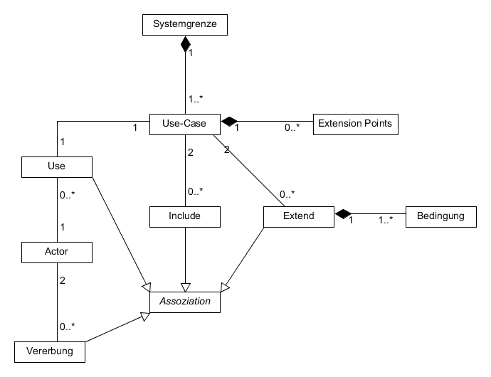

### Objektdiagramm
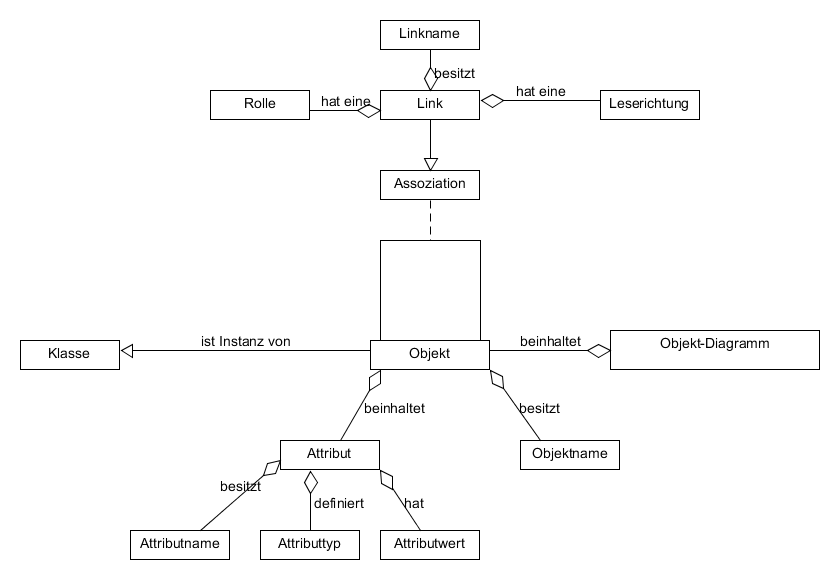

### Zustandsdiagramm
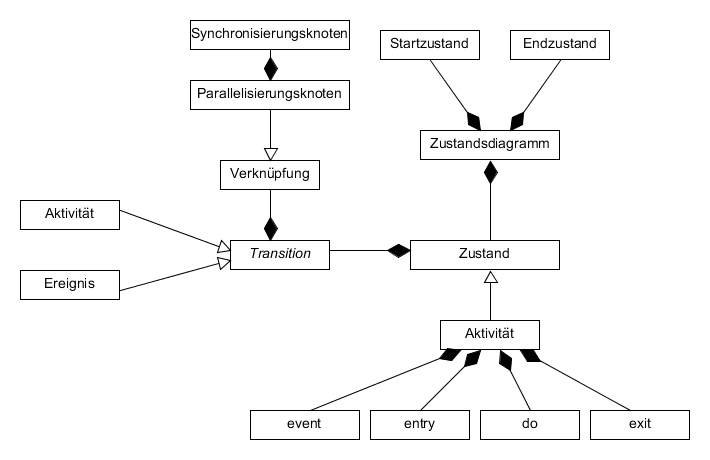

### Klassendiagramm
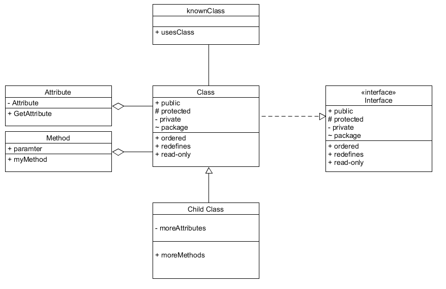

### Aktivitätsdiagramm

- Aktivitätsdiagramm: beschreiben Ablaufmöglichkeiten, die aus einzelnen Aktivitäten (Schritten) bestehen.
- Transition: ist ein Zustandsübergang. Die Aktivitäten beginnen mit einer eingehenden Transition und haben eine oder mehrere ausgehende Transitionen.
- Verzweigung: Verzweigungen, die auf Grund einer Bedingung stattfinden, können entweder mit dem Rautensymbol symbolisiert werden oder die verschiedenen ausgehenden Transitionen starten direkt am Aktivitätssysmbol. In beiden Varianten werden die Verzweigungsbedingungen in eckigen Klammern angegeben.
- Zusammenführung: Sobald eine der eingehenden Transitionen eingeht, geht der Aktivitätsfluss weiter.
- Splitting: Der Aktivitätsfluss wird auf mehrere Aktivitäten verteilt.
- Synchronisation (AND): Der Aktivitätsfluss geht erst dann weiter, wenn alle eingehenden Transitionen vorliegen.
- Signale senden und empfangen: Beim Übergang von einer Aktivität zur nächsten können Signale an Objekte gesendet oder empfangen werden.

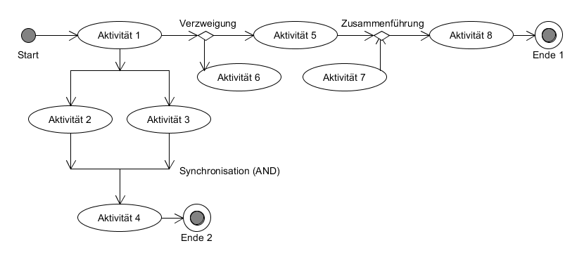

## Objektdiagramme

- Objektdiagramme sind Momentaufnahmen des Systemzustands zur Laufzeit
- Dazu wird die Instanziierung der Klassen eines Klassendiagramms und die zughörige Belegung der Attribute dargestellt
- Ein Objektdiagramm stellt die Ausprägung von Klassen, Assoziationen und Attributen dar

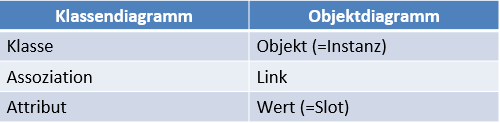
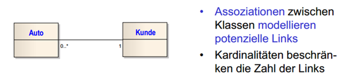
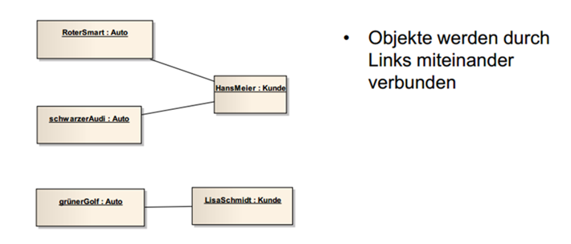
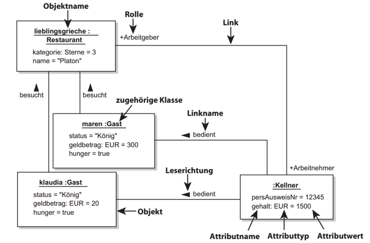

## Komponenten
### Software-Komponenten
- gliedern das Softwaresystem in funktionale Bausteine zur Wiederverwendung und Wartbarkeit
- implementierungsunabhängig definiert zwecks Portabilität
- Parallelisierung bei der Entwicklung (die einzelnen Komponenten können parallel verfeinert und entwickelt werden)
- können von Zulieferern entwickelt werden, die Spezialisten in dem Aufgabenbereich sind
- sollen leicht austauschbar sein
- Abgrenzung zu einem Modul: „EinModul ist eine Zusammenfassung von Operationen und Daten zur Realisierung einer abgeschlossenen Aufgabe“

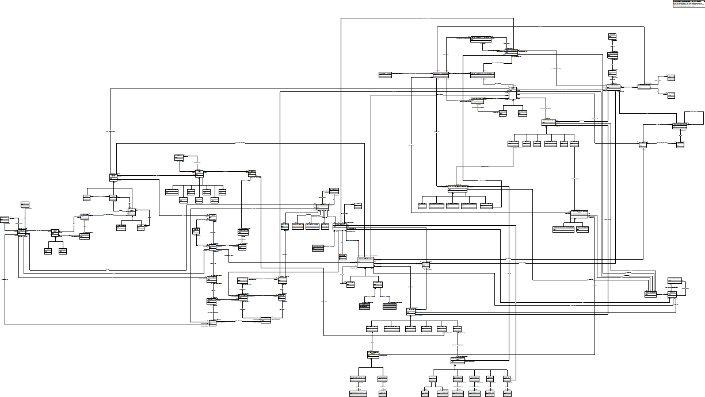

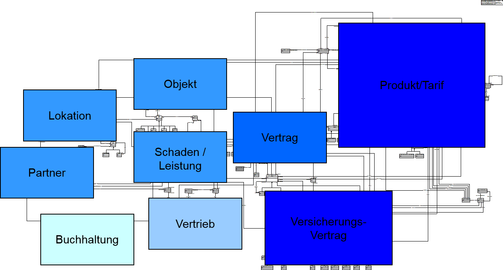

### Schnittstellen

- Definition besteht aus einer Menge von verschiedenen Operationen
- Verhalten der Komponenten ist über eine Schnittstelle zugreifbar
- Schnittstellen zwischen den Komponenten müssen klar definiert sein
- provided interface: wird durch Komponente angeboten
- required interface: wird von Komponente benötigt
- Schnittpunkte zwischen den Komponenten müssen so gering wie möglichgehalten werden -> geringe Kopplung
- Verantwortlichkeiten müssen sinnvoll auf die Komponenten aufgeteilt werden → hohe Kohäsion
- Komponenten können bei Verwendung derselben Schnittstellen ohne Systemänderungen ausgetauscht werden
- Eine Komponente setzt sich intern oft aus mehreren Klassen zusammen

**Schnittstellen sind das Bindeglied zwischen den Komponenten**

### Komponentenmerkmale

1. Exportiert eine oder mehrere Schnittstellen
   - Schnittstellen als Verträge aufgefasst
2. Importiert andere Schnittstellen
   - benutzt die Methoden der importierten Schnittstelle
   - ist erst lauffähig, wenn alle importierten Schnittstellen zur Verfügung stehen
   - ist unabhängig von der Implementierung der importierten Schnittstellen
3. Versteckt die Implementierung
   - Komponente kann durch andere Implemtierungen ersetzt werden
4. Definiert eine Einheit der Wiederverwendung
   - nur minimale Angaben über die Umgebung
5. Komponenten können andere Komponenten enthalten
   - Man kann neue Komponenten aus bestehenden Komponenten
     zusammensetzen (komponieren)

## Komponentendiagramme

- Zeigen, aus welchen Komponenten ein System besteht, welche Schnittstellen die Komponenten bereit stellen bzw. erfordern und wie die Teile eines Systems zusammenarbeiten
- Im Entwurf werden die Aufgaben des Gesamtsystems auf kleinere Subsysteme verteilt. Nachdem die einzelnen Komponenten mit ihren Aufgaben und der Kommunikation zwischen den Komponenten definiert wurden, kann die Entwicklungsarbeit aufgeteilt werden.
- Dokumentation von Softwarekomponenten und Schnittstellen kann in der Testphase als Grundlage von Integrationstests verwendet werden.

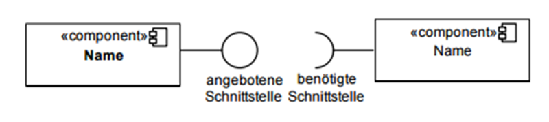

**Alternative Darstellungen**

- Komponenten bieten Schnittstellen (Kreis) und benötigen Schnittstellen (Halbkreis)
- Komponenten können über Schnittstellen in Diagrammen verknüpft werden
- In die Komponenten können die zugehörigen Klassen eingezeichnet werden

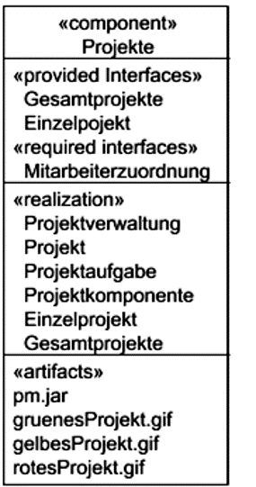

**Black-Box**

- provided + required interface

**White-Box**

- realization (Klassen, die die Komponente realisieren) + artifacts (Datei, die die Implementierung der Komponente enthält)

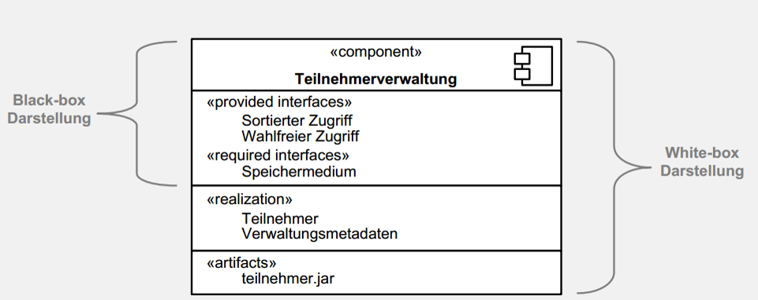

## Paketdiagramme

 
Pakete dienen der...
- gruppierung von Elementen, welche einen ähnlichen Zweck haben
- definierung von Namensräumen, in denen sich Elemente befinden
- kapselung von Daten nach außen

Das Ziel von Paketdiagrammen ist...
- die Struktur eines Systems in verschiedenen Sichten zu gliedern
- durch eine abstrakte Sicht einen Überblick über das System zu bieten

Des Weiteren...
- können Pakete beliebige Modellelemente enthalten, insbesondere andere Pakete
- können Subsysteme durch Pakete modelliert werden um diese auch in anderen Projekten wiederzuverwenden

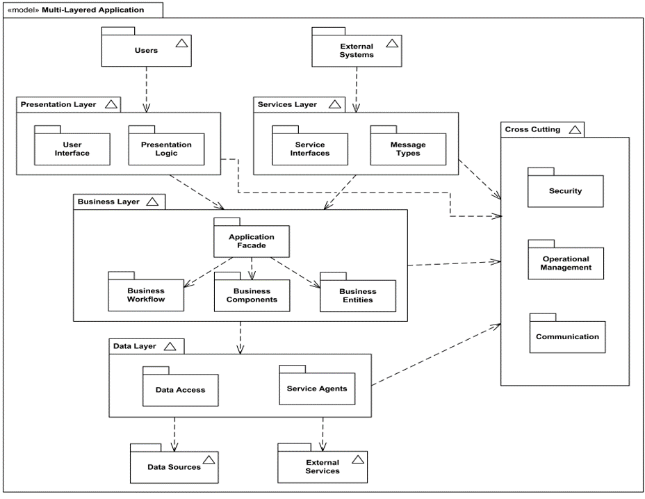

### Paketdiagramme Notationselemente

#### Paketname:
- Muss immer angegeben werden

#### Relation:
- Definiert eine Abhängigkeit zwischen zwei Paketen

#### Assoziation
- Beim Import kann die Sichtbarkeit der importierten Elemente und Pakete neu bestimmt werden:
    - << import >> : Beziehungen für öffentliche Sichtbarkeit
    - << access >> : Beziehungen für private Sichtbarkeit
    - << merge >> : die nicht privaten Inhalte des Zielpakets werden in die Inhalte des Quellpakets verschmolzen.

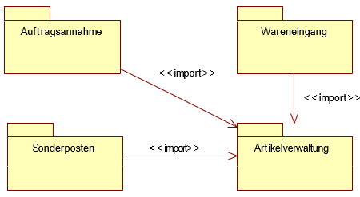

#### import

- Eine Beziehung, die alle Namen öffentlicher Elemente eines Pakets zum importierenden Paket als öffentlich hinzufügt
- Der Import ist transitiv = Die importierten Namen sind öffentlich und finden somit bei einem erneuten Import von einem anderen Paket Berücksichtigung

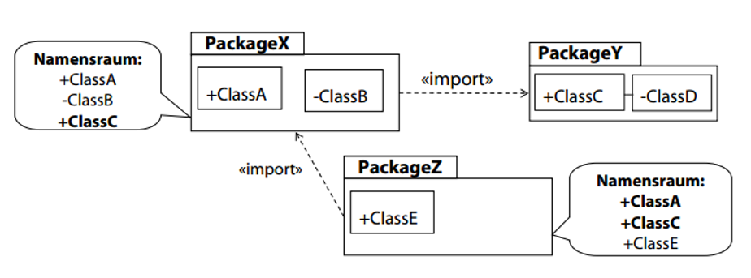

#### access

- Eine Beziehung, die alle Namen öffentlicher Elemente eines Pakets zum importierenden Paket als privat hinzufügt
- Der Import ist nicht transitiv = Änderung der Sichtbarkeit der importierten Elemente auf privat

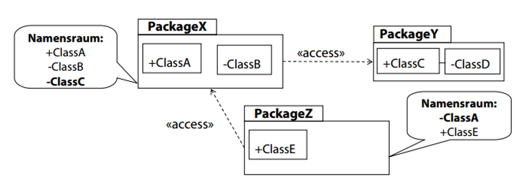

#### Beispiel
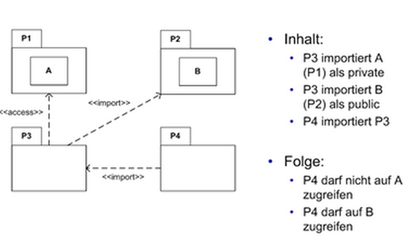

## Verteilungsdiagramme

* werden parallen zu Komponentendiagrammen eingesetzt
* dient zur Modellierung der Laufzeitumgebung verteilter Softwaresysteme
* helfen zu entscheiden, welche Hardware anzuschaffen ist, so dass vort der Implementiertung eine Laufzeitumgebung aufgebaut werden kann
* zeigen Rechnerknoten (Nodes) und die darauf verteilten Softwarekomponenten zur Laufzeit
*  zeigen Nodes, auf denen Prozesse laufen, und Links (Kommunikationsbeziehungen) zwischen den Rechnerknoten

### Knoten im Verteilungsdiagramm

* Knoten repräsentieren Geräte oder Ausführungsumgebungen, die Rechenleistung oder/und Speicher besitzen und auf die Artefakte verteilt werden:
  * `<<device>>` ein Gerät, das Hardware repäsentiert und Rechenkapazität besitzt
  * `<<execution env>>` eine Ausführungsumgebungen, die notwendige Software repräsentiert, um das Laufzeitsystem auszuführen
  * `<<executable>>` eine ausführbare Datei
  * `<<artifact>>` ein Objekt der Verteilung, z.B. eine Datei

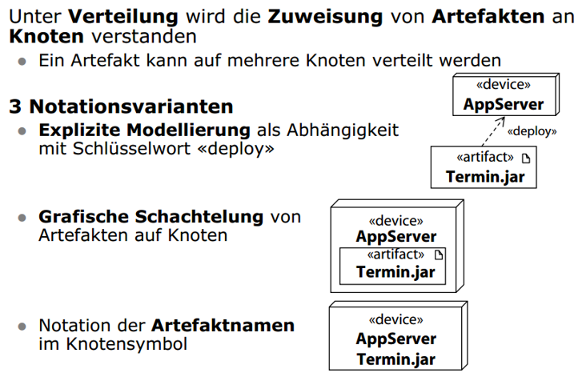

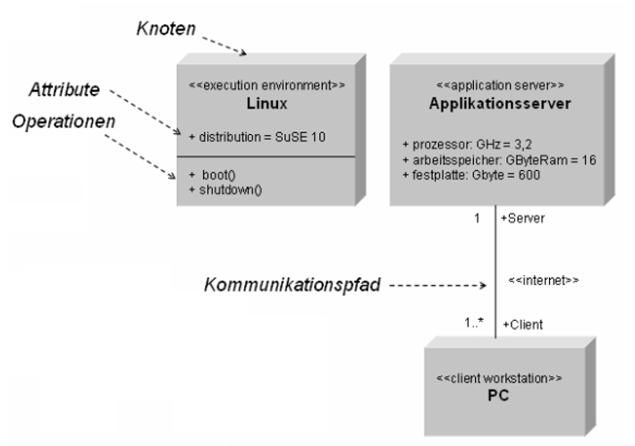

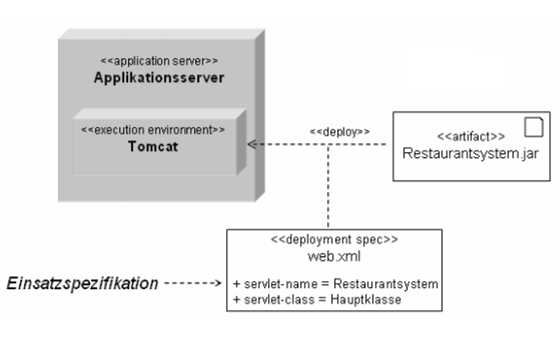

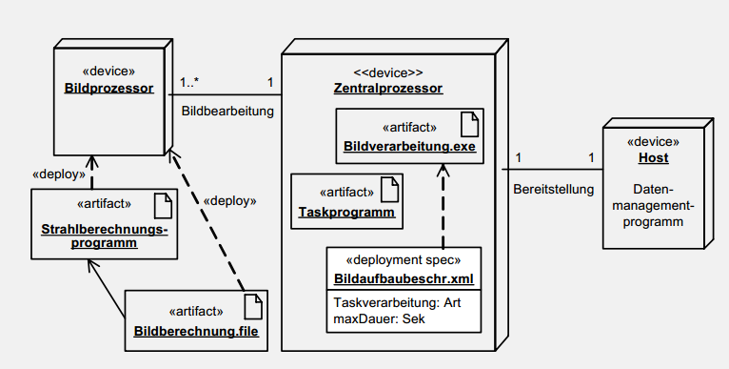

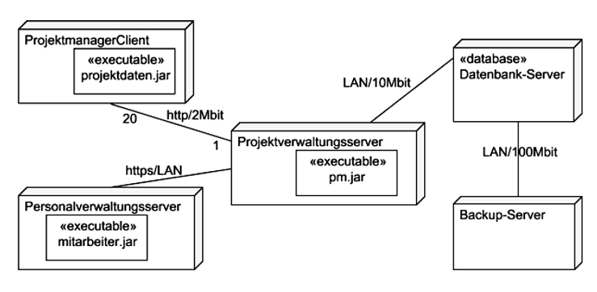

## Zustandsdiagramme

* Dienen zur Modellierung des Klassenverhaltens durch Zustände und Übergänge zwischen Zuständen
* Das Verhalten hängt von einem internen Zustand der Klasse ab
* Dadurch klärt sich die Frageb, wie sich das System bei Ereignissen verhält

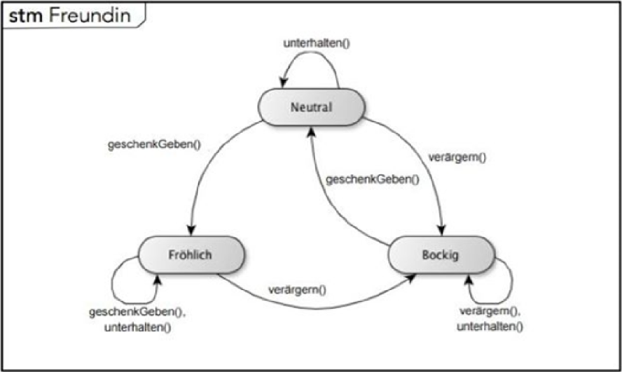
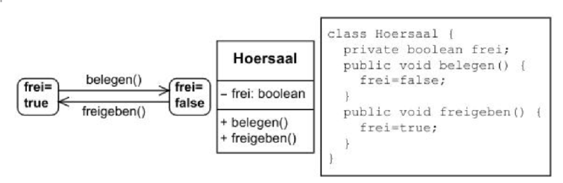

### Zustandsdiagramm Notationselemente
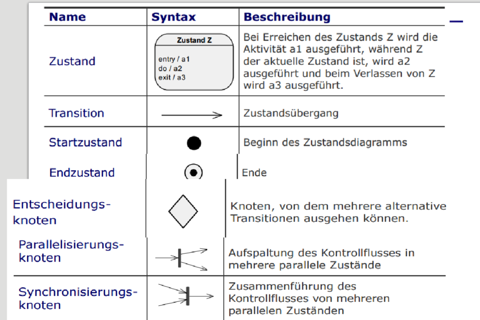

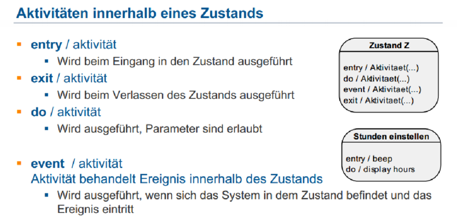

### Transition

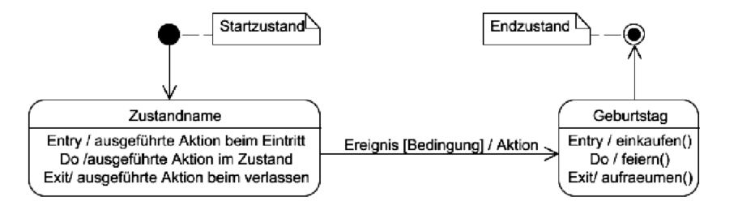

* Schafft Übergang von Ausgans- zu Zielzustand
* Wenn Ausgangs- und Zielzustand gleich sind, erfolgt eine Selbsttransition
* Beschriftung an der Transition: Ereignis[Bedingung]/Aktivität
* Eine Transition wird durchlaufen, wen das zugehörige Ereignis eintritt und die Bedingung wahr ist

### Syntax von Zustandsübergängen

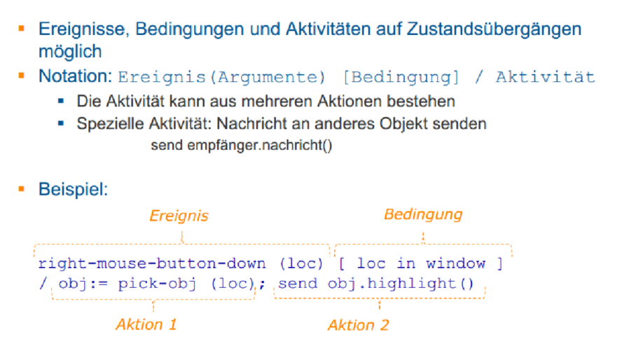

**Ereignistypen**

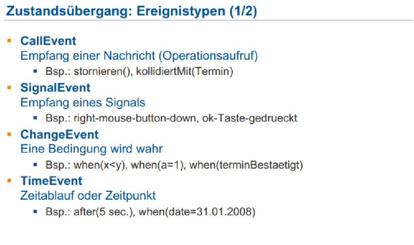

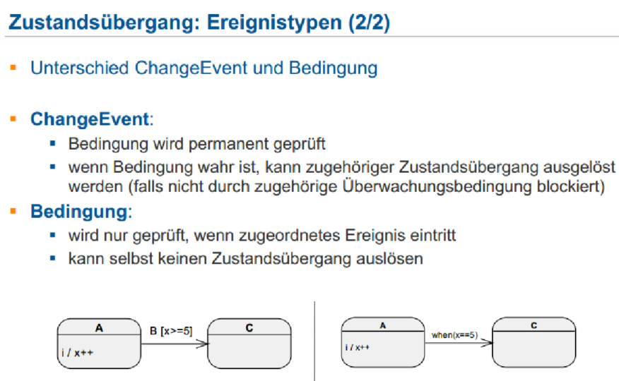

**Komplexe Zustände**

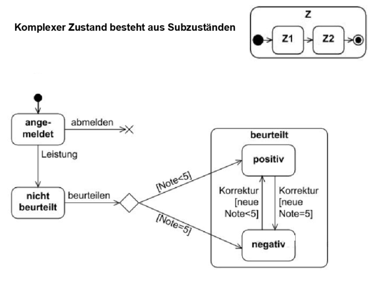

## Zustandsdiagramme Beispiele

### Zustandsmodell einer Tür

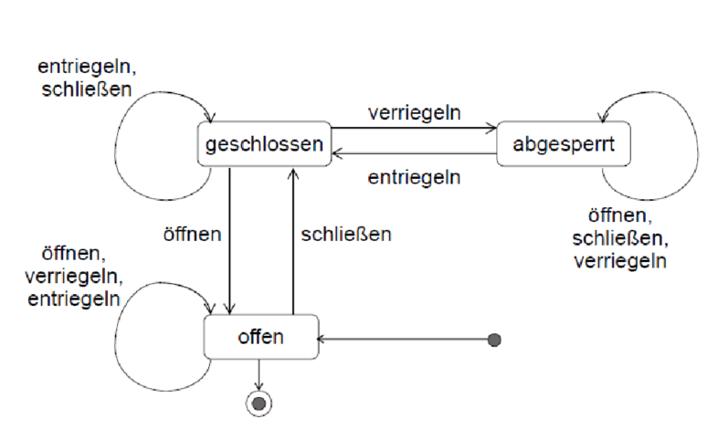

### Sparschwein

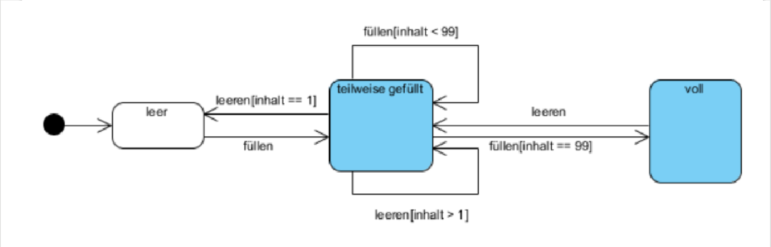

### Auftrag

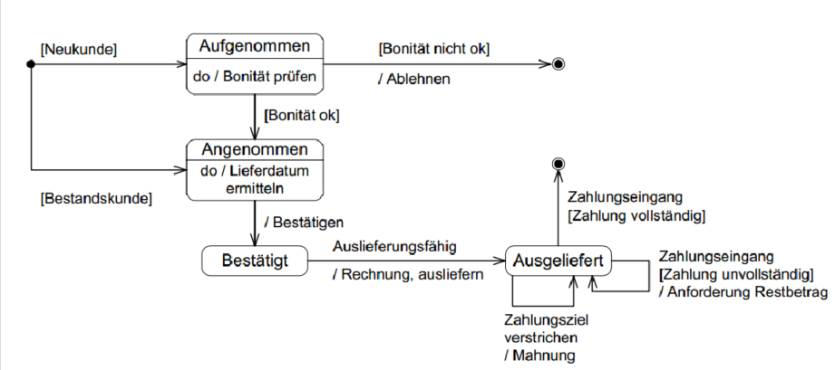
