# Vorlesung 12: MV* Architekturmuster 

## Einleitung

### Entwurfsmuster vs. Architekturmuster

#### Entwurfsmuster
* Richtlinien, wie man gängige Probleme bei der Implementierung eines Softwaresystems löst

#### Architekturmuster
* Richtlinien, um Struktur und Verhalten von Softwaresystemen abstrakt zu modellieren
* Richtlinien, wie die Interaktion zwischen zwischen Teilen des Softwaresystems (Pakete, Subsystemen, Server, Clients, Datenbanken) stattfinden soll

### Interaktive Softwaresysteme mit GUI
* Typisch für graphische Benutzungsschnittstellen ist
    - dass es Objekte zur Eingabe gibt,
    - die zur Veränderung der eigentlichen Datenklasse führen,
    - die dann wiederum eventuell zu Änderung der Anzeige führen  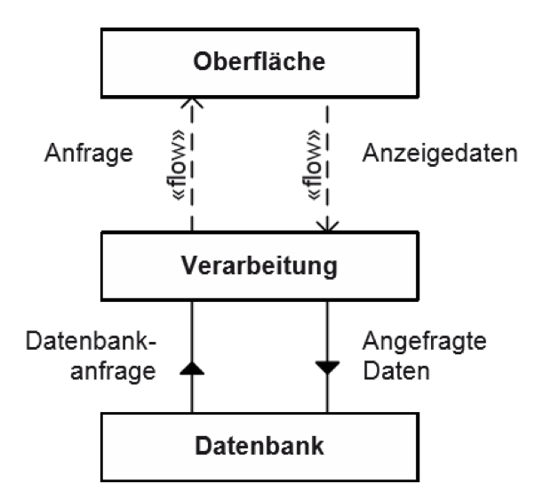
* Beispiel für „ungute“ Softwarestruktur bzw. Aufteilung der Programmlogik:
  GUI enthält Button. Event-Listener für Button wird in der GUI-Klasse implementiert
  (Callback). Dort wird dann Geschäftslogik implementiert. Geschäftslogik ist
  dann nicht benutzbar für andere Teile des Softwaresystems und nicht testbar

### MV*-Architekturmuster
* Lösungen für das genannte Problem führen zu Model-View-* Ansätzen
* Architekturmuster für interaktive Anwendungen mit GUI
* MV*-Vorteile
    - Single Responsibilty Principle: Separiert Logik, Präsentation und Daten
    - Separation of concerns (insbesondere gut für große Softwaresysteme mit vielen Software-Entwicklern)
    - Wartbarkeit, Erweiterbarkeit, Austauschbarkeit, Testbarkeit
    - Unterschiedliche Visualisierungen der Daten (Text, Grafik, etc.)
      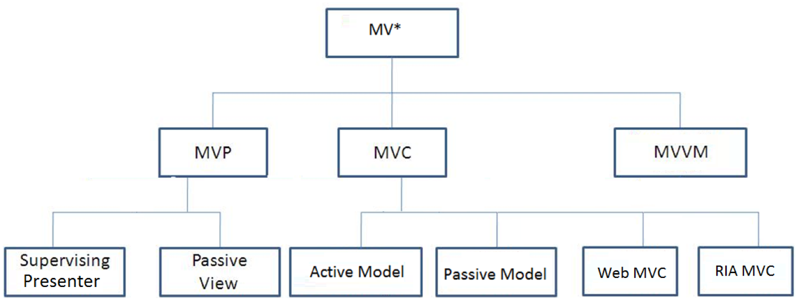

## Model View Controller
* Model enthält Geschäftslogik und Zustandsinformation der Softwareanwendung
* View stellt die Daten des Models dar, ist also „abhängig“ vom Model.
  Die View ist Beobachter des Zustands, um den aktuellen Zustand darzustellen;
  es kann viele Views für ein Model geben. HTML, JSF, Swing, JavaFX  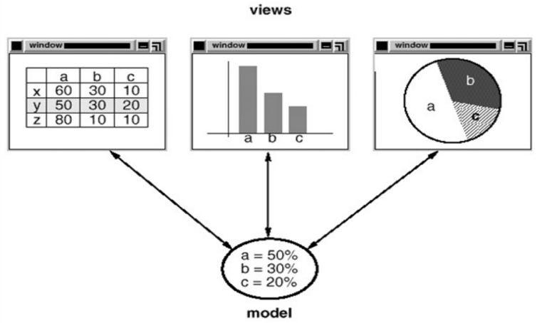
* Controller. Zwischenschicht, die die Eingaben aus der View verarbeitet
  und zwischen View und einem oder mehreren Models vermittelt.
  Ein Controller legt das Verhalten der Software auf Benutzereingaben
  fest und kann für unterschiedliche Views benutzt werden. Wichtig:
  Im Controller steckt keine Geschäftslogik

#### View
* (Graphische) Präsentation (Style, Layout) der Daten
* Interaktion mit dem Nutzer. Nutzeraktionen werden an Controller weitergegeben
* Statusänderung der View über Abfrage am Model
* Implementierung von Logik in der View (=GUI-Logik)
    - Animation, Formatierung, Validierung, Aus/Einblenden von Feldern in Abhängigkeit des Zustands
* Fehler bei der Implementierung von Logik
    - Implementierung von Geschäftslogik in der View
    - Aufrufe von Speicherfunktionen des Models

#### Model
* Enthält Daten und Geschäftslogik
* Kennt nicht die konkreten Views (lose Kopplung)
* Jede Änderung der Daten verursacht Aktualisierung der Views

#### Controller
* Verbindet als Zwischenschicht das View und Model. Enthält Steuerungslogik. Enthält keine Geschäftslogik.
* Reagiert auf Nutzereingaben (Tastatureingaben, Mausklicks, etc)
* Ruft Geschäftslogik vom Model (Delegation) auf und selektiert Views
* Ein Controller kann für verschiedene Views verwendet werden

### Active und Passive MVC
* Unterschied in der Synchronisierung der Daten im Model und View
* Passive Model
    - Nur der Controller manipuliert das Model und informiert die View,
      dass sich das Model geändert hat und dass sie sich „updaten“ soll.
      Die View holt dann Daten vom Model
* Active Model
    - Das Model hat Beobachter, nämlich die View(s).
      Wenn sich das Model ändert, informiert das Model die Beobachter,
      sich auf den neuesten Model-Stand zu bringen
    - Sinnvoll, wenn Model nicht nur durch den Controller verändert wird
    - Form des Observer-Entwurfsmusters

#### Active MVC
* In der View tritt ein Ereignis auf. Der Controller wird informiert.
* Controller steuert Änderungen des Modells
* Model teilt allen Views mit, dass eine Änderung aufgetreten ist
* Views stellen den aktuellen Zustand dar

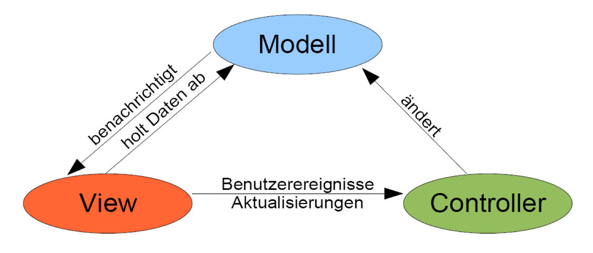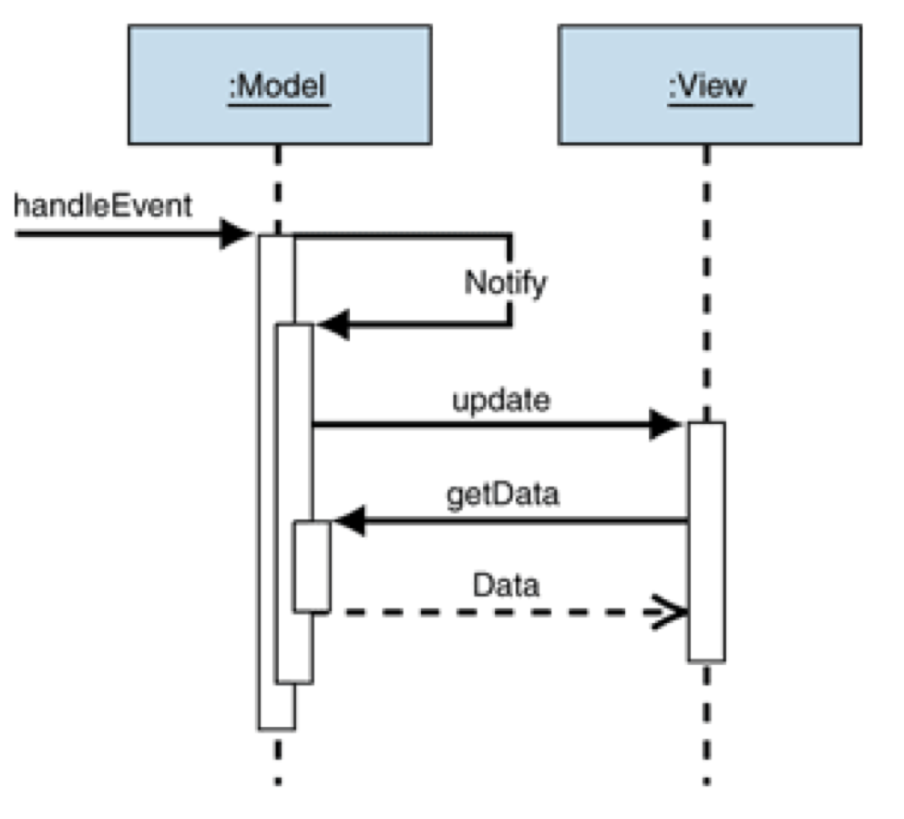

#### Passive MVC

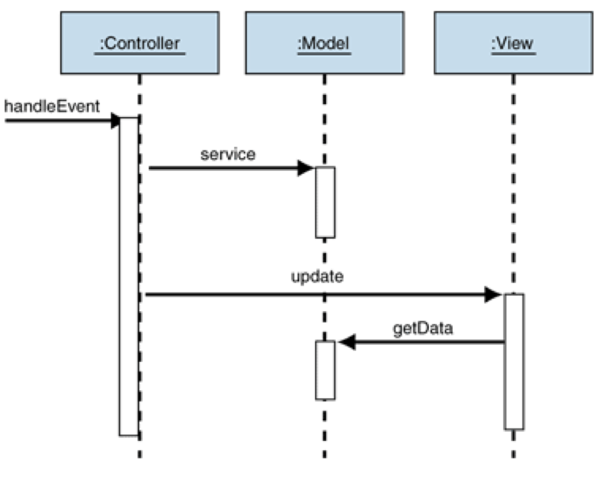

### Web MVC (Model2 Architektur)
* MVC wurde Desktop-Anwendungen entwickelt,
  bei dem die Software auf einem Computer in einem Prozess läuft
* Als das WWW aufkam, wurde MVC für Webanwendungen genutzt
  HTTP ist zustandslos. Notwendigkeit von Sessions zwischen Client und Server
* MVC in verteilten Systemen: „VCM-Architektur“, Controller enthält Steuerungslogik

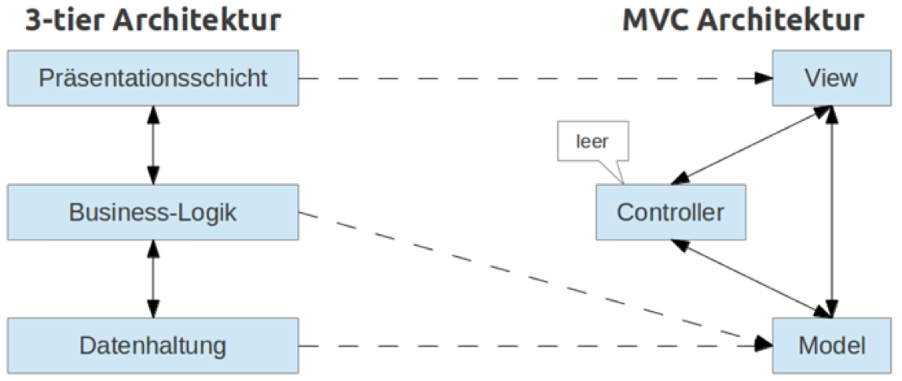
 

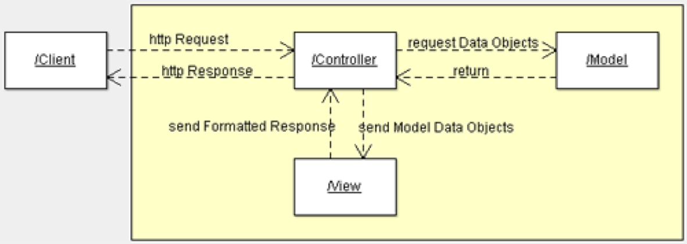

### RIA MVC (Rich Client Internet Application)
* Die Geschäfts- und Steuerungslogik wird auf dem Client ausgeführt
* Das Client-Model synchronisiert sich mit dem Model, das auf dem Server gespeichert wird

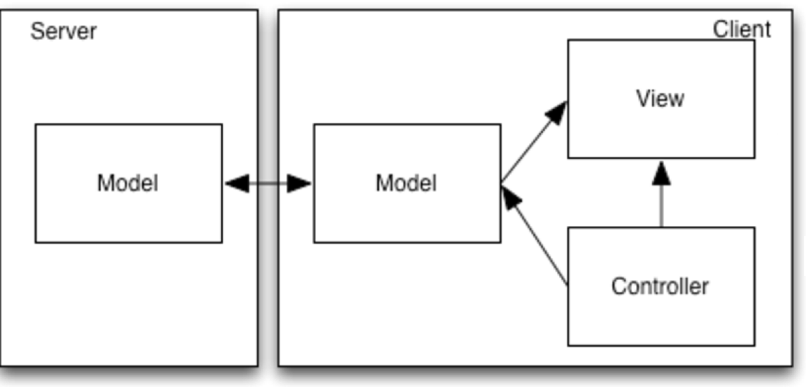

## MVP

* Nachteile von MVP: 
  * Die View kennt den Controller und das Modell. Bei Änderungen sind viele Klassen zu ändern.
  * Komplexe Views haben unterschiedliche Models - viele Abhängigkeiten und langsame Darstellung
  * UI-Logik über View ist manchmal über das Modell verteilt 
  * UI-Logik in der View ist schlecht zu testen - Gehört nicht in das Modell
* MVP beseitigt diese Nachteile:
  * View kennt nur den Presenter und informiert den Presenter über Ereignisse
  * Der Presenter implementiert UI-Logik
  * Presenter kennt nur eine Abstraktion (=Interface) der View
  * Nur der Presenter kennt das Modell - View kennt das Modell nicht 
  * Testfähigkeit - Verwendung von Interfaces für View und Presenter
  * View und Presenter kennen sich gegenseitig - 1-zu-1-Beziehung

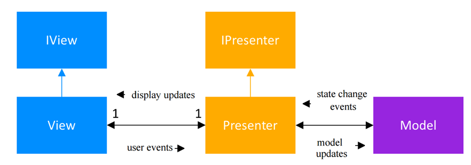

#### Komponenten:

* Model 
  * Schnittstelle zu den Daten. Kommunikation mit der Datenbank
  * Enthält Validierungslogik und Geschäftslogik
* View
  * Visualisierung der Daten und Validierungslogik für Eingabe der View 
  * Mehrere Views möglich. 
  * Jede View hat einen Presenter 
  * Kann von einem "Gui-Designer" seperat entwickelt werden 
  * GUI-Event-Listener - Weiterleitung der On-Click-Events an den Presenter 
  * Interface der View soll keine "get"-Methodn enthalten, sondern die Werte als Parameter bei Methodenaufrufen an den Presenter geben 
  * Interface enthält "set"- und "add"-Methoden zum Setzen von anzuzeigenden Werten 
* Presenter
  * Hält Referenz auf das Model und View - Vermittelt zwischen Model und View
  * Enthält Steuerungslogik und "holt" Daten aus dem Model 
  * Formatiert Daten für die GUI und ändert die View 
  * In der Regel gibt es einen Presenter für eine View - Komplexe Views können mehrere Presenter besitzen

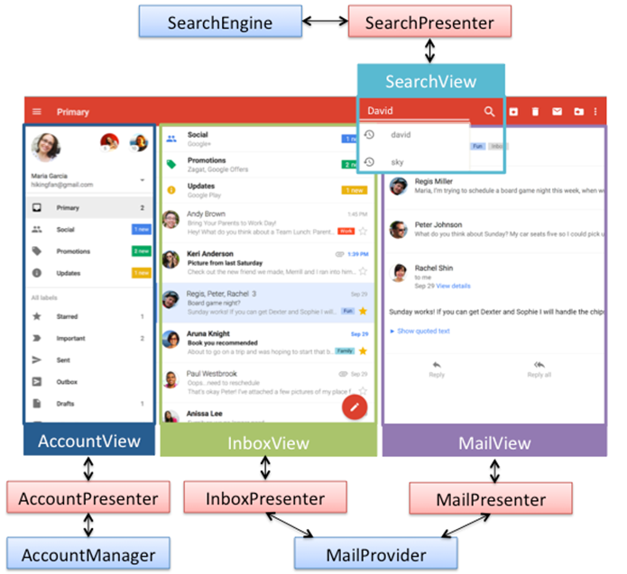

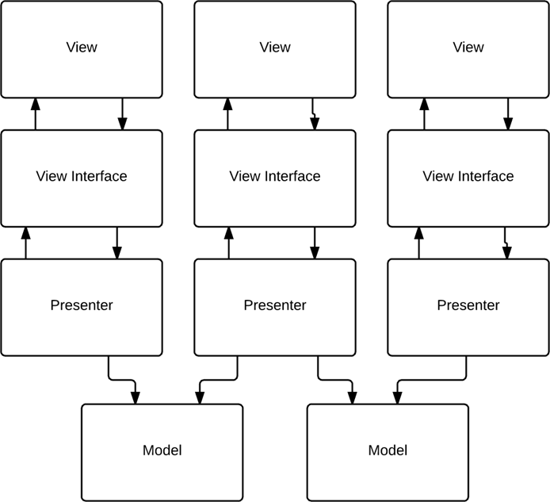

#### MVP Ablauf

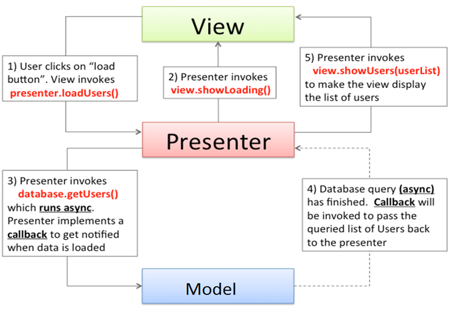

#### MVP-Varianten 

| MVP Passivew View                        |                                          |
| ---------------------------------------- | ---------------------------------------- |
| Dient nur zur Anzeige. Presenter ruft Methoden auf, um geänderte Model-Daten anzuzeigen. Interaktion mit Model ausschließlich durch den Presenter. Die View wird ausschließlich durch Presenter geändert |   |
| **MVP Supervising Presenter**            |                                          |
| View kann auch auf das Model zugreifen. Presenter kann bei komplexeren Updates aber immer noch aud die View zugreifen. View wird durch den Presenter und durch simplex Databinding zwischen View und Model geändert. | 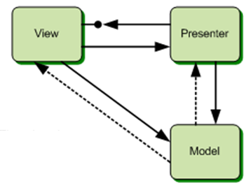 |

| MVP - Vorteile                           | MVP - Nachteile                          |
| :--------------------------------------- | :--------------------------------------- |
| Bessere Möglichkeiten für automatisierte Tests (auch durch Benutzung von Interfaces)  Lose Kopplung. View und Modell kennen sich nicht und sind unabhängig voneinander  Seperation of Cencerns: "Aspekte" können unabhängig voneinander und parallel entwickelt werden und getestet werden   Wiederverwendung. Insebesondere der Geschäftslogik im Model  Flexibilität. Views können einfach ausgetauscht werden oder verändert werden. | Große Anzal von Interfaces  Presenter können groß werden, weil auch die UI-Logik im Presenter festgelegt ist |

## MVVM

* Erlaubt ereignisgesteuerte Programmierung und deklarative Programmierung der GUI durch GUI-Designer (Kein Programmierer)
* Bei MVP steuert der Presenter die GUI 
* Bei MVVM stellt das ViewModel Datenströme zur Verfügung, an denen sich die View binden kann 
* Das ViewModel kennt ein oder mehrere Models, aber keine View (somit werden zur Implementierung auch keine Interfaces mehr benötigt)
* Die View kennt das ViewModel, aber nicht das Model 
* Das ViewModel speichert auch UI-Zustand 
* Die View benutzt das ViewModel, um über Eingaben des Benutzers zu informieren und entsprechende Aktionen auszulösen 
* Daten werden im ViewModel geändert und dann durch das 2-way-Databinding in der View dargestellt 

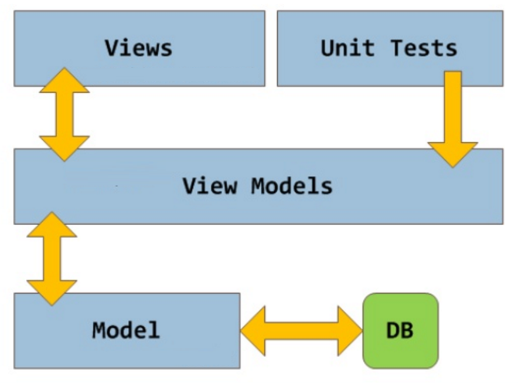

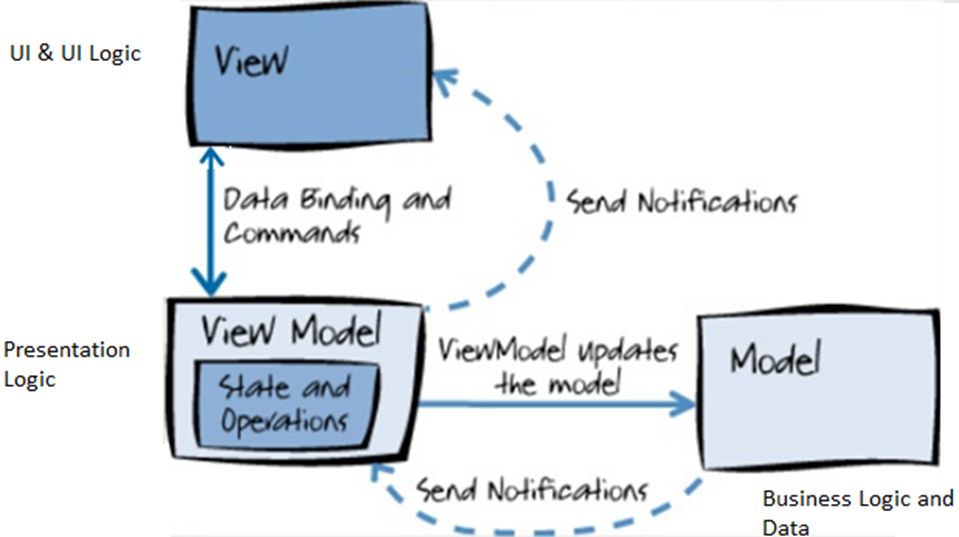

* **ViewModel**
  * Nicht visuelle Klasse, die die Präsentations-Logik enthält
  * Hält keine direkte Referent auf die View
  * Koordiniert die Interaktion der View mit dem Model
  * Kann Datenvalidierungen und Fehlerreporting vornehmen
  * Änderungen im Model werden durch das ViewModel in der View synchronisiert und umgekehrt
  * Das ViewModel speichert auch den Zusatnd der View und enthält UI-Logik, wodurch die Logik in der View miniiert wird
  * Das ViewModel holt Daten aus dem Model und führt darauf UI-Logik durch 
* **Model**
  * Nicht-visuelle Klasse, die die Daten und die Geschäftslogik der Anwendung kapselt 
  * Kennt weder das ViewModel noch die View
  * Sollte keine Use-Case-spezifische Logik enthalten 
  * Teilt anderen Teilen des Softwaresystems mit, wenn sich der Modelzustand ändert
  * Kann und sollte Datenvalidierungslogik enthalten
* **View**
  * Bestimmt: Aussehen und Layout der Daten 
  * Präsentiert UI-Verhalten (Animation und Transitionen)
  * Jede View besitzt eine Referenz zu einem oder mehreren ViewModels 

#### Databinding im Detail

* Databinding = Verbindung zwischen UI und Anwendungslogik bzw. Daten
* Wenn sich die Werte der Daten ändern, so ändern sich automatisch die GUI-Elemente, um Änderungen zu reflektieren

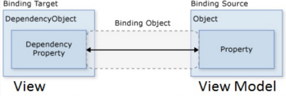

##### Varianten:

* One Time binding: Zeigt Daten einmal an, wenn die Bindung erzeugt wird
* One Way binding: Zeigt Daten an, wenn Bindung erzeugt wird und bei Änderung von Daten
* Two Way binding: Änderungen werden in beide Richtungen propagiert

| Vorteile                                 | Nachteile                                |
| ---------------------------------------- | ---------------------------------------- |
| Seperation of concerns Unit Tests einfach zu schreiben GUI-Designer und Entwickler können parallel arbeiten Die GUI kann ohne große Probleme neu entworfen werden | Schwer zu debuggen, weil viele Abläufe automatisch ablaufen Die Performanz der Anwendungen kann durch das Databinding negativ beeinflusst werden |

### Zusammenfassung

- **Model:** Business Objekte und Geschäftslogik

- **View:** Grafische Schnittstelle zum Benutzer

- **Presenter:**

  - 1-zu-1 Beziehung zwischen View und Presenter
  - Jede View implementiert ein Interface, durch das der Presenter mit der View interagieren kann
  - Jede View hat eine Referenz zumPresenter und kann dort Steuerungslogik initiieren

- **ViewModel:**

  - n-zu-1 Beziehung zwischen View und ViewModel
  - Views interagiert mit ViewModel durch Bindung an Attribute und Funktionen

- **Controller:**

  - n-zu-1 Beziehung zwischen View und Controller
  - Passive Model: Kommunikation View <->Model über Controller
  - Active-Model: Updates durch Observer-Pattern behandelt

  ​

| MVC                                      | MVP                                      | MVVM                                     |
| ---------------------------------------- | ---------------------------------------- | ---------------------------------------- |
| View sendet Eingabeereignisse an den Controller über „Callback-Handler“ | View interagiert mit dem Presenter durch Aufruf von Presenter-Funktionen | View bindet sich direkt an das ViewModel |
| View erhält in der „Active Model“-Variante Zustandsänderungen direkt vom Model ohne Aktivität des Controllers | Presenter interagiert mit der View durch Aufrufvon Interface-Funktionen, die durch die View implementiert sind | Änderungen in der View werden direkt in das ViewModel geschrieben und umgekehrt |
| Active Model zu benutzen, wenn das Model von unterschiedlichen Prozessen verändert wird | Zu benutzen, wenn ein Databinding nicht möglich ist | Zu benutzen, wenn Databinding möglich    |

