# Vorlesung 13: Entwurfsmuster

## Einleitung


### Was sind Entwurfsmuster?

* Ein Entwurfsmuster ist kein fertiger Programmcode, der direkt eingesetzt werden kann, sondern eine Art Schablone für die bewährte und generische Lösung eines immer wiederkehrenden Entwurfsproblems
* Also: Entwurfsmuster müssen auf das jeweilige Problem angewendet werden, also immer wieder neu implementiert werden
* Dienen der Wiederverwendbarkeit von Entwurfswissen und erleichtert Kommunikation unter Software-Entwicklern
* Kombination von Klassen zu größeren Einheiten, unabhängig von der Programmiersprache
* Patterns vs. Algorithmen:
  * Algorithmen lösen feinkörnige Probleme als Patterns (z.B. Suchen, Sortieren)
* Patterns vs. Frameworks:
  * Framework beinhaltet eine Menge von kooperierenden Köassen für einen spezifischen Anwendungsbereich erweiterbar durch Unterklassenbildung
  * Patterns sind abstrakter: Frameworks existieren als konkreter, wiederverwendbarer Code; Patterns enthalten nur Beispiele von Code
  * Patterns sind weniger spezifisch: Frameworks werden für konkrete Anwendungsbereiche eingesetzt - Patterns können fast überall eingesetzt werden

| Vorteile                                 | Nachteile                                |
| ---------------------------------------- | ---------------------------------------- |
| Verbessert Kommunikation zwischen Entwicklern, so dass diese über den Softwareentwurf auf Abstrakter Ebene diskutieren können | Design zur Entwurfs- bzw. Konzeptionszeit sehr aufwändig |
| Idee eines Entwurfs ist in den Mustern erkennbar | Muster sind ohne eine graphische Visualisierung (UML) im Code schwer zu erkennen |
| Wartbarkeit, Änderbarkeit und Wiederverwendbarkeit des Codes ist besser | Für Anfänger besteht ein hoher Enarbeitungsaufwand in die Ideen und Anwendbarkeit der Entwurfsmuster |

### Aufbau von Entwurfsmuster-Katalogen

Beschreibungen von Entwurfsmustern in einem Katalog enthalten folgende Attribute:

* Name, Übersicht, Motivation (z.B. Anwendungsbeispiel), Lösung (beteiligte Objekte,

  Klassen und ihre Beziehungen), Implementierung (mit Code-Fragmenten), bekannte
  Anwendungsfälle (z. B. in der Java-SDK), verwandte Patterns

### Entwurfsmuster und UML

* Bei der Beschreibung von Entwurfsmustern werden UML Diagramme verwendet (Klassen- und Sequenzdiagramme)


* Pattern-Name im gestrichelten Kreis, verbunden im eingekreisten Klassen, verbunden im Pattern und Benennung der Rollen


* **Erzeugungspattern** behandeln die Objekterzeugung und sollen das Wissen über die konkreten Klassen des Systems vor dem Benutzer verstecken mit dem Ziel der Konfigurierbarkeit und Änderbarkeit
* **Strukturpatterns** befassen sich mit der Komposition von Klassen und Objekten, um größere Strukturen zu bilden
* **Verhaltenspatterns** behandeln Objektinteraktion und -Verantwortlichkeiten. Sie charakterisieren die Art udn Weise, in der Klassen und Objekte zusammenarbeiten

### Probleme im Entwurf und Entwurfsmuster als Lösung

* Objekte einer gest benannten Klasse erzeugen
  * Lösung: Abstract Factory, Factory Method
* Abhängigkeit von speziellen Implementierungen
  * Lösung: Abstract Factory, Bridge
* Abhängigkeit von speziellen Algorithmen
  * Lösung: Strategy
* Zu enge Kopplung
  * Lösung: Abstract Factory, Bridge, Observer

### Überblick der vorgestellten Entwurfsmuster

* Abstract Factory: 	
  * Erzeugen von verwandten Objekten ohne Konstruktoraufruf
* Factory Method:
  * Erzeugung von Objekten deren Typ
    in Unterklassen bestimmt wird
* Builder:
  * Einen komplexen Erzeugungsprozessverbergen
* Singleton:
  * Instanziierung einerKlasse durch genau ein Objekt
* Adapter:
  * eine Schnittstelledurch Delegation (Objektadapter) oder Vererbung (Klassenadapter) an eineandere Schnittstelle anpassen
* Brücke:
  * Abstraktion und Implementierungvoneinander trennen
* Facade:
  * eineeinfache Schnittstelle auf Basiseiner umfangreichen und allgemeinen Schnittstelleerstellen
* Composite:
  * eine Objektstruktur durchUnterklassen abbilden, um so einzelne Instanzenund Gruppen von Instanzen gleichbehandeln zu können
* Proxy:
  * transparenter Zugriff auf(entfernte) Funktionalitäten über Stellvertreterobjekte
* Template Method:
  * Konkrete Schritte einesfestgelegten Algorithmus in Unterklassen implementieren
* Command:
  * Kontrollfluss in Klassenkapseln zwecks Mehrfachverwendung
* Observer:
  * Publish/subscribe Mechanismus
* Visitor:
  * kapselt eine Methode, die aufeiner Objektstruktur ausgeführt werden soll
* Strategy:
  * Unterstützung vonunterschiedlichen Algorithmen
* State:
  * Verhaltensänderung einesObjektes nach Zustandsänderung

### GoF-Pattern Übersicht


## Strategy

- Problem: Für einen Algorithmus gibt es verschiedene Möglichkeiten, sie zu implementieren.
  - Die Implementierung soll zur Laufzeit leicht ausgetauscht werden können, um die effizienteste/schnellste/beste zu wählen
- Lösung: Kapselung einer Familie von Algorithmen durch eine Schnittstelle


### Strategy – Lösungsbeispiel 1


### Strategy – Lösungsbeispiel 2


### GoF - Pattern Übersicht


## Composite

### Strukturmuster - Composite (Kompositum)

- Objekt-Hierarchien treten überall dort auf, wo komplexe Strukturen modelliert werden (graphische Anwendungen, Textverarbeitung, Dateisysteme, usw.)
- dabei werden einfache Objekte zu Gruppen zusammengefasst, welche wiederum zu größeren Gruppen zusammengefügt werden können (Teil-Ganzes-Hierarchie)
- gemeinsame Eigenschaften von Objekt und Gruppe werden vom Kompositum isoliert und daraus wird eine Oberklasse gebildet
- einzelne Instanzen und Gruppen von Instanzen können somit gleich behandelt werden


**Component:**
- Basisklasse
- deklariert die Schnittstelle für Objekte in der zusammengefügten Struktur
- implementiert ein Default-Verhalten
- deklariert eine Schnittstelle zum Zugriff auf Kindobjekte
- häufig abstrakt

**Leaf:**
- repräsentiert Blattobjekte, die keine Kinder haben

**Composite:**
- enthält weitere Composite-Elemente und/oder Leaf-Elemente
- definiert Verhalten für Objekte mit Kindern
- speichert Kindobjekte
- Implementiert kindobjekt-bezogene Operationen


### GoF - Pattern Übersicht


## Observer

### Observer - Observable (Beobachter)
- Auch "Publish-Subscribe oder "(Event-)Listener"
- Objekte zueinander konsistent halten, ohne diese eng miteinander zu koppeln
- Subjekte bieten die Möglichkeit, dass sich Interessenten anmelden (z. B. Kanal abonnieren)
- Bei jeder Subjektzustandsänderung werden diese Interessenten informiert (z. B. neue Nachrichten)
- Observable (= Subjekt)
  - register oder addListener (Observer registrieren)
  - unregister oder removeListener (registrierte Observer entfernen)
  - noftiy, notifyAll (update-Methoden aller registrierten Observer aufrufen)
  - setState (zustandsändernde Operation(en) für beliebige Clients)
  - getSate (Abfrage des aktuellen Zustands)
- Observer (= Interessent)
  - update (Reaktion auf Zuständsänderung des Subjekts)
    
    

### GoF-Pattern Übersicht


## Command
Bei einer Textverarbeitung können viele Funktionen von unterschiedlichen Stellen aus aufgerufen werden, z.B. Menü, Button, Popup-Menü bei Rechtsklick, Tastaturkürzel

* Die Funktion soll nicht immer neu implementiert werden
* Die Funktion soll rückgängig gemacht werden können
* Die Funktion soll mehrfach ausgeführt werden

Wie kann das softwaretechnisch realisiert werden, wenn die Funktionen eng mit den aufrufenden Objekten verbunden sind?

**Lösung:**
* Den Befehl in einer Klasse kapseln
* Der selbe Befehl kann von mehreren Stellen aus aufgerufen werden
* Die Befehsobjekte können in einer Befehlsgeschichte gespeichert werden
* Operation als Objekte mit Methode **execute()** darstellen
* Rückgängig mit Methode **undo()**

### UML-Diagramm
<center></center>

### Beispielprogramm
<center></center>

### Verbindung von Observer und Command in java
* Observer
  * Buttons, Menü-Einträge und Tasten generieren "ActionEvents"
  * Interface "ActionListener" ist vordefiniert
* Das "ActionListener„-Interface  implementieren und dann Instanzen davon bei Buttons, MenuItems, etc. registrieren

#### Elegante Verbindung von Observer und Command
* Commands sind **ActionListener** von Buttons, Menüs, etc.
* Einheitlicher Aufruf via **actionPerformed(ActionEvent evt)**
* Buttons und Menüs sind **PropertyChangeListener** von Commands
* Aktivierung / Deaktivierung

#### Wiederverwendung
* Gleiche **Action** für Menu, Button, Key

### Oberserver und Command in Java
<center></center>
<center></center>

### GoF Pattern Übersicht
<center></center>

## Adapter

### Zweck

- Adapter (Synonym: Wrapper) passt die Schnittstelle einer Klasse an eine andere Schnittstelle an, die von ihren Klienten erwartet wird
- lässt Klassen zusammenarbeiten, die wegen inkompatibler Schnittstellen ansonsten dazu nicht in der Lage wären

<center></center>

### Adapter

- „Adapter“ erbt von und verhält sich wie „Ziel“ und benutzt die „Adaptierte Klasse“
- Adapter leitet Aufruf der gewünschten Funktionalität an die adaptierte Klasse weiter

<center></center>

### Objekt-Adapter

<center></center>

<center></center>

### Klassen-Adapter

<center></center>

<center></center>

### GoF Pattern Übersicht

<center></center>

## Bridge

Das Muster ermöglicht die Trennung der Implementation von ihrer Abstraktion (Schnittstelle). 
Dadurch können beide unabhängig voneinander variiert werden.

Das Entwurfsmuster findet Verwendung, wenn:

- Abstraktion und Implementation erweiterbar sein sollen
- eine dauerhafte Verbindung zwischen der Abstraktion und ihrer Implementation vermieden werden soll
- Änderungen in der Implementation einer Abstraktion keine Änderungen auf Clienten haben sollen
- Die Implementation vor dem Clienten verborgen bleiben soll
- Die Implementation von verschiedenen Klassen gleichzeitig genutzt werden soll.

Die folgende Abbildung zeigt die Struktur des Brückenmusters:

<center></center>

## Factory Method

* Die Schnittstelle zur Erstellung eines Objektes ist eine (abstrakte) Methode einer Oberklasse.
* Die konkrete Implementierung der Erzeugung neuer Objekte findet jedoch nicht in der Oberklasse statt, sondern in von ihr abgeleiteten Unterklassen, die die besagte abstrakte Methode implementieren

```Java
public interface Product { ... }

public abstract class Creator {
	public void anOperation() {
		Product product = factoryMethod();
	}

	protected abstract Product factoryMethod();
}

public class ConcreteProduct implements Product { ... }

public class ConcreteCreator extends Creator {
	protected Product factoryMethod() {
		return new ConcreteProduct();
	}
}

public class Client {
	public static void main(String arg[]) {
		Creator creator = new ConcreteCreator();
		creator.anOperation();
	}
}
```
<h1>
<center></center><br>

<center></center><br>

<center></center>
</h1>

```Java
class ReaderFactory {
  public static enum BarcodeType {
    QR_CODE, DATAMATRIX, UPC_E
    //many more
  };

public static Reader createReader(BarcodeType type) throws Exception {
  switch(type) {
    case QR_CODE:
      return new QRCodeReader();
    case DATAMATRIX:
      return new DataMatrixReader();
    case UPC_E:
        return new UPCEReader();
    }
    throw new Exception("Barcode type not supported.");
  }
}
```
<br>
<center></center>


## Abstract Factory

Das Abstract Factory Erzeugungsmuster stellt Schnittstellen bereit, um verwandte oder voneinander abhängige Objekte 
zu erzeugen, ohne ihre konkreten Klassen zu verwenden. 

### Vor- und Nachteile

* Vorteile: 
  * Das Abschirmen der Konkreten Klassen macht den Klientcode allgemeingültig.
  * Es gelangen nur Objekte zum Client die auch zusammenpassen.
  * Der Austausch von ganzen Produktfamilien ist sehr einfach.
  * Es ist sehr einfach neue Produktfamilien zu integrieren.
* Nachteile:
  * Der Produktfamilie eine neue Produktart hinzuzufügen ist sehr aufwändig.
  * Mehr Klassen als beim "Factory Method"-Pattern.

### Anwendbarkeit:
* Wenn ein System unabhängig davon sein soll, wie seine Produkte erzeugt werden. 
* Wenn ein System mit einer von mehreren Produktfamilien konfiguriert werden soll.
* Wenn Objekte zu einem Kontext erstellt werden, also immer zusammenhängend erstellt werden müssen,
  
### Akteure:
* **AbstrakteFabrik:** stellt die Schnittstellen zum Erzeugen der Produkte einer Produktfamilie dar.
* **AbstraktesProdukt:** stellt die Schnittstellen eines Konkreten Produkts dar.
* **KonkreteFabrik:** implementiert die Schnittstellen der Abstrakten Vorlage zum Erzeugen der Konkreten Produkte.
* **KonkretesProdukt:** implementiert anhand der Schnittstellen der abstrakten Vorlagen ein konkretes Produkt, welches
  von einer konkreten Fabrik generiert wird.
* **Klient:** Verwendung der durch die abstrakten Klassen vorgegebenen Schnittstellen der Fabrik und der Produkte

### Diagramm 
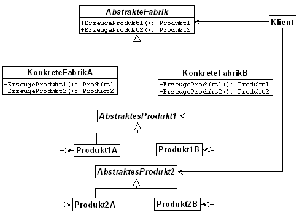

### Gemeinsamkeiten zu Factory Method
* Beide entkoppeln den Client von Konkreten Typen
* Klient kennt nur die Schnittstelle zur Factory und den Produkten
* Die Unterklasse (Implementierung) der Schnittstelle entscheidet welche Produkte konkret erstellt werden.
  Der Klient stützt sich allein auf die Abstraktion.


### Unterschiede:

| Abstract Factory                         | Factory Method                           |
| ---------------------------------------- | ---------------------------------------- |
|Ganze Produktfamilie wird erstellt| Ein Produkttyp wird erstellt.|
|Breite Schnittstelle| Schmale Schnittstelle|
|Schnittstelle (Abstract Factory) ist oft nur ein Interface und enthält keinen Implementierungscode| Schnittstelle ist oft abstrakt und enthält generischen Code (Herstellungscode, den alle Produkte durchlaufen müssen)|
|Benutzt Factory Methods, aber ohne generischen Code||

### Beispiel:

#### Diagramm:

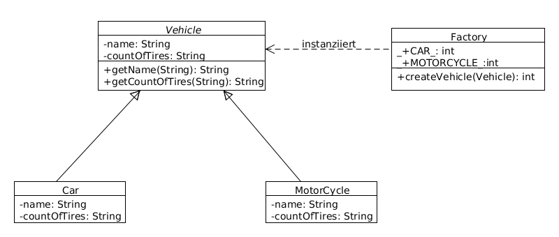

#### Code:

**Factory**-Klasse:
```Java
class Factory {
 public static final int CAR = 0;
 public static final int MOTORCYCLE = 1;
	
 public Vehicle createVehicle(int i) {
   switch(i) {
    case CAR:
      return new Car();
    case MOTORCYCLE:
      return new Motorcycle();
     default:
       throw new IllegalArgumentException(
         "Wrong vehicle number!");
  }
}
}
```

**Vehicle**-Interface:
```Java
interface Vehicle {
  public int getCountOfTires();
  public String getName();
}
```

**Car**-Klasse:
```Java
class Car implements Vehicle{
  public int getCountOfTires() {
    return 4;
  }
  public String getName() {
    return "Car";
  }
}
```

**Motorcycle**-Klasse:
```Java
class Motorcycle implements Vehicle {
  public int getCountOfTires() {
    return 2;
  }
  public String getName() {
    return "Motorcycle";
  }		
}
```

**FactoryPattern**-Klasse:
```Java
public class FactoryPattern {
  public static void main(String[] args) {
    Factory f = new Factory();
    Vehicle newCar = f.createVehicle(Factory.CAR);
    Vehicle newMotorcycle = f.createVehicle(Factory.MOTORCYCLE);
  }
}
```

## Proxy
* Proxy als Stellvertreter zu einem anderen Ding
* Client kommuniziert nur über eine Schnittstelle mit dem Proxy bzw. realen Subjekt
* Der Zugriff auf die „wertvolle“ Ressource wird durch eine vorgeschaltete Klasse gesteuert
* Der Nutzer des Proxys nutzen diesen wie die eigentliche Klasse

<center></center>

### Typische Beispiele: Remote Proxy
* Ein Objekt liegt auf einem anderen Rechner.
  Das RemoteProxy ist die Schnittstelle zum entfernt liegenden Objekt
* Ein Remote-Proxy ist ein lokaler Stellvertreter für ein Objekt in
  einem anderen Adressraum. Er wird beispielsweise in Netzwerkanwendungen verwendet

<center></center>

### Andere Proxy-Beispiele
* Ein virtueller Proxy dient der Verzögerung „teurer“ Operationen auf den
  Zeitpunkt des tatsächlichen Bedarfs
* Ein Schutzproxy setzt Zugriffsrechte auf ein Objekt durch

<center></center>

### Proxy-Impementierungsmöglichkeiten

```java
public interface KlasseMitWertvollemInhalt {
	public int anfrage(String details);
}
```
```java
public class RealeKlasse implements KlasseMitWertvollemInhalt {

	private Verbindung verbindung;

	public RealeKlasse(String verbindungsdaten){
		verbindung = new Verbindung(verbindungsdaten);
	}

	public int anfrage(String details){
		return verbindung.befragen(details);
	}
}
```
```java
public class Proxy implements KlasseMitWertvollemInhalt {

    private static RealeKlasse realesObjekt;

	public Proxy() {
		if (realesObjekt == null)
            realesObjekt = new RealeKlasse("Spezialinfos");
	}

	public int anfrage(String details) {
		return realesObjekt.anfrage(details);
	}
}
```
```java
public class Nutzer {

	public int proxyNutzen(String anfrage) {
		KlasseMitWertvollemInhalt k = new Proxy();
		return k.anfrage(anfrage);
	}

	public static void main(String[] s) {
		Nutzer n = new Nutzer();
		System.out.println(n.proxyNutzen("gib41"));
	}
}
```


### Unterschied zwischen Proxy vs. Adapter vs. Facade vs. Bridge
#### Proxy
* hat dieselbe Schnittstelle wir das „reale Subjekt“
* macht einen Zugriff auf eine Implementation über die gleiche Abstraktion mittelbar
  über ein anderes Objekt (z.B. wegen Remote, Cache, Logging, Locking, Zugriffsrecht, etc.)

#### Adapter
* Ein Adapter kann eine andere Schnittstelle besitzen
* passt eine vorgegebene Implementation an eine nicht kompatible Abstraktion an
* wird benutzt, nachdem die Software von unterschiedlichen Parteien nacheinander implementiert wurde
* dient dazu, voneinander unabhängigen Code “zusammen zu schweißen”
* “Fix” für das Problem, wenn externe Bibliotheken zu einem Softwaresystem hinzugefügt werden

#### Facade
* fasst mehrere Schnittstellen zu einer Schnittstelle zusammen

#### Bridge
* trennt Implementation von Abstraktion (=Interface), um beide unabhängig
  voneinander variieren zu können
* wird bereits vor der Implementierung “angedacht” und benutzt, so dass die Abstraktion
  und Implementierung unabhängig voneinander entwickelt und die Implementierung ausgetauscht werden kann

### GoF-Pattern Übersicht
<center></center>


## State

- Ein Objekt soll sein Verhalten zur Laufzeit ändern, wenn es seinen internen Zustand ändert
- Kann beispielsweise durch Vererbung geschehen
- Vererbung nicht immer sinnvoll. Andere Möglichkeit: mit Komposition und State-Pattern.
</br>
  <center></center>
  </br>

### State Pattern als UML-Diagramm
- Kapseln des zustandsabhängigen Code in Zustandsklassen.
- Komposition anstelle von Vererbung.
</br>
<center></center>
<center></center>
</br>

### State Pattern Implementierungsauszug
```java
public abstract class Zustand {
	protected int x;
	public abstract Zustand setX(int x);
	public abstract String status();
	protected Zustand(int x) {
		this.x = x;
	}
}

public class ZustandOK extends Zustand {
	public ZustandOK(int x) {
		super(x);
	}

	public Zustand setX(int x) {
		this.x = x;
		if (x >= 42) return new ZustandKritisch(x);
		return this;
	}

	public String status() { return "alles ok"; }
}
public class Messstation {

	private String standort = "City";
	private Zustand z = new ZustandOK(0);

	public void zustandAendern(int wert) {
	  z = z.setX(wert);
	}

	public void ausgeben() {
	  System.out.println(standort
                     + " Zustand: " + z.status());
	}

}

```
</br>

### GoF-Pattern Übersicht
<center></center>


## Singleton

### Erzeugermuster

- **Zweck:** Absichern, dass eine Klasse genau eine Objektinstanz besitzt und durch einen globalen Zugriffspunkt bereitgestellt wird.
- **Beispiel:** Logging oder gemeinsamer Zugriff auf Ressourcen.
- **Implementierung:** Die Objektinstanz wird erzeugt wenn sie benötigt wird(Lazy loading). Bei weiteren Anfragen wird nur die Referenz des bereits erzeugten Objekts zurück gegeben. Nutzer dürfen keine Konstruktoren aufrufen, da es sonst mehrere Objekte gibt(Konstruktoren werden private). Das Objekt ist über eine Klassenmethode zugreifbar.


**Nachteile:**
- Die Kopplung wird erhöht, was die Wartbarkeit einschränkt.
- Wann kann die Ressourcen-Freigabe eines Singletons erfolgen?
- Notwendige Synchronisation bei multithreaded-Applikationen
- Singletons in Clusterumgebungen

<center></center>

<center></center>

<center></center>

### GoF Pattern Übersicht

<center></center>

## Facade

- Szenario: Eine Softwarekomponente oder Subsystem ist sehr komplex.

- Starke Kopplung, weil es viele Abhängigkeiten von „außen“ auf einzelne Klassen gibt

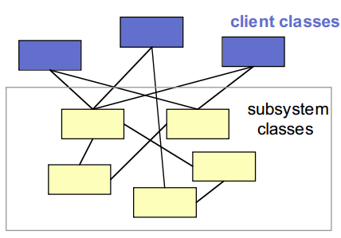

- Bau einer Fassade, hinter der die Komplexität versteckt wird.

- Einfaches Interface zu einem komplexen Subsystem

- Viele Abhängigkeiten zwischen Klassen werden durch Facade reduziert

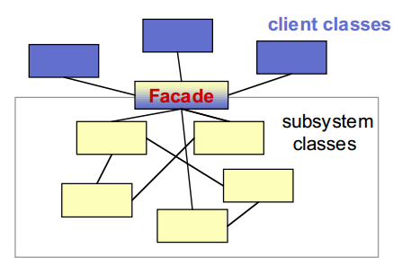

### Facade-Beispiel

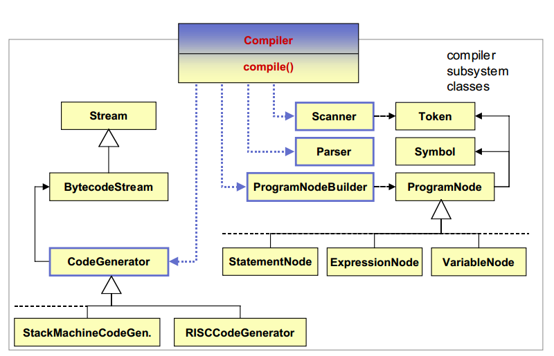

### GoF-Pattern Übersicht

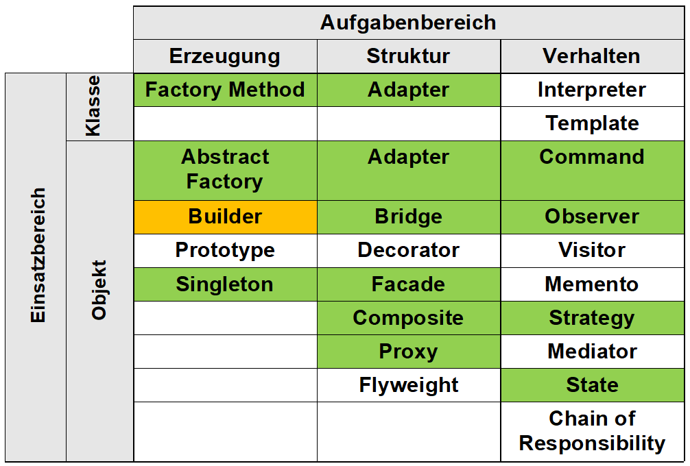

## Builder

### Builder-Pattern

- zu einem komplexen Objekt existieren unterschiedliche Darstellungen

- die Konstruktion eines komplexen Objekts ist unabhängig von der Erzeugung der Bestandteile

- Trennung des Erzeugungsprozesses einer komplexen Objektstruktur von der internen Darstellung der Objektstruktur

- Es trennt die	Konstruktion komplexer	Objekte	von deren Repräsentationen, wodurch dieselben Konstruktionsprozesse wiederverwendet werden können

- Die Implementierungen der Konstruktion und der Repräsentationen werden isoliert

- Builder versteckt interne Repräsentation vor dem Direktor

- Neue Repräsentationen lassen sich leicht durch neue konkrete Builderklasse einfügen

- Der Konstruktionsprozess wird an einer eindeutigen Stelle (im Direktor) gesteuert. Spätere Änderungen lassen sich ohne Änderung der Klienten realisieren


### Akteure

- Vier Akteure: Builder, ConcreteBuilder, Product, Director
- Builder
    - spezifiziert abstrakte Schnittstelle zur Erzeugung der Teile eines komplexen Objekts
- ConcreteBuilder
    - implementiert die Schnittstelle und erzeugt die Einzelteile
    - Definiert und verwaltet die von ihm erzeugte Präsentation
- Director
    - konstruiert das komplexe Objekt unter Verwendung der Schnittstelle des Builders
    - Kennt die benötigte Baureihenfolge
- Product
    - Ist das komplexe Objekt

<center>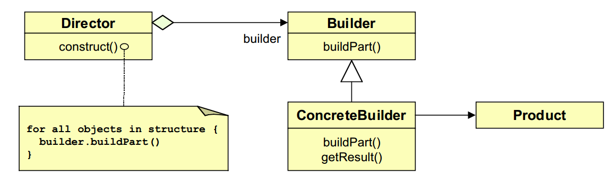</center>

<center></center>

### Beispiel für ein konkrete Anwendung des Builder-Patterns:

Lesen von RTF-Dateien und Konvertieren nach LaTex, Text, PDF, etc.

<center>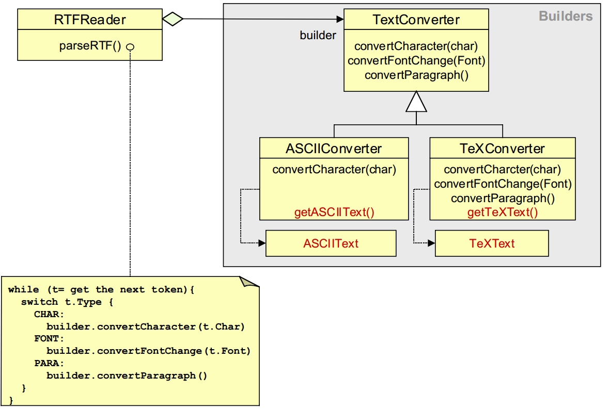</center>

### GoF Pattern Übersicht

<center>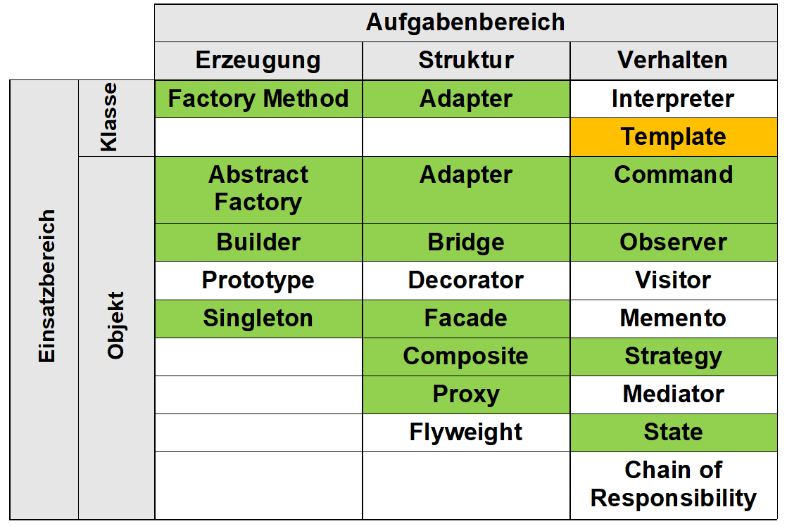</center>

## Template Method

- Eine abstrakte Klasse legt den Ablauf der Methode vor
- Subklassen dürfen diese Methode implementieren
- Eine Template Method muss final sein, damit sie nicht überschrieben werden kann
- Dadurch hat die Methode immer den gleichen Ablauf, aber liegt in Verantwortung bei den Subklassen

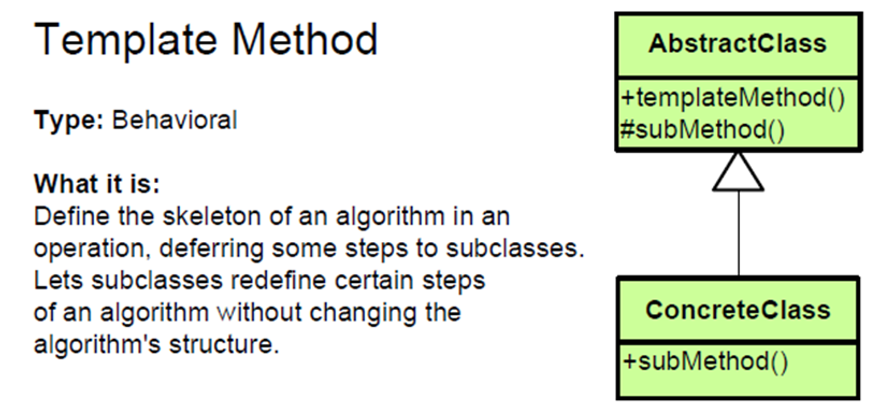

### Code Beispiel

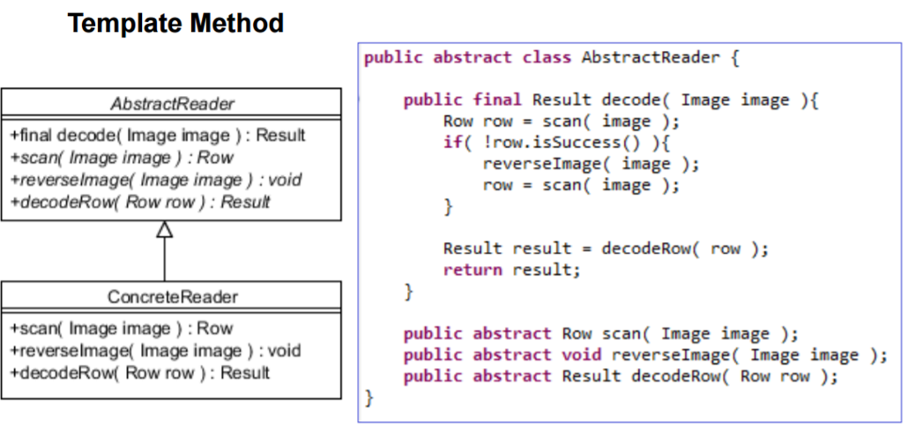

### Strategy Pattern vs Template Method pattern

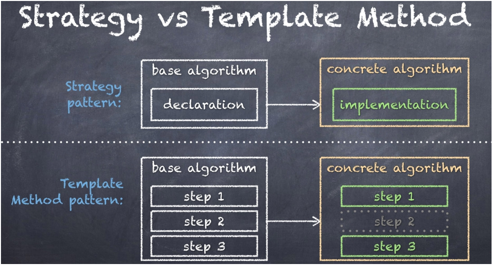
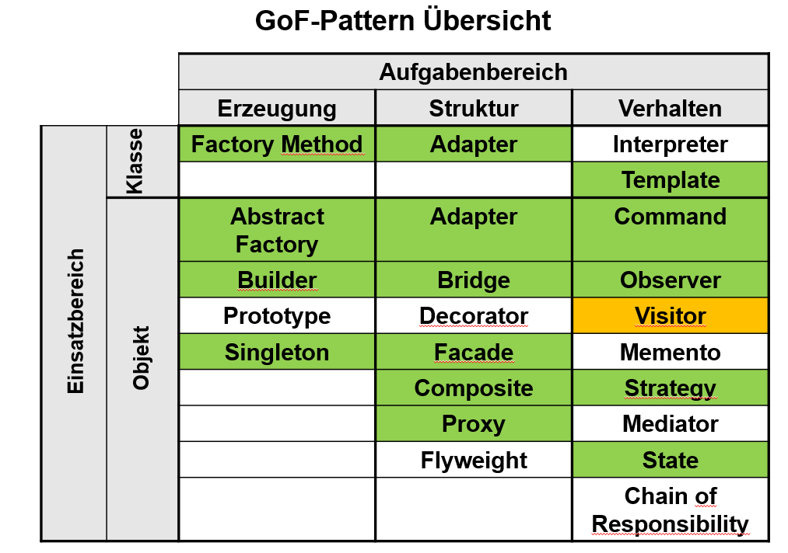

## Visitor

### Verhaltensmuster

#### Zweck

- Stellt eine allgemeine Möglichkeit zur Traversierung einer beliebigen Objektstruktur zur Verfügung
- Kapselt eine auf den Elementen einer Objektstruktur auszuführende Operation als ein Objekt.
- Trennt die Datenstruktur von den Operationen, die auf der Objektstruktur auszuführen sind.
- Ermöglicht es, eine neue Operation zu definieren, ohne die Klassen der von ihr bearbeiteten Elemente zu verändern.

#### Beispiel

- Compilerbau: Erzeugen des Quellcodes aus abstraktem Syntaxbaum
- Interpreter: Berechne dynamisch das Ergebnis eines Ausdrucks

#### Visitor und ObjectStructure

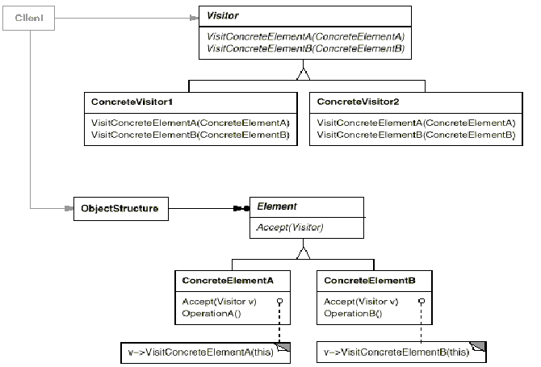

### Visitor-Implementierung

#### Visitor

- deklariert für jede Klasse konkreter Elemente eine Besuchsfunktion

#### ConcreteVisitor

- implementiert Besuchsfunktionen
- jede Besuchsfunktion ist ein Fragment des Algorithmus, welcher auf der gesamten Objektstruktur angewendet wird
- lokaler Zustand des Besuchers dient als Kontext für den Algorithmus

#### Element

- deklariert eine Schnittstelle zum Empfang eines Besuchers

#### ConcreteElement

- implementiert den Empfang eines Besuchers
- Definiert, wie das konkrete Element traversiert wird
- Gibt Visitor an Kindelement weiter

#### ConcreteElement und ConcreteVisitor

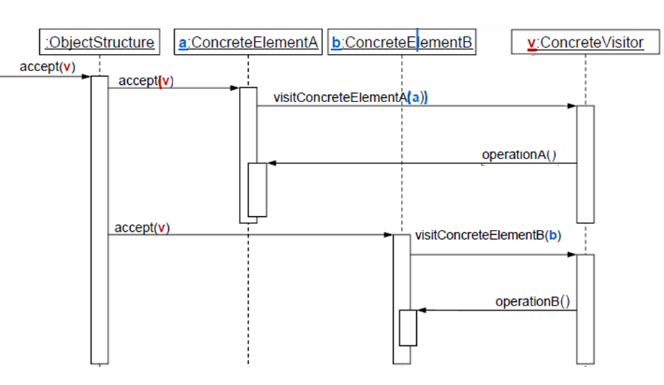

## Architekturmuster vs. Entwurfsmuster

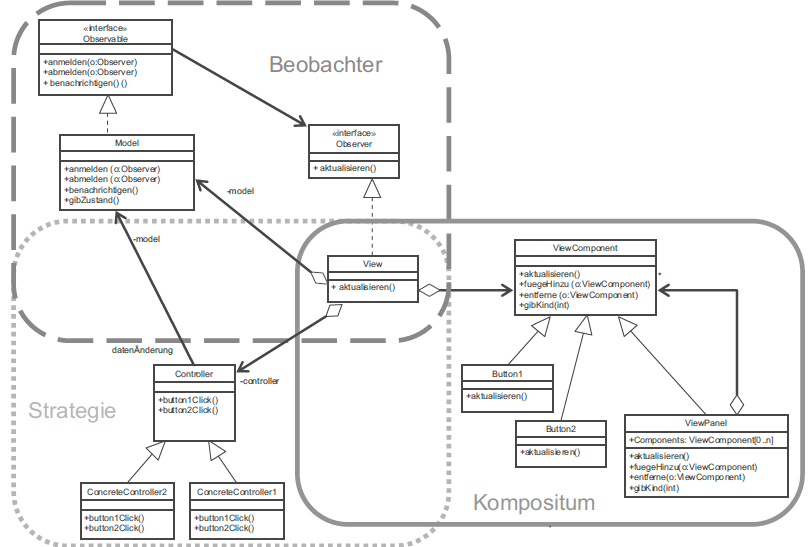

### Active Model View Controller

- View

    - implementiert bei Bedarf das Composite Pattern
  
- Model

    - Implementiert Beobachter-Muster (Publish-Subscribe)
    - Model ist das beobachtete Objekt
    - Hat 1...n Beobachter, nämlich die Views
    - Das Model bietet Mechanismus, bei denen sich die Beobachter registrieren
    - Datenänderung über update-Methode der Views

- Controller 

    - Kann bei Bedarf Strategy Pattern verwenden
	
## Zusammenfassung

#### Abstrakte Fabrik (Abstract Factory, Seite 93)

Biete eine Schnittstelle zum Erzeugen von Familien verwandter oder voneinander abhängiger Objekte, ohne ihre konkreten Klassen zu benennen.

#### Adapter (Adapter, 151)

Passe die Schnittstelle einer Klasse an eine andere von ihren Klienten erwartete Schnittstelle an. Das Adaptermuster läßt Klassen zusammenarbeiten, die wegen inkompatibler Schnittstellen ansonsten dazu nicht in der Lage wären.

#### Befehl (Command, 245)

Kapsle einen Befehl als ein Objekt. Dies ermöglicht es, Klienten mit verschiedenen Anfragen zu parametrieren, Operationen in eine Queue zu stellen, ein Logbuch zu führen und Operationen rückgängig zu machen.

#### Beobachter (Observer, 257)

Definiere eine 1-zu-n-Abhängigkeit zwischen Objekten, so daß die Änderung des Zustands eines Objekts dazu führt, daß alle abhängigen Objekte benachrichtigt und automatisch aktualisiert werden.

#### Besucher (Visitor, 269)

Kapsle eine auf den Elementen einer Objektstruktur auszuführende Operation als ein Objekt. Das Besuchermuster ermöglicht es Ihnen, eine neue Operation zu definieren, ohne die Klassen der von ihr bearbeiteten Elemente zu verändern.

#### Brücke (Bridge, 165)

Entkopple eine Abstraktion von ihrer Implementierung, so daß beide unabhängig voneinander variiert werden können.

#### Dekorierer (Decorator, 177)

Erweitere ein Objekt dynamisch um Zuständigkeiten. Dekorierer bieten eine flexible Alternative zur Unterklassenbildung, um die Funktionalität einer Klasse zu erweitern.

#### Erbauer (Builder, 103)

Trenne die Konstruktion eines komplexen Objekts von seiner Repräsentation, so daß derselbe Konstruktionsprozeß unterschiedliche Repräsentationen erzeugen kann.

#### Fabrikmethode (Factory Method, 115)

Definiere eine Klassenschnittstelle mit Operationen zum Erzeugen eines Objekts, aber lasse Unterklassen entscheiden, von welcher Klasse das zu erzeugende Objekt ist. Fabrikmethoden ermöglichen es einer Klasse, die Erzeugung von Objekten an Unterklassen zu delegieren.

#### Fassade (Facade, 189)

Biete eine einheitliche Schnittstelle zu einer Menge von Schnittstellen eines Subsystems. Die Fassadenklasse definiert eine abstrakte Schnittstelle, welche die Verwendung des Subsystem vereinfacht.

#### Fliegengewicht (Flyweight, 199)

Nutze Objekte kleinster Granularität gemeinsam, um große Mengen von ihnen effizient verwenden zu können.

#### Interpreter (Interpreter, 285)

Definiere für eine gegebene Sprache eine Repräsentation der Grammatik sowie einen Interpreter, der die Repräsentation nutzt, um Sätze in der Sprache zu interpretieren.

#### Iterator (Iterator, 299)

Ermögliche den sequentiellen Zugriff auf die Elemente eines zusammengesetzten Objekts, ohne seine zugrundeliegende Repräsentation offenzulegen.

#### Kompositum (Composite, 213)

Füge Objekte zu Baumstrukturen zusammen, um Teil-Ganzes—Hierarchien zu repräsentieren. Das Kompositionsmuster ermöglicht es Klienten, einzelne Objekte sowie Kompositionen von Objekten einheitlich zu behandeln.

#### Memento (Memento, 317)

Erfasse und externalisiere den internen Zustand eines Objekts, ohne seine Kapselung zu verletzen, so daß das Objekt später in diesen Zustand zurückversetzt werden kann.

#### Prototyp (Prototype, 127)

Bestimme die Arten zu erzeugender Objekte durch die Verwendung eines prototypischen Exemplars, und erzeuge neue Objekte durch Kopieren dieses Prototypen.

#### Proxy (Proxy, 227)

Kontrolliere den Zugriff auf ein Objekt mit Hilfe eines vorgelagerten Stellvertreterobjekts.

#### Schablonenmethode (Template Method, 327)

Definiere das Skelett eines Algorithmus in einer Operation und delegiere einzelne Schritte an Unterklassen. Die Verwendung einer Schablonenmethode ermöglicht es Unterklassen, bestimmte Schritte eines Algorithmus zu überschreiben, ohne seine Struktur zu veränden.

#### Singleton (Singleton, 139)

Sichere ab, daß eine Klasse genau ein Exemplar besitzt, und stelle einen globalen Zugriffspunkt darauf bereit.

#### Strategie (Strategy, 333)

Definiere eine Familie von Algorithmen, kapsele jeden einzelnen und mache sie austauschbar. Das Strategiemuster ermöglicht es, den Algorithmus unabhängig von ihn nutzenden Klienten zu variieren.

#### Vermittler (Mediator, 345)

Definiere ein Objekt, welches das Zusammenspiel einer Menge von Objekten in sich kapselt. Vermittler fördern lose Kopplung, indem sie Objekte davon abhalten, auf einander explizit Bezug zu nehmen. Sie ermöglichen es Ihnen, das Zusammenspiel der Objekte von ihnen unabhängig zu variieren.

#### Zustand (State, 357)

Ermögliche es einem Objekt, sein Verhalten zu ändern, wenn sein interner Zustand sich ändert. Es wird so aussehen, als ob das Objekt seine Klasse gewechselt hat.

#### Zuständigkeitskette (Chain of Responsibility, 367)

Vermeide die Kopplung des Auslösers einer Anfrage an seinen Empfänger, indem mehr als ein Objekt die Möglichkeit erhält, die Anfrage zu erledigen. Verkette die empfangenden Objekte, und leite die Anfrage an der Kette entlang, bis ein Objekt sie erledigt.
