# Vorlesung 13: Entwurfsmuster

## Einleitung

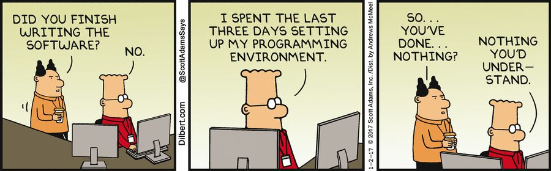

### Was sind Entwurfsmuster?

* Ein Entwurfsmuster ist kein fertiger Programmcode, der direkt eingesetzt werden kann, sondern eine Art Schablone für die bewährte und generische Lösung eines immer wiederkehrenden Entwurfsproblems
* Also: Entwurfsmuster müssen auf das jeweilige Problem angewendet werden, also immer wieder neu implementiert werden
* Dienen der Wiederverwendbarkeit von Entwurfswissen und erleichtert Kommunikation unter Software-Entwicklern
* Kombination von Klassen zu größeren Einheiten, unabhängig von der Programmiersprache
* Patterns vs. Algorithmen:
  * Algorithmen lösen feinkörnige Probleme als Patterns (z.B. Suchen, Sortieren)
* Patterns vs. Frameworks:
  * Framework beinhaltet eine Menge von kooperierenden Köassen für einen spezifischen Anwendungsbereich erweiterbar durch Unterklassenbildung
  * Patterns sind abstrakter: Frameworks existieren als konkreter, wiederverwendbarer Code; Patterns enthalten nur Beispiele von Code
  * Patterns sind weniger spezifisch: Frameworks werden für konkrete Anwendungsbereiche eingesetzt - Patterns können fast überall eingesetzt werden

| Vorteile                                 | Nachteile                                |
| ---------------------------------------- | ---------------------------------------- |
| Verbessert Kommunikation zwischen Entwicklern, so dass diese über den Softwareentwurf auf Abstrakter Ebene diskutieren können | Design zur Entwurfs- bzw. Konzeptionszeit sehr aufwändig |
| Idee eines Entwurfs ist in den Mustern erkennbar | Muster sind ohne eine graphische Visualisierung (UML) im Code schwer zu erkennen |
| Wartbarkeit, Änderbarkeit und Wiederverwendbarkeit des Codes ist besser | Für Anfänger besteht ein hoher Enarbeitungsaufwand in die Ideen und Anwendbarkeit der Entwurfsmuster |

### Aufbau von Entwurfsmuster-Katalogen

Beschreibungen von Entwurfsmustern in einem Katalog enthalten folgende Attribute:

* Name, Übersicht, Motivation (z.B. Anwendungsbeispiel), Lösung (beteiligte Objekte,

  Klassen und ihre Beziehungen), Implementierung (mit Code-Fragmenten), bekannte
  Anwendungsfälle (z. B. in der Java-SDK), verwandte Patterns

### Entwurfsmuster und UML

* Bei der Beschreibung von Entwurfsmustern werden UML Diagramme verwendet (Klassen- und Sequenzdiagramme)

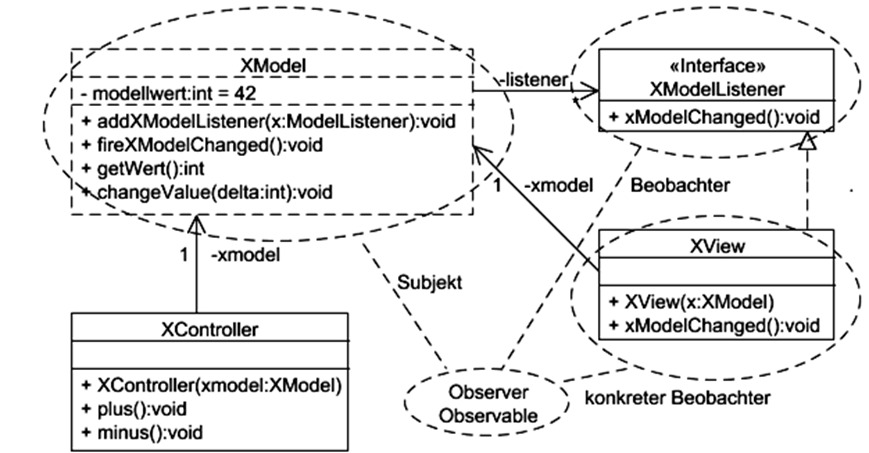

* Pattern-Name im gestrichelten Kreis, verbunden im eingekreisten Klassen, verbunden im Pattern und Benennung der Rollen

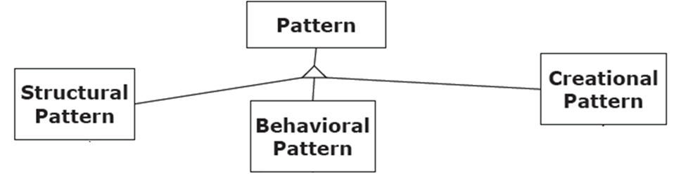

* **Erzeugungspattern** behandeln die Objekterzeugung und sollen das Wissen über die konkreten Klassen des Systems vor dem Benutzer verstecken mit dem Ziel der Konfigurierbarkeit und Änderbarkeit
* **Strukturpatterns** befassen sich mit der Komposition von Klassen und Objekten, um größere Strukturen zu bilden
* **Verhaltenspatterns** behandeln Objektinteraktion und -Verantwortlichkeiten. Sie charakterisieren die Art udn Weise, in der Klassen und Objekte zusammenarbeiten

### Probleme im Entwurf und Entwurfsmuster als Lösung

* Objekte einer gest benannten Klasse erzeugen
  * Lösung: Abstract Factory, Factory Method
* Abhängigkeit von speziellen Implementierungen
  * Lösung: Abstract Factory, Bridge
* Abhängigkeit von speziellen Algorithmen
  * Lösung: Strategy
* Zu enge Kopplung
  * Lösung: Abstract Factory, Bridge, Observer

### Überblick der vorgestellten Entwurfsmuster

* Abstract Factory: 	
  * Erzeugen von verwandten Objekten ohne Konstruktoraufruf
* Factory Method:
  * Erzeugung von Objekten deren Typ
    in Unterklassen bestimmt wird
* Builder:
  * Einen komplexen Erzeugungsprozessverbergen
* Singleton:
  * Instanziierung einerKlasse durch genau ein Objekt
* Adapter:
  * eine Schnittstelledurch Delegation (Objektadapter) oder Vererbung (Klassenadapter) an eineandere Schnittstelle anpassen
* Brücke:
  * Abstraktion und Implementierungvoneinander trennen
* Facade:
  * eineeinfache Schnittstelle auf Basiseiner umfangreichen und allgemeinen Schnittstelleerstellen
* Composite:
  * eine Objektstruktur durchUnterklassen abbilden, um so einzelne Instanzenund Gruppen von Instanzen gleichbehandeln zu können
* Proxy:
  * transparenter Zugriff auf(entfernte) Funktionalitäten über Stellvertreterobjekte
* Template Method:
  * Konkrete Schritte einesfestgelegten Algorithmus in Unterklassen implementieren
* Command:
  * Kontrollfluss in Klassenkapseln zwecks Mehrfachverwendung
* Observer:
  * Publish/subscribe Mechanismus
* Visitor:
  * kapselt eine Methode, die aufeiner Objektstruktur ausgeführt werden soll
* Strategy:
  * Unterstützung vonunterschiedlichen Algorithmen
* State:
  * Verhaltensänderung einesObjektes nach Zustandsänderung

### GoF-Pattern Übersicht

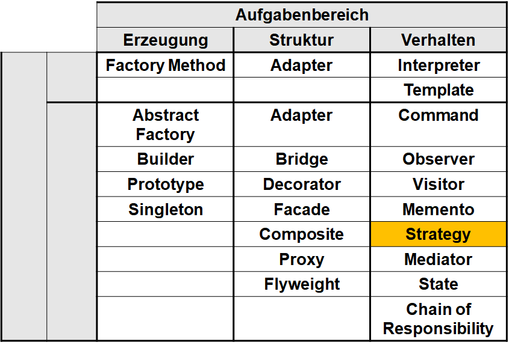

## Strategy

- Problem: Für einen Algorithmus gibt es verschiedene Möglichkeiten, sie zu implementieren.
  - Die Implementierung soll zur Laufzeit leicht ausgetauscht werden können, um die effizienteste/schnellste/beste zu wählen
- Lösung: Kapselung einer Familie von Algorithmen durch eine Schnittstelle

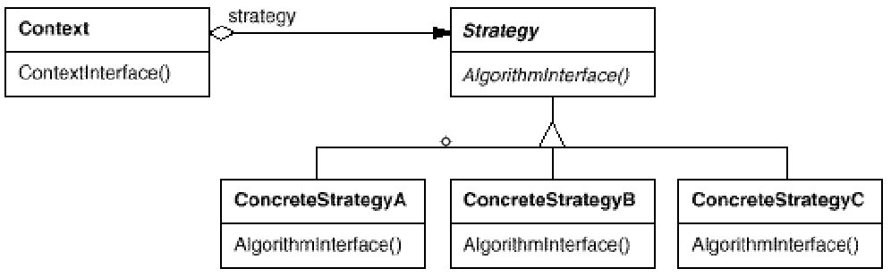

### Strategy – Lösungsbeispiel 1

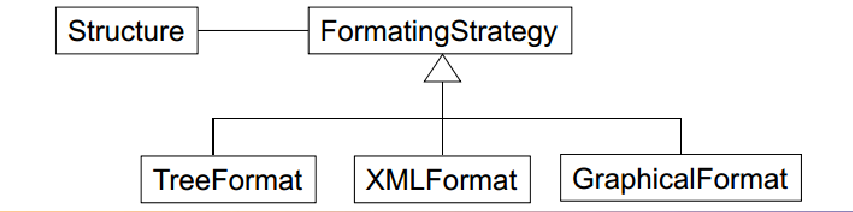

### Strategy – Lösungsbeispiel 2

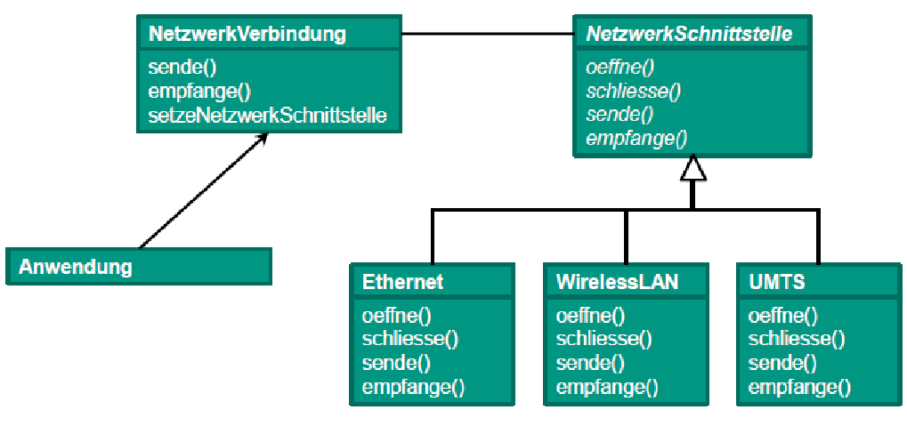

### GoF - Pattern Übersicht

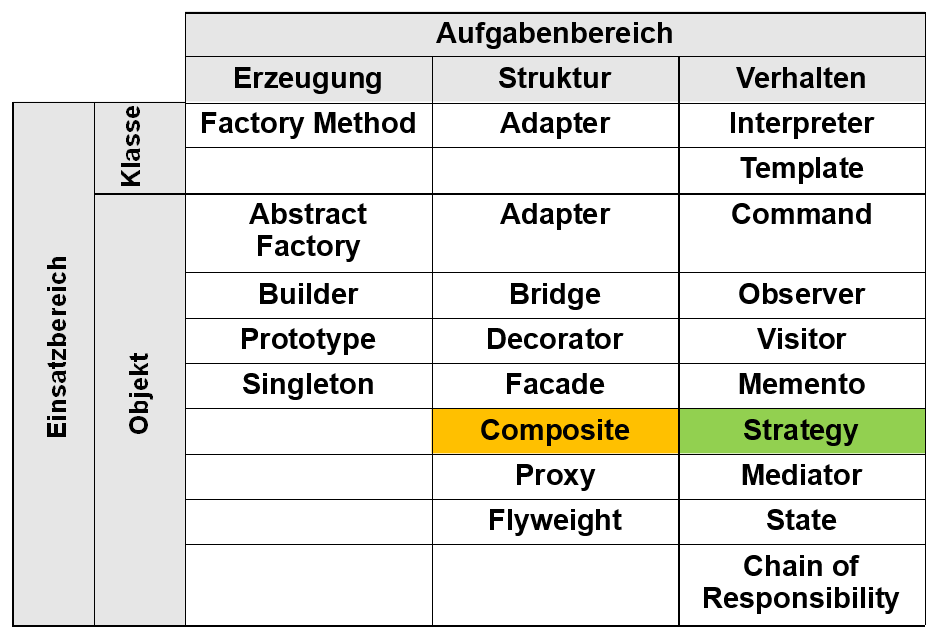

## Composite

### Strukturmuster - Composite (Kompositum)

- Objekt-Hierarchien treten überall dort auf, wo komplexe Strukturen modelliert werden (graphische Anwendungen, Textverarbeitung, Dateisysteme, usw.)
- dabei werden einfache Objekte zu Gruppen zusammengefasst, welche wiederum zu größeren Gruppen zusammengefügt werden können (Teil-Ganzes-Hierarchie)
- gemeinsame Eigenschaften von Objekt und Gruppe werden vom Kompositum isoliert und daraus wird eine Oberklasse gebildet
- einzelne Instanzen und Gruppen von Instanzen können somit gleich behandelt werden

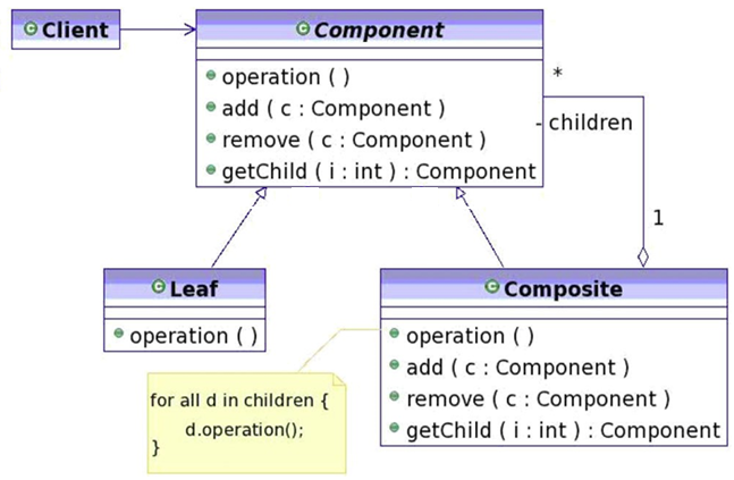

**Component:**
- Basisklasse
- deklariert die Schnittstelle für Objekte in der zusammengefügten Struktur
- implementiert ein Default-Verhalten
- deklariert eine Schnittstelle zum Zugriff auf Kindobjekte
- häufig abstrakt

**Leaf:**
- repräsentiert Blattobjekte, die keine Kinder haben

**Composite:**
- enthält weitere Composite-Elemente und/oder Leaf-Elemente
- definiert Verhalten für Objekte mit Kindern
- speichert Kindobjekte
- Implementiert kindobjekt-bezogene Operationen

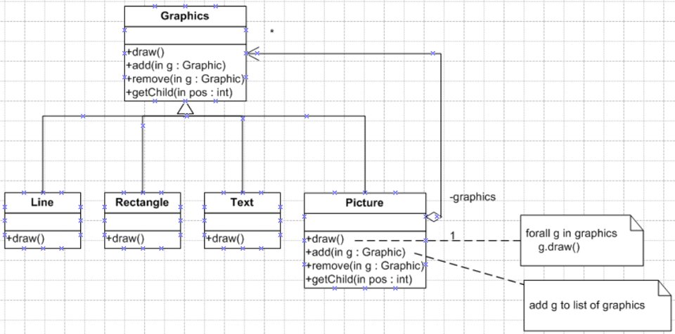

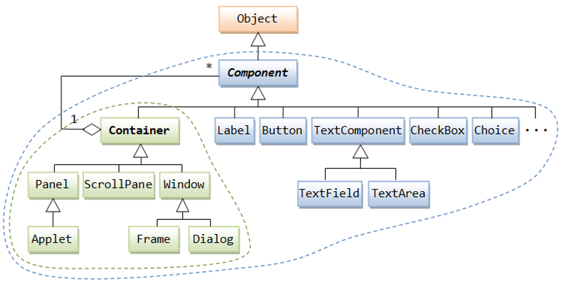

### GoF - Pattern Übersicht

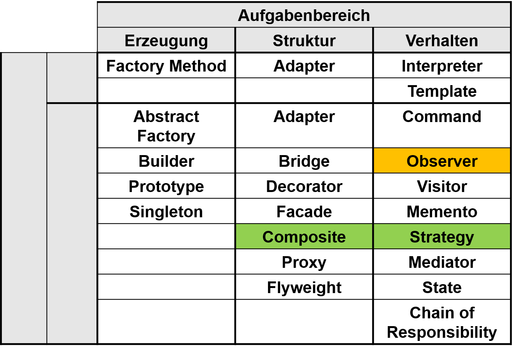

## Observer

### Observer - Observable (Beobachter)
- Auch "Publish-Subscribe oder "(Event-)Listener"
- Objekte zueinander konsistent halten, ohne diese eng miteinander zu koppeln
- Subjekte bieten die Möglichkeit, dass sich Interessenten anmelden (z. B. Kanal abonnieren)
- Bei jeder Subjektzustandsänderung werden diese Interessenten informiert (z. B. neue Nachrichten)
- Observable (= Subjekt)
  - register oder addListener (Observer registrieren)
  - unregister oder removeListener (registrierte Observer entfernen)
  - noftiy, notifyAll (update-Methoden aller registrierten Observer aufrufen)
  - setState (zustandsändernde Operation(en) für beliebige Clients)
  - getSate (Abfrage des aktuellen Zustands)
- Observer (= Interessent)
  - update (Reaktion auf Zuständsänderung des Subjekts)
    
    

### GoF-Pattern Übersicht


## Command
Bei einer Textverarbeitung können viele Funktionen von unterschiedlichen Stellen aus aufgerufen werden, z.B. Menü, Button, Popup-Menü bei Rechtsklick, Tastaturkürzel

* Die Funktion soll nicht immer neu implementiert werden
* Die Funktion soll rückgängig gemacht werden können
* Die Funktion soll mehrfach ausgeführt werden

Wie kann das softwaretechnisch realisiert werden, wenn die Funktionen eng mit den aufrufenden Objekten verbunden sind?

**Lösung:**
* Den Befehl in einer Klasse kapseln
* Der selbe Befehl kann von mehreren Stellen aus aufgerufen werden
* Die Befehsobjekte können in einer Befehlsgeschichte gespeichert werden
* Operation als Objekte mit Methode **execute()** darstellen
* Rückgängig mit Methode **undo()**

### UML-Diagramm
<center></center>

### Beispielprogramm
<center></center>

### Verbindung von Observer und Command in java
* Observer
  * Buttons, Menü-Einträge und Tasten generieren "ActionEvents"
  * Interface "ActionListener" ist vordefiniert
* Das "ActionListener„-Interface  implementieren und dann Instanzen davon bei Buttons, MenuItems, etc. registrieren

#### Elegante Verbindung von Observer und Command
* Commands sind **ActionListener** von Buttons, Menüs, etc.
* Einheitlicher Aufruf via **actionPerformed(ActionEvent evt)**
* Buttons und Menüs sind **PropertyChangeListener** von Commands
* Aktivierung / Deaktivierung

#### Wiederverwendung
* Gleiche **Action** für Menu, Button, Key

### Oberserver und Command in Java
<center></center>
<center></center>

### GoF Pattern Übersicht
<center></center>

## Adapter

### Zweck

- Adapter (Synonym: Wrapper) passt die Schnittstelle einer Klasse an eine andere Schnittstelle an, die von ihren Klienten erwartet wird
- lässt Klassen zusammenarbeiten, die wegen inkompatibler Schnittstellen ansonsten dazu nicht in der Lage wären

<center></center>

### Adapter

- „Adapter“ erbt von und verhält sich wie „Ziel“ und benutzt die „Adaptierte Klasse“
- Adapter leitet Aufruf der gewünschten Funktionalität an die adaptierte Klasse weiter

<center></center>

### Objekt-Adapter

<center></center>

<center></center>

### Klassen-Adapter

<center></center>

<center></center>

### GoF Pattern Übersicht

<center></center>

## Bridge

## Factory Method

## Abstract Factory

## Proxy
* Proxy als Stellvertreter zu einem anderen Ding
* Client kommuniziert nur über eine Schnittstelle mit dem Proxy bzw. realen Subjekt
* Der Zugriff auf die „wertvolle“ Ressource wird durch eine vorgeschaltete Klasse gesteuert
* Der Nutzer des Proxys nutzen diesen wie die eigentliche Klasse

<center></center>

### Typische Beispiele: Remote Proxy
* Ein Objekt liegt auf einem anderen Rechner.
  Das RemoteProxy ist die Schnittstelle zum entfernt liegenden Objekt
* Ein Remote-Proxy ist ein lokaler Stellvertreter für ein Objekt in
  einem anderen Adressraum. Er wird beispielsweise in Netzwerkanwendungen verwendet

<center></center>

### Andere Proxy-Beispiele
* Ein virtueller Proxy dient der Verzögerung „teurer“ Operationen auf den
  Zeitpunkt des tatsächlichen Bedarfs
* Ein Schutzproxy setzt Zugriffsrechte auf ein Objekt durch

<center></center>

### Proxy-Impementierungsmöglichkeiten

```java
public interface KlasseMitWertvollemInhalt {
	public int anfrage(String details);
}
```
```java
public class RealeKlasse implements KlasseMitWertvollemInhalt {

	private Verbindung verbindung;

	public RealeKlasse(String verbindungsdaten){
		verbindung = new Verbindung(verbindungsdaten);
	}

	public int anfrage(String details){
		return verbindung.befragen(details);
	}
}
```
```java
public class Proxy implements KlasseMitWertvollemInhalt {

    private static RealeKlasse realesObjekt;

	public Proxy() {
		if (realesObjekt == null)
            realesObjekt = new RealeKlasse("Spezialinfos");
	}

	public int anfrage(String details) {
		return realesObjekt.anfrage(details);
	}
}
```
```java
public class Nutzer {

	public int proxyNutzen(String anfrage) {
		KlasseMitWertvollemInhalt k = new Proxy();
		return k.anfrage(anfrage);
	}

	public static void main(String[] s) {
		Nutzer n = new Nutzer();
		System.out.println(n.proxyNutzen("gib41"));
	}
}
```


### Unterschied zwischen Proxy vs. Adapter vs. Facade vs. Bridge
#### Proxy
* hat dieselbe Schnittstelle wir das „reale Subjekt“
* macht einen Zugriff auf eine Implementation über die gleiche Abstraktion mittelbar
  über ein anderes Objekt (z.B. wegen Remote, Cache, Logging, Locking, Zugriffsrecht, etc.)

#### Adapter
* Ein Adapter kann eine andere Schnittstelle besitzen
* passt eine vorgegebene Implementation an eine nicht kompatible Abstraktion an
* wird benutzt, nachdem die Software von unterschiedlichen Parteien nacheinander implementiert wurde
* dient dazu, voneinander unabhängigen Code “zusammen zu schweißen”
* “Fix” für das Problem, wenn externe Bibliotheken zu einem Softwaresystem hinzugefügt werden

#### Facade
* fasst mehrere Schnittstellen zu einer Schnittstelle zusammen

#### Bridge
* trennt Implementation von Abstraktion (=Interface), um beide unabhängig
  voneinander variieren zu können
* wird bereits vor der Implementierung “angedacht” und benutzt, so dass die Abstraktion
  und Implementierung unabhängig voneinander entwickelt und die Implementierung ausgetauscht werden kann

### GoF-Pattern Übersicht
<center></center>


## State

## Singleton

### Erzeugermuster

- **Zweck:** Absichern, dass eine Klasse genau eine Objektinstanz besitzt und durch einen globalen Zugriffspunkt bereitgestellt wird.
- **Beispiel:** Logging oder gemeinsamer Zugriff auf Ressourcen.
- **Implementierung:** Die Objektinstanz wird erzeugt wenn sie benötigt wird(Lazy loading). Bei weiteren Anfragen wird nur die Referenz des bereits erzeugten Objekts zurück gegeben. Nutzer dürfen keine Konstruktoren aufrufen, da es sonst mehrere Objekte gibt(Konstruktoren werden private). Das Objekt ist über eine Klassenmethode zugreifbar.


**Nachteile:**
- Die Kopplung wird erhöht, was die Wartbarkeit einschränkt.
- Wann kann die Ressourcen-Freigabe eines Singletons erfolgen?
- Notwendige Synchronisation bei multithreaded-Applikationen
- Singletons in Clusterumgebungen

<center>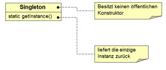</center>

<center>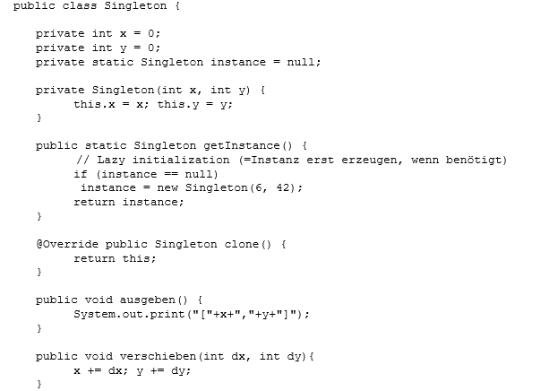</center>

<center>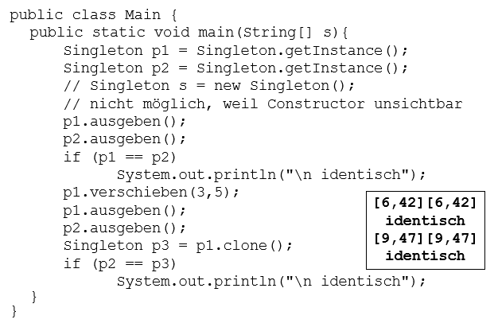</center>

### GoF Pattern Übersicht

<center>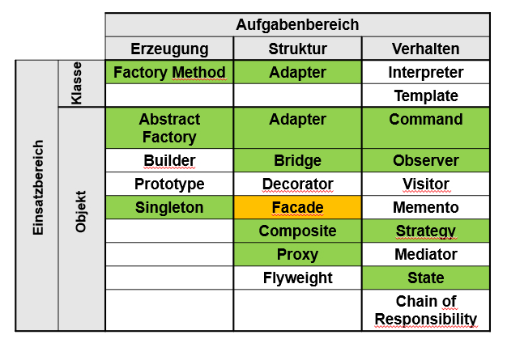</center>

## Facade

## Builder

### Builder-Pattern

- zu einem komplexen Objekt existieren unterschiedliche Darstellungen 

- die Konstruktion eines komplexen Objekts ist unabhängig von der Erzeugung der Bestandteile

- Trennung des Erzeugungsprozesses einer komplexen Objektstruktur von der internen Darstellung der Objektstruktur

- Es trennt die	Konstruktion komplexer	Objekte	von deren Repräsentationen, wodurch dieselben Konstruktionsprozesse wiederverwendet werden können

- Die Implementierungen der Konstruktion und der Repräsentationen werden isoliert	

- Builder versteckt interne Repräsentation vor dem Direktor	

- Neue Repräsentationen lassen sich leicht durch neue konkrete Builderklasse einfügen	

- Der Konstruktionsprozess wird an einer eindeutigen Stelle (im Direktor) gesteuert. Spätere Änderungen lassen sich ohne Änderung der Klienten realisieren


### Akteure

- Vier Akteure: Builder, ConcreteBuilder, Product, Director
- Builder 
    - spezifiziert abstrakte Schnittstelle zur Erzeugung der Teile eines komplexen Objekts 
- ConcreteBuilder 
    - implementiert die Schnittstelle und erzeugt die Einzelteile
    - Definiert und verwaltet die von ihm erzeugte Präsentation 
- Director 
    - konstruiert das komplexe Objekt unter Verwendung der Schnittstelle des Builders
    - Kennt die benötigte Baureihenfolge	
- Product
    - Ist das komplexe Objekt
  
<center></center>

<center></center>

### Beispiel für ein konkrete Anwendung des Builder-Patterns: 

Lesen von RTF-Dateien und Konvertieren nach LaTex, Text, PDF, etc.

<center></center>

### GoF Pattern Übersicht

<center></center>

## Template Method

## Visitor

## Architekturmuster vs. Entwurfsmuster

## Fazit
