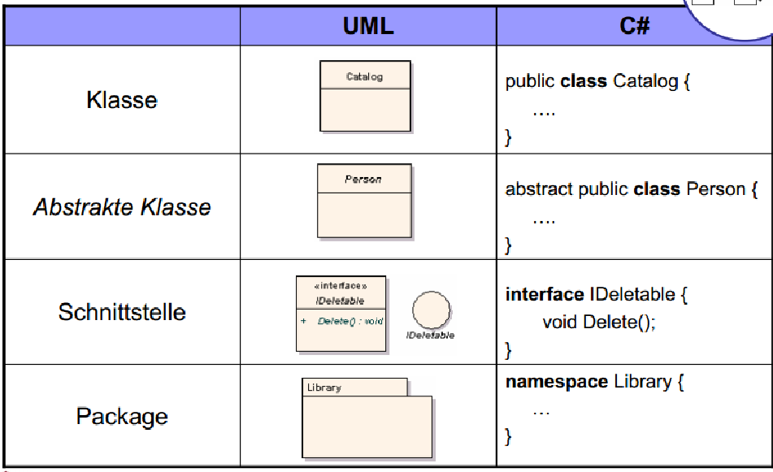
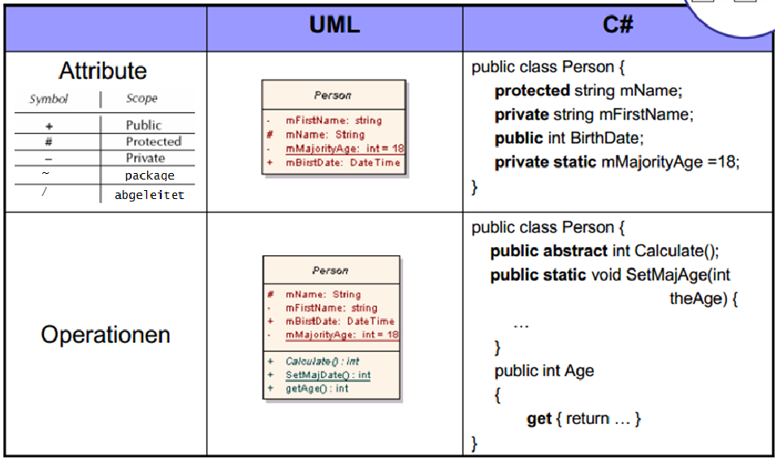
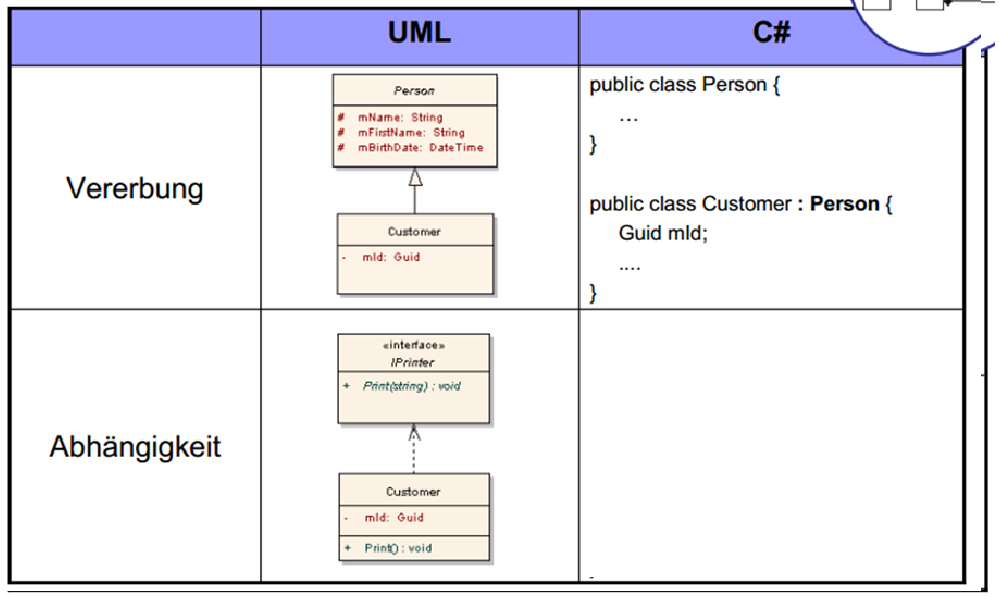
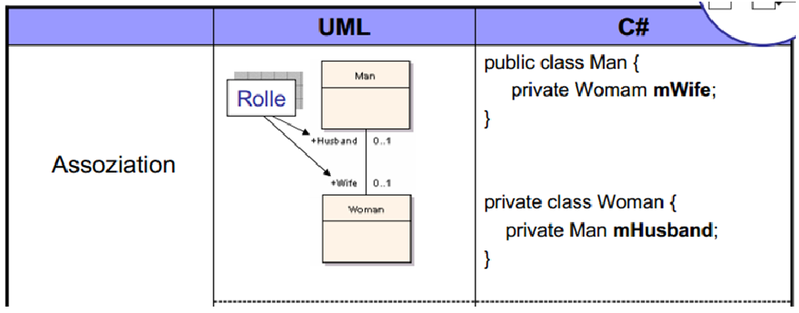
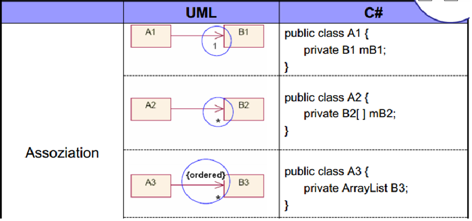
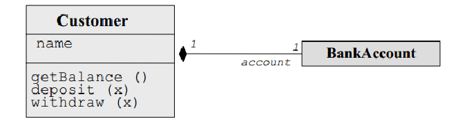
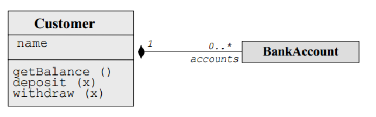
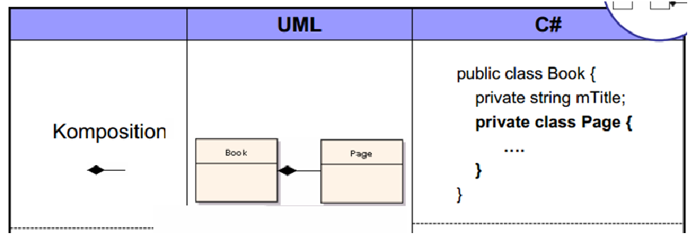
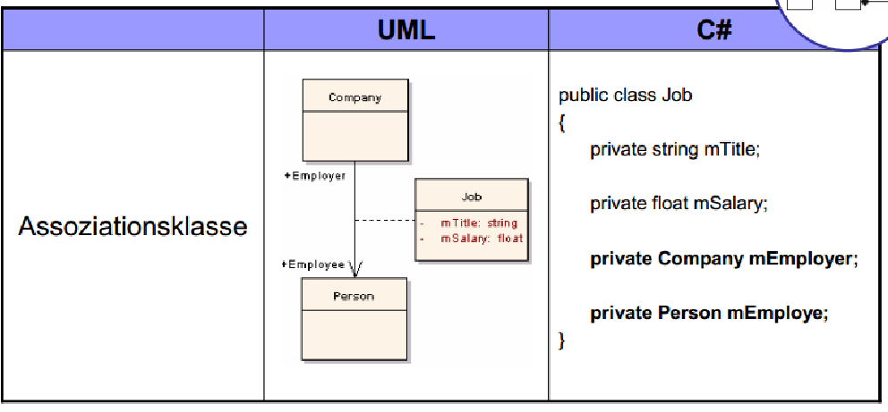

# Vorlesung 14: Implementierung und Dokumentation

## Einleitung

## Übersetzung von UML Klassendiagrammen in objektorientierte Programmiersprachen



- Bei Übersetzung in Source-Code auf Vererbung und Sichtbarkeit achten
- Es kann vereinbart werden, dass get- und set-Methoden in Klassendiagrammen weggelassen werden



### Attribute mit package-scope("~")

Klassendiagramm mit Klasse „A“ und Attribute i:

```java
~ int i; 

Java Source Code:

public class A { 
  int i;
}
```

### abgeleitetes Attribut("/")

Klassendiagramm mit Klasse „A“ und Attribute „enthalteneMehrwertSteuer“:

```java
public class A { 
  static double mwst = 19;
  double preis;
  public getEnthalteneMehrwertSteuer() {
     return preis - (preis / (1 + (mwst/100)));
  }
 }
```


**Umwandlung UML in Programmcode – Beziehungen**




- Bei Übersetzung von Aggregation, Komposition auf Richtung und Kardinalitäten achten 


- Objektreferenz darf nie null sein. Also bei der Deklaration der Instanzvariable oder im Konstruktor setzen


**Code:**

```java
public class Projektaufgabe	{

private Mitarbeiter bearbeiter; 

	public Mitarbeiter getBearbeiter()	{
		return	bearbeiter;
	}

	public void setBearbeiter(Mitarbeiter bearbeiter)	{
		this.bearbeiter	= bearbeiter;
	}
}
```


### Assoziation




```java
class Dekan{
	...
	private Fakultaet rFakultaet;
	...
	public Fakultaet getFakultaet() {
		return rFakultaet;
	}
}

class Fakultaet {
	...
	private Dekan rDekan;
	...
	public Dekan getDekan(){
		return rDekan;
	}
}
```

- Die entsprechenden Rollen werden als Attribute in die jeweils gegenüberliegende Klasse eingefügt
- Ist die Multiplizit#t 0... 1, kann das entsprechende Attribut unter Umständen auch den wert *null* haben.

### Kardinilität n

- Umsetzung als Collection(Array, Container)


- Umsetzung hängt von Art der Collection ab
    - Sollen Datein geordnet sein?
    - Sind doppelte Einträge erlaubt?
    - Gibt es spezielle Zuordnung key -> value?

- Multiplizität 0...n ist als Array umsetzbar

Eine mögliche Umsetzung für 1...n sieht wie folgt aus:

```java
public class Projektaufgabe {
	private List<Mitarbeiter> bearbeiter = new ArrayList<Mitarbeiter>();
}
```

### Umwandlung in UML in Programmcode - Beziehungen



### Assoziation vs Aggregation vs Komposition

```java
public Class A {
	public void doSomething(B b){
	}
}

public class A {
	private B b;

	public void setB(B b){
		this.b = b;
	}
}

public class A {
	private B b = new B();
}
```

### Arten der Zugehörigkeit (Komposition)

- Existenzabhängiges Teil, Instanzvariable gehört ausschließlich zum Objekt
- Bei Rückgabe wird Kopie des Objekts erstellt und zurückgeben


```java
public class Projektaufgabe {
	private final Mitarbeiter bearbeiter;
	public Mitarbeiter getBearbeiter() {
		return bearbeitet.clone();
	}
}

// in Mitarbeiter.java
	public Mitarbeiter clone(){
		Mitarbeiter ergebnis = new Mitarbeiter();
		ergebnis.minr = minr;
		ergebnis.nachname = nachname;
		ergebnis.vorname = vorname;
		return ergebnis;
	}
```

**Beispiel**



```java
class Customer {
	private String name;
	private BankAccount account;

	public Customer (String cname, double initialBalance) {
		name = cname;
		account = new BankAccount(initialBalance);
	}

	public String getName() {
		return name;
	}

	public double getBalance() {
		return account.getBalance();
	}

	public void transferTo(BankAccount other, double amount()) {
		account.transferTo(other, amount);
	}

	public void withdraw(double x) {
		account.withdraw(x);
	}

	public void deposit (double x) {
		account.deposit(x);
	}
}
```



```java
import java.util.ArrayList;

class Customer {
	private String name;
	private ArrayList accounts;

	public Customer (String cname) {
		name = cname;
		accounts = new ArrayList();
	}

	public voide createAccount (double initializeBalance) {
		BankAccount a = new BankAccount(initializeBalance);
		accounts.add(a);
	}

	public String getName() {
		return name;
	}
}
```

- Eine weiter Möglichkeit, Kompositionen umzusetzen, ist die Verwendung einer inneren Klasse





## Beispiele Übersetzungen

## Best Practices