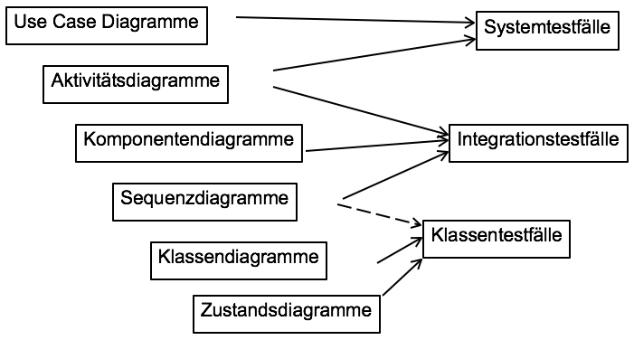
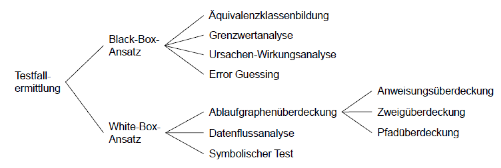
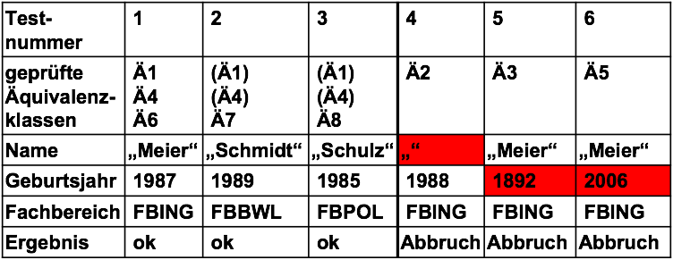
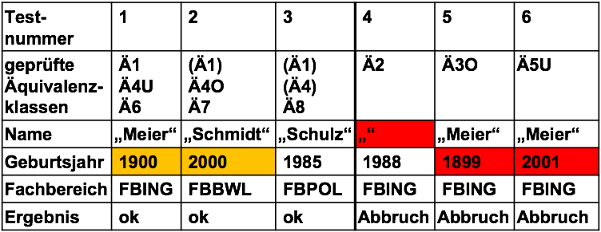

# Vorlesung 15: Softwareprüfung

## Einleitung

## Software Qualität

## Qualitätsmaßnahmen

## Analysierende Verfahren

## Testende Verfahren

## Testarten im Software Entwicklungsprozess

## Weitere Testarten

## Ermittlung von Testfällen
### Ableitung von Testfällen bei Verwendung von UML


### Testfallermittlung
* Auswahl der Testfälle ist eine zentrale Aufgabe des Testens
* Vollständiges Testen in der Regel unmöglich (stichprobenartig testen)
* __Ziel__: Mit möglichst wenig Testfällen möglichst viele Fehler finden

### Verfahren zur Testfallermittlung


* __Funktionsorientierter__ Test (Black-Box-Test):
    - Testfallauswahl aufgrund der Modulspezifikation Interne Struktur kann unbekannt sein prüft definierte Schnittstellen (Funktionalität)
    - _Datenbezogene Testfälle_:
        - Ausgehend von der Spezifikation des zu untersuchenden Objekts werden verschiedene Eingaben definiert, deren gewünschtes Resultat aus der Spezifikation abzuleiten ist
* __Strukturorientierter__ Test (White-Box-Test)
    - Testfallauswahl aufgrund der internen Struktur prüft die Details der Logik (Codereview)
    - Klassenspezifikation muss ebenfalls bekannt sein (erwartete Resultate)
    - _Ablaufbezogene Testfälle_:
        - Es wird die Struktur des zu untersuchenden Programms analysiert und versucht, möglichst alle Ablaufalternativen (if, while) durchzuspielen

## Funktionsorientierter Test
* Aufdeckung der Abweichung eines Testobjekts von seiner Spezifikation
* Auswahl der Testfälle ohne Kenntnis der inneren Struktur
* Überprüfung des Verhaltens des Testobjekts bei fehlerhaften Eingabedaten
* __Ziel__: Umfassende Prüfung der spezifizierten Funktionalität

__Verfahren zur Testfallermittlung__:
1. Error Guessing
2. Äquivalenzklassenbildung
3. Grenzwertanalyse

### Error Guessing
* Intuitive Auswahl des Testfälle aufgrund von Erfahrung
* Kein systematisches Verfahren
* Ergänzt die Methoden zur Testfallbestimmung

__Typische Fehler__:
* Nichtberücksichtigung von Sonderfällen (z. B. Division durch Null)
* Fehlende Behandlung von Grenzwerten
* Überschreitung von Feldgrenzen
* Endlosschleifen
* Nichtinitialisierung von Variablen
* Falsche logische Operationen (Negationen)

### Äquivalenzklassenbildung
* Gleichartige Eingabedaten werden zu Klassen zusammengefasst und aus jeder Klasse wird ein Repräsentant ausgewählt.
* Bestimmung von gültigen Äquivalenzklassen (Normalfall) sowie ungültigen Äquivalenzklassen (Sonderfall)
* Äquivalenzklassenbildung zerlegt die Menge der Eingaben in disjunkte Teilmengen
* Jeder Repräsentant einer Teilmenge hat das gleiche Verhalten bzgl. einer vorgegebenen Operation
* Beispiel: Restklassen (modulo x): werden zwei beliebige Repräsentanten aus Restklassen addiert, liegt das Ergebnis immer in derselben Restklasse
* Übertragungsidee auf Tests: Eingaben werden in Klassen unterteilt, die durch die Ausführung des zu testenden Systems zu „gleichartigen“ Ergebnissen führen

_Beispiel: Multiplikation zweier ganzer Zahlen:  „void mul(x, y)“_

__Mögliche Äquivalenzklassen__:
* X und Y sind positiv
* X ist positiv und Y ist negativ
* X ist negativ und Y ist positiv
* X und Y sind negativ

#### Regeln zur Bildung von Äquivalenzklassen
* man muss mögliche Eingaben kennen (aus Anforderungs-Spezifikation)
* für einfache Zahlenparameter: Intervall mit gültigen Werten
* Wenn explizit eine Menge von Werten vorgegeben ist: jeder Wert stellt eine Äquivalenzklasse dar

#### Beispiele für Äquivalenzklassen von Eingaben
* Erlaubte Eingabe: 1 <= Wert <= 99 (Wert sei ganzzahlig)
    - eine gültige Äquivalenzklasse: 1 <= Wert <= 99
    - zwei ungültige Äquivalenzklassen: Wert < 1, Wert > 99
* Erlaubte Eingabe in einer Textliste: für ein Auto können zwischen einem und sechs Besitzer eingetragen werden
    - eine gültige Äquivalenzklasse: ein bis sechs Besitzer
    - zwei ungültige Äquivalenzklassen: kein Besitzer, mehr als sechs Besitzer
* Erlaubte Eingabe: Instrumente Klavier, Geige, Orgel, Pauke
    - vier gültige Äquivalenzklassen: Klavier, Geige, Orgel, Pauke
    - eine ungültige Äquivalenzklasse: alles andere, z.B. Zimbeln

#### Beispiel Spezifikation:
* Einem Konstruktor zur Verwaltung von Studierenden wird ein Name, ein Geburtsjahr und ein Fachbereich übergeben.
* Einschränkungen:
    - Das Namensfeld darf nicht leer sein
    - Das Geburtsjahr muss zwischen 1900 und 2000 liegen
    - Es können nur die Fachbereiche aus einer Aufzählung (FBING, FBBWL und FBPOL) übergeben werden

| Eingabe          | gültige Äquivalenzklassen         |  ungültige Äquivalenzklassen   |
| :--------------- |:----------------------------------|:------------------------------ |
| __Name__         | _Ä1)_ nicht leer                  | _Ä2)_ leer                     |
| __Geburtsjahr__  | _Ä4)_ 1900< = Geburtsjahr <= 2000 | _Ä3)_ Geburtsjahr < 1900       |
|                  |                                   | _Ä5)_ Geburtsjahr > 2000       |
| __Fachbereich__  | _Ä6)_ FBING                       |                                |
|                  | _Ä7)_ FBBWL                       |                                |
|                  | _Ä8)_ FBPOL                       |                                |

#### Testfallerzeugung aus Äquivalenzklassen
Die Äquivalenzklassen sind eindeutig zu nummerieren. Für die Erzeugung von Testfällen aus den Äquivalenzklassen sind zwei Regeln zu beachten:
* gültige Äquivalenzklassen:
    - möglichst viele Klassen in einem Test kombinieren
* ungültige Äquivalenzklassen:
    - Auswahl eines (wichtig!) Testdatums aus einer ungültigen Äquivalenzklasse in Kombination mit Werten, die ausschließlich aus gültigen Äquivalenzklassen entnommen sind. Grund: für alle ungültigen Eingabewerte muss eine Fehlerbehandlung existieren



### Grenzwertanalyse
* Viele Software-Fehler sind auf Schwierigkeiten in Grenzbereichen der Äquivalenzklassen zurück zu führen (z.B. Extremwert nicht berücksichtigt, Array um ein Feld zu klein)
* Aus diesem Grund wird die Untersuchung von Äquivalenzklassen um die Untersuchung der Grenzen ergänzt
* Auswahl von Testfälle für solche Grenzfälle

_Beispiel: 1<=Wert<=99 (ganzzahlig)_
* _Äquivalenzklasse Wert<1:_
    - _obere Grenze Wert=0 (untere Grenze spielt hier keine Rolle)_
* _Äquivalenzklasse Wert>99:_
    - _untere Grenze Wert=100 (obere Grenze spielt keine Rolle)_
* _Äquivalenzklasse 1<=Wert<=99:_
    - _untere Grenze Wert=1 und obere Grenze Wert=99_

_Diese Grenzfallbetrachtung kann direkt in die Testfallerzeugung eingehen_

Testfälle nach einer Äquivalenzklassenanalyse und Grenzwertanalyse
(Testfallanzahl erhöht sich meist)



#### Mögliche Übersetzung nach JUnit (Ausschnitt)
```java
import junit.framework.TestCase;

public class ImmatrikulationTest extends TestCase {
    ...

    public void test1(){
        try{
            new Immatrikulation("Meier", 1900, Bereich.FBING);
        }catch(ImmatrikulationsException e){
            fail("falsche Exception");
        }
    }

    public void test4(){
        try{
            new Immatrikulation("", 1988, Bereich.FBING);
            fail("fehlende Exception");
        }catch(ImmatrikulationsException e){
        }
    }

    ...
}

```

## Strukturorientierter Test

## Unittests

## TDD

## Test Doubles