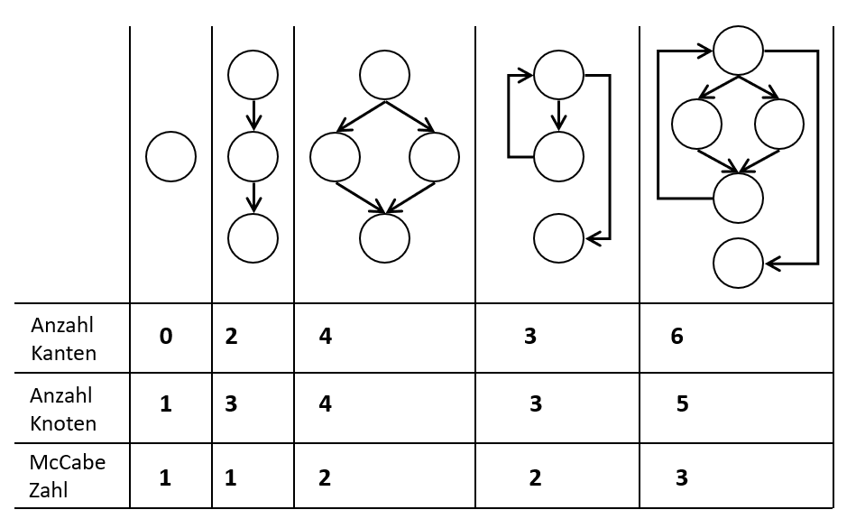

# Vorlesung 15: Softwareprüfung

## Einleitung

## Software Qualität

## Qualitätsmaßnahmen

## Analysierende Verfahren
### Entwurfsziele
- Niedrige Kopplung
	- Der Grad, zu dem die Klassen voneinander abhängig (Methodenaufrufe, Vererbung und Zugriff auf öffentliche Attribute) sind
	- Starke Kopplung entspricht starken Abhängigkeiten und erschwert Wiederverwendung und Wartbarkeit
- Hohe Kohäsion
	- Misst, wie stark verwandt oder fokussiert die Aufgaben eines Elementes (z.B. Klasse, Komponente, Paket) sind
	- Niedrige Kohäsion lässt darauf schließen, dass in einer Klasse mehrere Funktionalitäten implementiert wurden und erschwert das Verständnis und die Wiederverwendbarkeit


Softwarequalität (z.B. Kohäsion und Kopplung) lässt sich auf zwei Arten messen?

### Quantitave und qualitative Aussagen über Softwarequalität
1. Qualitativ: 
	- mittels subjektiver Beurteilungsmethoden („gut“, „schlecht“) oder Review-Checklisten oder Codeinspektion
2. Quantitativ: Metrik 
	- Eine Softwaremetrik ist eine Funktion, die eine Software-Einheit in einen Zahlenwert abbildet, der als der Erfüllungsgrad  einer  Qualitätseigenschaft der Software-Einheit interpretiert wird.
	- Eine Metrik ist ein interpretiertes Maß, das automatisch ermittelt werden kann und ein Indiz für die Qualität eines Produktes ist
	- Metriken sollen nur als Indikatoren betrachtet werden, d.h. gewonnene Aussagen müssen nachgeprüft werden
	- Ergebnissen  nicht  blind  vertrauen,  sondern als Hilfsmittel  für  eigene Urteilsfindung interpretieren
	- Es existieren zwei Arten von Metriken
		1. Konventionelle Metriken
		2. OO-Metriken


- Beispiel: SIZE (oder auch LOC=Lines of Code): Anzahl der Codezeilen
	- Leicht zu messen
	- Umfang variiert mit der Sprache, Programmierstil, etc.
	- Werden Kommentare dazu gezählt?

#### Zyklomatische Komplexität (McCabe)

- Codemaß, das die Komplexität von Kontrollflüssen in Methoden misst
- Quantitatives Maß für den erwarteten Testaufwand 
- Methoden mit einer hohen „Cyclomatic Complexity“ sind schwerer zu warten und zu testen
- Zyklomatische Komplexität gibt Obergrenze für die Testfallanzahl für den Zweigüberdeckungstest an
- Aber: „Lange“ Methoden sind nicht unbedingt komplex
- Folgt man McCabe, so sollen Methoden, für die z(G) > 10 gilt, einem Refactoring unterzogen werden


1. Man konstruiere die Kontrollflussgraphen
2. Man messe die strukturelle Komplexität
    Die zyklomatische Zahl z(G) eines Kontrollflussgraphen G ist:
				z(G) = e – n + 2 mit
		e = Anzahl der Kanten des Kontrollflussgraphen
		n = Anzahl der Knoten


**Beispiele für die zyklomatische Komplexität**


					z(G) = e – n + 2

### Objektorientierte SW-Metriken
- In *objektorientierten Programmen* versagt die McCabe-Metrik, da die Kontrollflußkomplexit¨at der meisten Methoden gering ist (z (G) = 1).
- Metriken müssen deshalb das *Zusammenspiel der Klassen* betrachten – typischerweise anhand des (statischen) Objektmodells
- Werkzeuge für OO-Metriken, z.B.:
	- Checkstyle
	- JMetric
	- Eclipse plugin
		- http://metrics.sourceforge.net/
		- berechnet u. A. erweiterte MCCabe-Zahl und LCOM*

#### Beispiele für OO SW-Metriken 

- Lines of Code pro Methode: Maximum sollte unter 20 liegen
- Methoden pro Klasse: sollte zwischen 3 und 15 liegen
- Parameter pro Methode: sollte unter 6 liegen
- Instanzvariablen pro Klasse: Die Zahl sollte unter 10 liegen
- Depth of Inheritance Tree (DIT) = Anzahl der Oberklassen
- Number Of Children (NOC) = Anzahl der direkten Unterklassen
- Weighted Method per Class (WMC) = Anzahl der definierten Methoden
- Coupling Between Object Classes (CBO) = Anzahl der benutzten Klassen
- Lack of Cohesion in Methods (LCOM)
	- Aussage über die “Güte” der Kapselung. Kann Hinweis auf Entwurfsfehler sein.
	- Es gibt unterschiedliche Varianten zur Berechnung von LCOM. Im folgenden werden zwei Varianten dargestellt

### LCOM (Lack of Cohesion in Methods)
LCOM (C) = Methodenpaare ohne gemeinsame Instanzvariablen minus Methodenpaare mit gemeinsamen Instanzvariablen (falls LCOM (C) < 0 => LCOM (C) = 0). Ziel: LCOM (C) = 0


**Lack of Cohesion in Methods (LCOM*) = LCOM-HS (Henderson-Sellers) = LCOM5**
- *LCOM** =  (avgNutzt – m)  /  (1 - m)
	- nutzt(a) die Zahl der Methoden, die eine Instanzvariable a der untersuchten Klasse nutzen 
	- avgNutzt der Durchschnitt aller Werte für alle Instanzvariablen
	- m die Anzahl aller Methoden der untersuchten Klasse


- Ist der Wert nahe Null, handelt es sich um eine eng zusammenhängende Klasse
- Ist der Wert nahe 1, ist die Klasse schwach zusammenhängend und man sollte über eine Aufspaltung nachdenken. Hinweis auf Entwurfsfehler

- Hinweise
	- Es muss vorher festgelegt werden, ob Klassenvariablen und Klassenmethoden berücksichtigt werden sollen
	- Ist LCOM* benutzbar, wenn man auch get()- und set()-Methoden nutzt? 

#### LCOM* Beispiel
			public class C {

				private int a;
				private int b;
				private int c;

	
				public void m1(int x){
					a = a + x;
				}
				public void m2(int x){
					a = a + x;
					b = b - x;
				}
	
				public void m3(int x){
					a = a + x;
					b = b - x;
					c = c + x;
				}
			}


- LCOM* =  (avgNutzt – m)  /  (1 - m)
	- nutzt(a) die Zahl der Methoden, die eine Instanzvariable a der untersuchten Klasse nutzen 
	- *avgNutzt* der Durchschnitt aller Werte für alle Instanzvariablen
	- m die Anzahl aller Methoden der untersuchten Klasse


## Testende Verfahren Statische Tests

* Analyse und Prüfung der Systembeschreibungen
* Ausführung des Systems nicht erforderlich

### Arten von testenden statischen Verfahren

* Review
    * Prüfen und Überwachen des Systemverhaltens gegenüber dem spezifizierten Verhalten 
    * System wird mit Testdaten ausgeführt und sein Verhalten beobachtet
    * Validierung ist die Beurteilung, ob ein Softwaresystem die spezifizierten Anforderungen erfüllt

* Walkthrough
    * abgeschwächte From des Reviews
* Audit
    * während ein Review das Ergebnis prüft, prüft ein Audit die Vorgehensweise und den Ablauf, also Prüfung des Wegs zum Ergebnis

* Code-Inspektion
    * Diskussion des Source-Codes mit erfahrenen Softwareentwicklern. Dient zum Aufdecken von Fehlern und nicht zum Beheben von Fehlern dient

* Statische Analyse
    * Werkzeuggestütztes Auffinden von Fehlern ohne direkte Ausführung des Systems mit dem Ziel, fehlerverdächtige Stellen des Systems zu lokalisieren

* Formale Verifikation
    * Verifikation ist die Beurteilung eines Systems, um festzustellen, ob die Resultate einer gegebenen Entwicklungsphase den Vorgaben aus einer vorhergehenden entsprechen
    

## Testende Verfahren Dynamisch

* Prüfen und Überwachen des Systemverhaltens gegenüber dem spezifizierten Verhalten 
* System wird mit Testdaten ausgeführt und sein Verhalten beobachtet
* Validierung ist die Beurteilung, ob ein Softwaresystem die spezifizierten Anforderungen erfüllt 

### Was ist Testen?

* Testen ist der Prozess, ein Programm mit der Absicht auszuführen, Fehler zu finden
* Testen dient dem Nachweis der korrekten Umsetzung der Anforderungen und der Aufdeckung von Fehlern
* Durch das Testen kann die Korrektheit eines Programms nicht bewiesen werden

### Was ist Debugging?

* Debugging dient der Lokalisierung der Ursache des Fehlers

### Grundsätze der Softwareprüfung

* Systematisch prüfen: Prüfung planen und nach Vorschriften durchführen
* Softwareprüfung kann nur gegen Vorgaben (Anforderungen oder Vergleichsresultate) erfolgen
* Prüfverfahren müssen reproduzierbare Ergebnisse liefern
* Prüfergebnisse müssen mit Testprotokollen dokumentiert werden
* Planungen der Softwareprüfung früh im Entwicklungsprozess beginnen
* Anzahl Zeilen Testcode oft größer als Anzahl Zeilen für „normalen“ Code
* unabhängige Testpersonen zur Aufstellung von Testplänen und zur Durchführung von Testläufen: ein Softwareentwickler sollte die von ihm implementierte Funktionalität nicht selber testen (außer mit Unittests)

* Fehlerkorrektur sorgfältig
    * Wahrscheinlichkeit für richtige Korrektur beim 1. Versuch oft gering
    * Vermeidung der Einschleusung neuer Fehler 
    * Wiederholung der zugehörigen Testfälle

## Testarten im Software Entwicklungsprozess
### Testarten


#### Unittest
* __Ziel:__ Aufdecken aller Abweichungen der Implementierung von der Spezifikation
 * Prüfen der Einzelfunktionen isoliert von den anderen Klassen des Systems

#### Integrationstest
* __Ziel:__ Aufdecken von Fehlern in Schnittstellen und im Zusammenspiel zwischen integrierten Klassen
 * Prüfen des Zusammenwirkens der Komponenten und Klassen

#### Systemtest
* __Ziel:__ Aufdeckung aller Abweichungen des Systemverhaltens in Bezug auf das in der Anforderungsdefinition spezifizierte Systemverhalten
 * Überprüfung..
  * ..der vollständigen Erfüllung der Benutzeranforderungen
  * ..der Korrektheit der Ergebnisse
  * ..der Robustheit gegen fehlerhafte Eingabedaten
  * ..von nichtfunktionalen Anforderungen


#### Abnahmetest
* Akzeptanztest
* Neudeutsch: End-To-End-Test
* Test der Akzeptanz durch den Benutzer
* Auch Validierung nichtfunktionaler Anforderungen
* Test des Systems mit realen Daten unter realen Einsatzbedingungen
* Aufdecken aller Fehler, die auf Missverständnissen bei Absprachen zwischen Benutzer und Entwickler beruhen
* Test gegen Abnahmekriterien, die in der Anforderungsdefinition festgelegt wurden


## Weitere Testarten

### Regressionstest
* „Fertige“ Software wird geändert (neue Anforderungen oder Bugfixes)
* Gibt es Auswirkungen auf die alten Testergebnisse, wenn Änderungen vorgenommen worden sind?
* Benötigt automatisierte Wiederholbarkeit der Testfälle


### Stresstest
* testen das Verhalten beim Überschreiten von definierten Grenzen

### Test des Speicherverhaltens (z.B. bei Verwendung von C/C++)
* welche Operationen fordern wie viel Speicherplatz an / geben ihn frei
* wo wird Speicher-Freigabe vergessen (memory leak = Speicherloch)
* wo wird auf bereits freigegebenen (oder nicht initialisierten) Speicherplatz zugegriffen
* wo wird Speicherplatz mehrfach freigegeben  und wo finden Zugriffe jenseits der Grenzen von Arrays statt

### GUI-Test
* Graphische Oberflächen sind Softwareschichten, die Logik enthalten und getestet werden müssen
* Daher gibt Capture & Replay-Werkzeuge: alle Mausbewegungen und Tastatureingaben werden aufgezeichnet und können dann zur Testwiederholung erneut abgespielt werden

### Penetrationstest
* z.B.: Hackerangriff simulieren

### Lasttest
* Ein Lasttest testet das System auf Zuverlässigkeit und das Einhalten der Spezifikation innerhalb des erlaubten Grenzbereichs
* Test der geforderten Performance
 * Transaktionsrate bzw. Antwortzeiten
* Skalierbarkeit
 * Anzahl Endbenutzer
 * Datenvolumen
* Zugriffskonflikte konkurrierender Benutzer

### Performancetest
* Untersuchung des Laufzeitverhaltens
* wie oft wird jede Methode aufgerufen
* welche Methode ruft wie oft welche andere Methode auf
* von welchen Methoden wird eine Methode wie oft aufgerufen
* wie viel Prozent der Gesamtlaufzeit wird mit der Ausführung einer bestimmten Methode verbracht
* Nutzen der ermittelten Daten
 * Operationen, die am meisten Laufzeit in Anspruch nehmen, optimieren
 * Tatsächliche Aufrufabhängigkeiten werden sofort sichtbar


## Ermittlung von Testfällen
### Ableitung von Testfällen bei Verwendung von UML


### Testfallermittlung
* Auswahl der Testfälle ist eine zentrale Aufgabe des Testens
* Vollständiges Testen in der Regel unmöglich (stichprobenartig testen)
* __Ziel__: Mit möglichst wenig Testfällen möglichst viele Fehler finden

### Verfahren zur Testfallermittlung


* __Funktionsorientierter__ Test (Black-Box-Test):
    - Testfallauswahl aufgrund der Modulspezifikation Interne Struktur kann unbekannt sein prüft definierte Schnittstellen (Funktionalität)
    - _Datenbezogene Testfälle_:
        - Ausgehend von der Spezifikation des zu untersuchenden Objekts werden verschiedene Eingaben definiert, deren gewünschtes Resultat aus der Spezifikation abzuleiten ist
* __Strukturorientierter__ Test (White-Box-Test)
    - Testfallauswahl aufgrund der internen Struktur prüft die Details der Logik (Codereview)
    - Klassenspezifikation muss ebenfalls bekannt sein (erwartete Resultate)
    - _Ablaufbezogene Testfälle_:
        - Es wird die Struktur des zu untersuchenden Programms analysiert und versucht, möglichst alle Ablaufalternativen (if, while) durchzuspielen

## Funktionsorientierter Test
* Aufdeckung der Abweichung eines Testobjekts von seiner Spezifikation
* Auswahl der Testfälle ohne Kenntnis der inneren Struktur
* Überprüfung des Verhaltens des Testobjekts bei fehlerhaften Eingabedaten
* __Ziel__: Umfassende Prüfung der spezifizierten Funktionalität

__Verfahren zur Testfallermittlung__:
1. Error Guessing
2. Äquivalenzklassenbildung
3. Grenzwertanalyse

### Error Guessing
* Intuitive Auswahl des Testfälle aufgrund von Erfahrung
* Kein systematisches Verfahren
* Ergänzt die Methoden zur Testfallbestimmung

__Typische Fehler__:
* Nichtberücksichtigung von Sonderfällen (z. B. Division durch Null)
* Fehlende Behandlung von Grenzwerten
* Überschreitung von Feldgrenzen
* Endlosschleifen
* Nichtinitialisierung von Variablen
* Falsche logische Operationen (Negationen)

### Äquivalenzklassenbildung
* Gleichartige Eingabedaten werden zu Klassen zusammengefasst und aus jeder Klasse wird ein Repräsentant ausgewählt.
* Bestimmung von gültigen Äquivalenzklassen (Normalfall) sowie ungültigen Äquivalenzklassen (Sonderfall)
* Äquivalenzklassenbildung zerlegt die Menge der Eingaben in disjunkte Teilmengen
* Jeder Repräsentant einer Teilmenge hat das gleiche Verhalten bzgl. einer vorgegebenen Operation
* Beispiel: Restklassen (modulo x): werden zwei beliebige Repräsentanten aus Restklassen addiert, liegt das Ergebnis immer in derselben Restklasse
* Übertragungsidee auf Tests: Eingaben werden in Klassen unterteilt, die durch die Ausführung des zu testenden Systems zu „gleichartigen“ Ergebnissen führen

_Beispiel: Multiplikation zweier ganzer Zahlen:  „void mul(x, y)“_

__Mögliche Äquivalenzklassen__:
* X und Y sind positiv
* X ist positiv und Y ist negativ
* X ist negativ und Y ist positiv
* X und Y sind negativ

#### Regeln zur Bildung von Äquivalenzklassen
* man muss mögliche Eingaben kennen (aus Anforderungs-Spezifikation)
* für einfache Zahlenparameter: Intervall mit gültigen Werten
* Wenn explizit eine Menge von Werten vorgegeben ist: jeder Wert stellt eine Äquivalenzklasse dar

#### Beispiele für Äquivalenzklassen von Eingaben
* Erlaubte Eingabe: 1 <= Wert <= 99 (Wert sei ganzzahlig)
    - eine gültige Äquivalenzklasse: 1 <= Wert <= 99
    - zwei ungültige Äquivalenzklassen: Wert < 1, Wert > 99
* Erlaubte Eingabe in einer Textliste: für ein Auto können zwischen einem und sechs Besitzer eingetragen werden
    - eine gültige Äquivalenzklasse: ein bis sechs Besitzer
    - zwei ungültige Äquivalenzklassen: kein Besitzer, mehr als sechs Besitzer
* Erlaubte Eingabe: Instrumente Klavier, Geige, Orgel, Pauke
    - vier gültige Äquivalenzklassen: Klavier, Geige, Orgel, Pauke
    - eine ungültige Äquivalenzklasse: alles andere, z.B. Zimbeln

#### Beispiel Spezifikation:
* Einem Konstruktor zur Verwaltung von Studierenden wird ein Name, ein Geburtsjahr und ein Fachbereich übergeben.
* Einschränkungen:
    - Das Namensfeld darf nicht leer sein
    - Das Geburtsjahr muss zwischen 1900 und 2000 liegen
    - Es können nur die Fachbereiche aus einer Aufzählung (FBING, FBBWL und FBPOL) übergeben werden

| Eingabe          | gültige Äquivalenzklassen         |  ungültige Äquivalenzklassen   |
| :--------------- |:----------------------------------|:------------------------------ |
| __Name__         | _Ä1)_ nicht leer                  | _Ä2)_ leer                     |
| __Geburtsjahr__  | _Ä4)_ 1900< = Geburtsjahr <= 2000 | _Ä3)_ Geburtsjahr < 1900       |
|                  |                                   | _Ä5)_ Geburtsjahr > 2000       |
| __Fachbereich__  | _Ä6)_ FBING                       |                                |
|                  | _Ä7)_ FBBWL                       |                                |
|                  | _Ä8)_ FBPOL                       |                                |

#### Testfallerzeugung aus Äquivalenzklassen
Die Äquivalenzklassen sind eindeutig zu nummerieren. Für die Erzeugung von Testfällen aus den Äquivalenzklassen sind zwei Regeln zu beachten:
* gültige Äquivalenzklassen:
    - möglichst viele Klassen in einem Test kombinieren
* ungültige Äquivalenzklassen:
    - Auswahl eines (wichtig!) Testdatums aus einer ungültigen Äquivalenzklasse in Kombination mit Werten, die ausschließlich aus gültigen Äquivalenzklassen entnommen sind. Grund: für alle ungültigen Eingabewerte muss eine Fehlerbehandlung existieren


### Grenzwertanalyse
* Viele Software-Fehler sind auf Schwierigkeiten in Grenzbereichen der Äquivalenzklassen zurück zu führen (z.B. Extremwert nicht berücksichtigt, Array um ein Feld zu klein)
* Aus diesem Grund wird die Untersuchung von Äquivalenzklassen um die Untersuchung der Grenzen ergänzt
* Auswahl von Testfälle für solche Grenzfälle

_Beispiel: 1<=Wert<=99 (ganzzahlig)_
* _Äquivalenzklasse Wert<1:_
    - _obere Grenze Wert=0 (untere Grenze spielt hier keine Rolle)_
* _Äquivalenzklasse Wert>99:_
    - _untere Grenze Wert=100 (obere Grenze spielt keine Rolle)_
* _Äquivalenzklasse 1<=Wert<=99:_
    - _untere Grenze Wert=1 und obere Grenze Wert=99_

_Diese Grenzfallbetrachtung kann direkt in die Testfallerzeugung eingehen_

Testfälle nach einer Äquivalenzklassenanalyse und Grenzwertanalyse
(Testfallanzahl erhöht sich meist)


#### Mögliche Übersetzung nach JUnit (Ausschnitt)
```java
import junit.framework.TestCase;

public class ImmatrikulationTest extends TestCase {
    ...

    public void test1(){
        try{
            new Immatrikulation("Meier", 1900, Bereich.FBING);
        }catch(ImmatrikulationsException e){
            fail("falsche Exception");
        }
    }

    public void test4(){
        try{
            new Immatrikulation("", 1988, Bereich.FBING);
            fail("fehlende Exception");
        }catch(ImmatrikulationsException e){
        }
    }

    ...
}

```

## Strukturorientierter Test (White-Box-Test)
* Betrachtung des Ein-/Ausgabeverhaltens und der inneren Struktur der Testobjekts -> Test der implementierten Realisierung
* Ziel: Für jeden möglichen Pfad dutch das Testobjekt soll das Verhalten des Testobjekts in Abhängigkeit von den Eingabedaten festgestellt werden
* Auswahl der Testfälle aufgrund der Kenntnis der Ablaufstrukturen des Testobjekts
  * Zum Beispiel Abläufe aus Aktivitätsdiagrammen
* Wahl der Testfälle:
  * Jede Klasse und jede Methode des Testobjekts wird mindestens einmal aufgerufen
  * Jeder Zweig wird mindestens einmal durchlaufen
  * Möglichts viele/alle Pfade werden durchlaufen

### Der Kontrollflussgraph (KFG)
eines Programms P ist ein gerichteter Graph
KFG(P) = def G = (V, E, VStart, VZiel)
* V: Menge der Knoten (Anweisungen des Programms)
* E: Teilmenge von VxV: Menge der Kanten (Nachfolgerelation bezüglich der Ausführung des Programms)
* VStart, VZiel aus V: Ausgewählte Knoten für Start und Ende des Programms (VZiel kann auch eine Menge von Knoten sein)

```java
public int aha(int ein) {
  int erg = -ein/2;
  int i = ein;
  while(i > 0) {
    erg = erg + (i--);
  }
  if (ein < 0 || ein % 2 == 1) {
    erg = 0;
  }
  return erg * 2;
}
```
(Methode gibt Quadrat aller positiven geraden Zahlen, sonst 0 zurück)

### Normalisierung eines KFG
Wunsch: Graph sollte unabhängig von der Formatierung sein

Folgende Regeln, mit denen mehrere Knoten k1, k2, ..., kn, die nacheinander durchlaufen werden können, also k1->k2->...->kn, zu einem Knoten Verschmolzen werden

* die Knotenfolge wird bei jedem Durchlauf immer nur über k1 betreten, es gibt außer den gennanten Kanten keine weiteren Kanten, die in k2,..., kn-1 beginnen
* die Knotenfolge wird bei jedem Durchlauf immer nur über kn verlassen, es gibt außer den genannten Kanten keine weiteren Kanten, die in kn,..., kn-1 beginnen
* die Knotenfolge ist maximal bezüglich a) und b)

### White box Tests
* **C0: Anweisungsüberdeckung(Statement Coverage):** Jede Anweisung des Programms wird mindestens einmal durchlaufen
* **C1: Zweigüberdeckung (Branch Coverage):** Jeder Zweig der Anwendung wird mindestens einmal durchlaufen, z.B. einmal if und einmal else oder einmal while und einmal nicht while
* **C2: Pfadüberdeckung (Path Coverage):** Jeder mögliche Pfad der Anwendung wird mindestens einmal durchlaufen
* **C3: Bedingungsüberdeckung (Condition Coverage):** Jede Bedingung und jede Teilbedingung wird mindestens einmal durchlaufen und ist einmal true und einmal false

#### Anweisungsüberdeckung (C0)
Ziel: alle Anweisungen des Programms durch Wahl geeigneter Testdaten mindestens einmal ausführen, alle Knoten des KFG mindestens einmal besuchen

#### Zweigüberdeckung (C1)
Ziel: alle Kanten des KFG überdecken, d.h. alle Zweige des Programms einmal durchlaufen

### Zusammenfassung zu C0 und C1
* Vorteile der Anweisungsüberdeckung:
  * einfach
  * geringe Anzahl von Eingabedaten
  * nicht ausführbare Programmteile werden erkannt

* Nachteil der Anweisungsüberdeckung:
  * Logische Aspekte werden nicht überprüft

* deshalb:
  * Zweigüberdeckungstest gilt als das Minimalkriterium im dynamischen Softwaretest,
  * schließt den Anweisungsüberdeckungstest ein,
  * fordert die Ausführung aller Zweige eines KFG,
  * jede Entscheidung mindestens einmal wahr und falsch

* Nachteile der Zweigüberdeckung:
  * Fehlende Zweige werden nicht automatisch entdekct
  * Kombinationen von Zweigen sind unzureichend geprüft
  * Komplexe Bedingungen werden nicht analysiert
  * Schleifen werden nicht ausreichent analysiert

## Unittests
1. Die Anzahl der Code-Zeilen für Unittests übersteigt bei weitem die Anzahl der Zeilen des zu testenden Codes.
2. Ein Unittest testet genau eine Klasse.
3. Ein Test ist <strong>kein</strong> Unittest wenn:
  * Er kommuniziert mit einer Datenbank
  * Er kommuniziert mit einem Netzwerk
  * Er kann nicht gleichzeitig mit irgendeinem anderen Unittest ausgeführt werden
  * Es müssen spezille Dinge (wie Änderungen an Konfigurationsdateien) an der Umgebung für die Ausführung getan werden

### Test-Fixture
* Ein Testfall sieht in der Regel so aus, dass eine bestimmte Konfiguration von Objekten aufgebaut wird, gegen die der Test läuft.
* Diese Menge von Testobjekten wird auch als Test-Fixture bezeichnet.
* Damit fehlerhafte Testfälle nicht andere Testfälle beeinflussen können, wird die Test-Fixture für jeden Testfall neu initialisiert.
* In der Methode <strong>setUp</strong> werden Variablen initialisiert und mit der Methode <strong>tearDown</strong> werden wertvolle Testressourcen (z.B. Datenbank- oder Netzwerkverbindungen) wieder freigegeben.

### TestSuite
* Um eine Menge von Tests zusammen ausführen zu können, werden die Tests zu TestSuites zusammengefasst.
* Mit JUnit können beliebig viele Tests in einer TestSuite zusammengefasst werden.
* pro Package eine TestSuite-Klasse definieren.

## TDD (Test-driven delevopment)


### Zusammenspiel von Klassen testen
- Bis jetzt wurde nur eine Klasse betrachtet, die keine Assoziation zu anderen zu testenden Klassen hat
- Weil die Implementierung von andern Klassen noch nicht vorhanden sind, muss man die Implementierung "simulieren", sodass man die eigene Klasse testen kann
- Eine solche Klasse zur "Simulation" wird Test-Double genannnt.
- Liegt die Klasse vor, die man temporär durch den Test-Double prüfen wollte, können diese Tests mit einer realen Klasse wiederholt werden
- Test-Doubles dienen auch für die Implementierung von Klassen, die auf Ressourcen (z. B. Datenbanken) zugreifen, die nicht immer verfügbar sind
- Test-Doubles wurden früher per Hand programmiert. Heutzutage kann man diese per Software automatisch erzeugen lassen:
  * Beispiele: jMoch, http://jmock.org/, EasyMock, http://easymock.org/, Mockito, https://github.com/mockito/mockito
- Achtung:
  * Test-Doubles sind oft aufwändig in der Erstellung, müssen bei Änderungen am Code mit verändert werden und geben keine Garantie dafür, dass die Software keine Fehler enthält.

## Test Doubles


- Mock: Dynamische und konfigurierbare Laufzeit-Implementierung eines Interfaces oder einer Klasse, für die Rückgabewerte von Methoden definiert werden.
- Stub: Fragmentartige Implementierung als Stellvertreter, genutzt zum Testen.
- Dummy: Ersatzklasse ohne Implementierung als Stellvertreter, um das Testen zu ermöglichen. Wird herumgereicht, aber nicht benutzt. (z.B. um eien Parameterliste einer Methode zu füllen). Muss existieren, aber eine "Interaktion" mit einem Dummy ist nicht angedacht.
- Dummies und Stubs werden erzeugt, um die Testumgebung "lauffähig" zu machen und nicht für die eigentliche "Verifikation" benutzt. Ein Dummy wird als "Wert" herumgereicht, während ein Stub Daten an die zu testende Klasse zurückgibt ("indirekte Inputs").
- Spy: Ein Mock, der die Aufrufe von Methoden etc. zählt
- Spies und Mocks werden benutzt, um die Korrektheit des Kommunikationsablauf zwischen zu testender Klasse und den daran beteiligten Klassen zu überprüfen ("indirekte Outputs").
- Fake: Funktionierende, einfach aufzusetzende, simplifizierte Implementierung mit "gehackter Funktionalität", also nicht verwendbar in Produktion(z.B. eine In-memory-Datenbank). Fakes werden in Integrationstests verwendet.
- Fakes spielen dieselbe Rolle wie Dummies oder Stubs. Sie werden erzeugt, um die Testumgebung lauffähig zu machen, aber nicht für die Verifikation benutzt.
- Test Doubles werden nicht für direkte Outputs der SUT benutzt.
