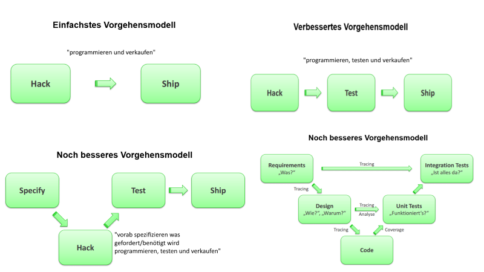
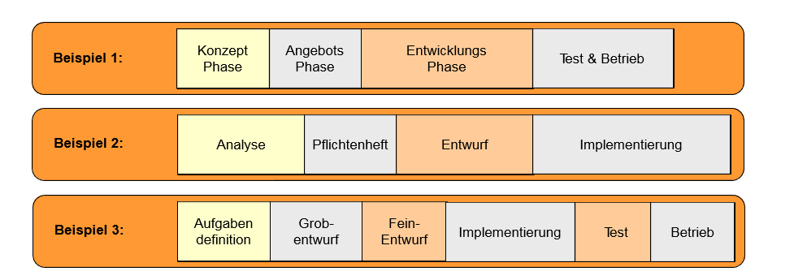
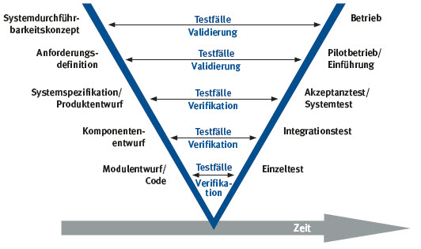

## Vorlesung 2: Vorgehensmodelle

### Wiederholung
* Phasen der Softwareentwicklung
* Rollen in einem Softwareprojekt
* Softwarequalität

### Lernziele
* Verstehen, was ein Vorgehensmodell für Softwareentwicklung ist
* Wissen, welche relevanten Vorgehensmodelle existieren (insbesondere agile Vorgehensmodelle)
* Vor- und Nachteile von verschiedenen Vorgehensmodellen verstehen

### Vorgehensmodelle

### Verschiede Vorgehensmodelle  

* Anhand dieser Grafik wird deutlich, wofür man Vorgehensmodelle braucht und warum.
* Vom einfachen bis zum „besten“ dem rechtsunteren Vorgehensmodell erkennt man deutliche Unterschiede. Das 4. Modell ist strukturierter und man erkennt eine überschaubarere Planung wie als einfaches „programmieren und verkaufen“.  

* Ein Vorgehensmodell ist eine vereinfachte Beschreibung eines Softwareentwicklungsprozesses. Es beschreib Folgen bzw. Bündel von Aktivitäten, die zur Durchführung eines IT-Projekts erforderlich sind. Üblich ist eine Gliederung in Phasen, Arbeitsabschnitte und Aktivitätsblöcke, durch die der Entwicklungsprozess in planbare und kontrollierbare Einheiten zerlegt wird. 
* Es schafft also ein gemeinsames Verständnis von dem, was und wann etwas erledigt wird und macht den Softwareentwicklungsprozess transparenter, planbar, nachvollziehbar und  kontrollierbar.
* Dadurch sollen die Ziele wie z.B. höhere Qualität der Software, effizientere Produktion, bessere Wartbarkeit, schnellere Fehlerbehebung und erhöhte Änderungsfreundlichkeit erreicht werden.

### Das Phasenmodell ein primitives Vorgehensmodell

* Anhand der Beispiele 1, 2 & 3 erkennt man sehr genau eine Phasenweise Einteilung der verschiedenen Aufgabenbereiche

### Vorgehensmodellle umfassen:
* Phasen
* Tätigkeiten/Aktivitäten die während der Phasen ausgeführt werden
* Software/Dokumente/“Artefakte“, die während der einzelnen Aktivitäten entstehen
* Rollen von Personen

Eine Phase ist eine zeitlich begrenzte Aktivität/Tätigkeit mit einer speziellen Aufgabe, die von Mitarbeitern mit geeigneten Rollen/Qualifikationen bearbeitet werden, um basierend auf vorgegebenen Artefakten neue Artefakte* zu produzieren.
*Als Artefakte bezeichnet man alle Arbeitsergebnisse innerhalb eines Projekts. Dies bezieht sich nicht alleine auf die Erstellung der Software, es beinhaltet auch Vorarbeiten und Zwischenergebnisse, die für die Durchführung des Projekts notwendig sind. Artefakte sind notwendig um Projektinformationen zu erfassen, wodurch man mit Hilfe der Planung den Status des Projekts ermitteln und vermitteln kann.
### Softwareentwicklungsprozess

* Phase beinhaltet 1 zu n Aktivitäten. Diese Aktivitäten werden unterstützt durch Technik begrenzt auf die Anzahl der Rollen m. n Aktivitäten werden durch eine m Anzahl an Rollen/Personen ausgeführt.
* Eine Aktivität beinhaltet 1 zu n Aktivitäten.
* Diese Anzahl an Aktivitäten führen zu einem Ergebnis das bestehend aus 1 zu n Ergebnissen ist.
* Diese Ergebnisse erfüllt die Anzahl an Richtlinien und ergeben einen n Anzahl an Notationen.

* Es gibt kein perfektes Vorgehensmodell. Jedes Modell muss an die Menschen und an das Projekt angepasst werden. Dazu hat man eine Auswahl an vielen verschiedenen Modellen.   
* Es gibt sechs grundlegende Phasen, die alle Vorgehensmodelle gemeinsam haben:

  1.Anforderungsanalyse 
  2.Softwaresystemanalyse 
  3.Softwareentwurf 
  4.Softwareimplementierung 
  5.Softwaretest
  6.Wartung

### Requirements Engineering

Ist das Festlegen der Anforderungen an ein System und die Ermittlung, Beschreibung, Analyse und Gewichtung der Anforderungen in einer möglichst exakten und eindeutigen Form, um eine qualitative Verbesserung der Anforderungsdefinition und eine Reduktion der Fehler zu erreichen. Die Ergebnisse des Requirements Engineering (die Anforderungen) dienen als Richtlinie, da sie festlegen, welche Funktionen das System in welcher Qualität besitzen muss.
Typische Anforderungen:

* gewünschte Funktionen
* Beschreibung korrekter und falscher Eingabedaten und gewünschter Ausgabedaten
* mögliche Systemerweiterungen
* Dokumentationsanforderungen
* Qualitätsmerkmale

Im Requirements Engineering werden vor allem die folgenden drei Gruppen betrachtet:

* Funktionale Anforderungen spezifizieren die Funktionalität, die Entwickler in ein Produkt bauen müssen, um Nutzer zu befähigen, ihre Aufgaben zu bewältigen
* Nicht-funktionale Anforderungen sind Forderungen nach Einhaltung von Qualitätsattributen.
* Rahmenbedingungen (engl. constraint) sind organisatorische oder technologische Einschränkungen des Freiheitgrades eine Lösung bereitzustellen.

#### Systemanalyse
* Ziel: Verstehen des Problems und des realisierenden Systems
* Untursuchung der technischen und ökonomischen Durchführbarkeit
* Beschreibung der ablauffähigen Vorgänge
* Graphische Darstellung des Problems in Systemmodellen
* Zerlegung des Problems in Teilprobleme

Das Ergebnis daraus: Systemmodell

#### Softwareentwurf 
* Planung von Form und Struktur der Lösung.
* Beschreibung der Beziehung der Vorgänge untereinander
* Beschreibung der Beziehung zur Umwelt (externe Ereignisse, externe Schnittstellen)
* Muss die in der Anforderungsspezifikation definierten Anforderungen erfüllen

Das Ergebnis daraus: Entwurfsspezifikation

#### Implementierung
* Umsetzung der Entwurfsspezifikation in einer Programmiersprache + Dokumentation
* Entwickertests

Das Ergebnis daraus: Programmcode, Dokumentation, Tests

#### Test
* Integrationstest
    * Überprüfung des Gesamtsystems gegen die Entwurfsspezifikation
    * Testen umd Fehlerzustände in den Schnittstellen und den zu integrierenden Komponenten aufzudecken.
* Systemtest
    * Überprüfung des Gesamtsystems gegen die Anforderungen
    * Testen eines integrierten Systems
    * Leistungsmessungen und Optimierungen

Testergebnisse: Testspezifikation und Testprotokolle

#### Wartung und Weiterentwicklung
* Wartungsaufgaben
    * Beseitigung aufgetretener Fehler
    * Optimierung
    * Anpassung an neue Anforderungen
    * Austausch von Teilen des Gerätesystems

Ergebnis: Protokolle für das Monitoring von Systemzuständen sowie verbessertes Softwareprodukt

#### Bekannte Vorgehensmodelle
* Wasserfall-Modell
* V-Modell
* Agile Vorgehensmodelle

#### Wasserfallmodell 
* Weiterentwicklung des "Phasenmodells"
* Jede Phase muss vollständig durchgelaufen werden.
* Streng sequentiell. Nächste Phase beginnt erst nach Abschluss der vorigen Phase
* Iterationen sind nur zwischen zwei aufeinanderfolgenden Phasen erlaubt.
* Aus jeder Phase entstehen Dokumente, die abgenommen werden.

##### Vorteile
* Einfach verständlich, kein großter Schulungsaufwand nötig
* Begrenzter Managementaufwand
* Sehr strukturierter und kontrollierbarer Prozessablauf

##### Nachteile
* In der Praxis sind Überlappungen der Phasen notwendig
* Annahme, dass zu Beginn eine abgeschlossene und korrekte Anforderungsdefinition existiert, entspricht nicht der Realität
* Lauffähige Version des Systems liegt erst am Ende der Entwicklung vor
* Auftraggeber ist nur in der ersten Phase (Anforderungsdefinition) mit eingebunden
* Nichteinhalten der Projektdauer führt zu Abstrichen in den späten Phasen
* Testen wird nur am Ende des Entwicklungszyklus vorgesehen

#### V-Modell
* Standard für den öffentlichen Bereich
* Definiert 25 Rollen für Managementaufgaben
* Anpassbarkeit auf konkrete Projektbedingungen
* Integriert die Qualitätssicherung mit in den Prozess
* Klare Zuordnung zwischen Entwicklungs- und Qualitätssicherung
* Das V-Modell gliedert den Entwicklungsprozess in drei Sichten:
    * Andersicht
    * Architektursicht
    * Implementierungssicht

##### Vorteile 
* Umfassendes Modell
* Integriert viele Aspekte des Entwicklungsprozess
* Erweiterbar und anpassbar

##### Nachteile
* Nicht für kleine Projekte geeignet
* Nicht für rasch ändernde Anforderungen geeignet

### Von klassischen zu agilen Vorgehensmodellen
#### Beobachtungen in einem Softwareprojekt
* Unentschlossenheit der Kunden
* Stakeholder und Anforderungen sind nicht alle bekannt
* widersprüche in den Angaben des Kunden, teilweise wegen "Unternehmenspolitik"

* Missverständnisse zwischen Auftragnehmer und Kunde
* über- und/oder unterschätzte Aufwände

* Änderungen in den Prioritäten, Geschäftsprozessen etc. während des Projekts
* oft in komplexe Projekt- und Technologielandschaften eingebunden

* Technische Risiken, z.B. Infrastruktur hält nicht, was sie verspricht

#### Antworten klassischer „traditioneller“ Entwicklungsprozesse

- **Anforderungen**
  - Am Anfang des Projekts vollständig abstimmen
  - Genaue Spezifikation/Pflichtenheft erstellen als Vertragsgrundlage
  - Änderungen nur über ein definiertes *Change Request Verfahren*
  - Ziele: *genaues Verständnis* der Anforderungen sowie *Anforderungsstabilität und Verfolgbarkeit*
- **Dokumente**
  - Alles wird dokumentiert, wichtig sind insbesondere Spezifikationsdokumente  für Offshore-Partner, Wartungsteam (wobei diese kaum lesen)
  - Ziele: *Klarheit*, *Review-Fähigkeit* bzw. *Abstimmbarkeit*, und *Reduktion von Kommunikation*
- **Risikomanagement**
  - Risiken häufig nur pauschal berücksichtigt (z.B. 20% „Risiko-Zuschlag“)
- **Pläne**
  - Am Anfang des Projektes grobe Planung (auch zur Preisfindung)
  - Ziele nach Priorität: Einhaltung des Termins, Einhaltung des Budgets, Qualität, vollständige Funktionalität
- **Verträge**
  - Meistens *Festpreisprojekte*, um Risiken zu vermeiden
- **Kunde**
  - Integriert nach Verfügbarkeit, Kommunikation über Dokumente
- **Prozesse**
  - Viele Rollen, viele Workflows

#### Kritik  an  klassischen  Vorgehensmodellen

- Es müssen viele Dokumente erzeugt und gepflegt werden
- Es ist eine eigene Wissenschaft, Modelle wie das V-Modell zu verstehen und für eigene Projekte anzuwenden
- Komplexität der Prozesse wirkt abschreckend und hemmen die Kreativität
- Zusammenhänge sind nicht immer direkt erkennbar
- Schwergewichtige und dokumentengetriebene Prozessmodelle sind hinderlich, insbesondere in Domänen mit rasch ändernden Anforderungen
- Alternativer Ansatz sind agile Prozesse (=leichtgewichtige Prozesse)
- Beispiele für agile Prozesse:
  - Xtreme Programming (XP)
  - Scrum
  - Kanban
  - Feature Driven Development
  - Crystal

Im weiteren Verlauf der Lehrveranstaltung werden drei populäre Vertreter der agilen Prozesse erläutert: Extreme Programming, Scrum und Kanban

### Agile Vorgehensmodelle

#### Das agile Manifest

#### Grundwerte
* Kundenzufriedenheit durch flexible Reaktion auf Kundenwünsche
* **Face-to-Face** Kommunikation
* Zyklischer und inkrementeller Entwicklungsprozess
  * Früh und häufig ausführbare Software ausliefern
  * Software in regelmäßigen, kurzen Abständen dem Kunden präsentieren
  * Entwicklungsprozess möglichst leichtgewichtig gestalten
  * Passe den Prozess bei Bedarf an eine veränderte Umgebung an
  * Reduktion der Entwurfsphase auf ein Mindestmaß

#### Prinzipien
* Die wichtigen Dinge zuerst machen
  * Die Features mit dem höchsten Mehrwert zuerst realisieren
  * Geschäftswert = *f(Kosten, Zeit, Funktionalität, Qualität)*
* **KISS** = Keep it stupid simple
* **YAGNI** = You ain't gonna need it

#### Praktiken
* Kundeneinbindung und Kundenfeedback
* Regelmäßige Überprüfung und Verbesserung der eigenen Effektivität

#### Vergleich mit anderen Vorgehensmodellen
|                                     | Bisheriger Ansatz                  | Agiler Ansatz                       |
| :---------------------------------- | :--------------------------------- | :---------------------------------- |
| **Mitwirkung des Kunden**           | unwahrscheinlich                   | kritischer Erfolgsfaktor            |
| **Etwas Nützliches wird geliefert** | erst nach einiger (längerer) Zeit  | mindestens alle sechs Wochen        |
| **Das Richtige entwickeln durch**   | langes Spezifizieren, Vorausdenken | Kern entwickeln, zeigen, verbessern |
| **Nötige Disziplin**                | formal,  wenig                     | informell, viel                     |
| **Änderungen**                      | erzeugen Widerstand                | werden erwartet und toleriert       |
| **Kommunikation**                   | über Dokumente                     | zwischen Menschen                   |
| **Vorsorge für Änderungen**         | durch Versuch der Vorausplanung    | durch *flexibel bleiben*            |

### Zusammenfassung

- Softwareentwicklungsprozesse sind Aktivitäten, die bei der Entwicklung von Softwaresystemen ausgeführt werden. Diese können in einem Vorgehensmodell dargestellt werden.
- Es gibt charakteristische Aufgaben und Tätigkeiten, die während der Softwareentwicklung durchgeführt werden müssen. Sie werden in Entwicklungsphasen zusammengefasst.
- Jede Entwicklungsphase besteht aus einer Reihe von Tätigkeiten und Ergebnissen, die am Ende der Phase vorliegen müssen.
- Allgemeine Entwicklungsphasen sind **Anforderungsspezifikation**, **Systemanalyse**, **Entwurf**, **Implementierung**, **Testen** und **Wartung**.
- Einige Vorgehensmodelle beschreiben den Softwareentwicklungsprozess als Kreislauf von Aktivitäten.
- Agile Vorgehensmodelle wie Scrum oder XP sollen ermöglichen, auf geänderte oder neue Anforderungen geeignet reagieren zu können.