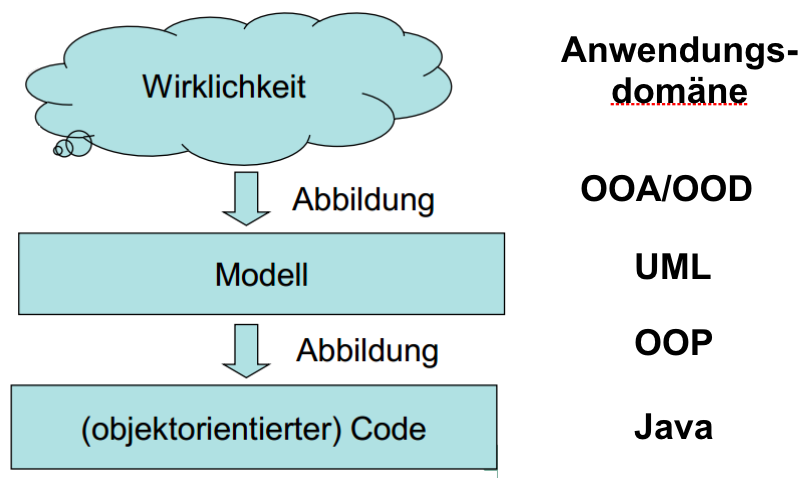
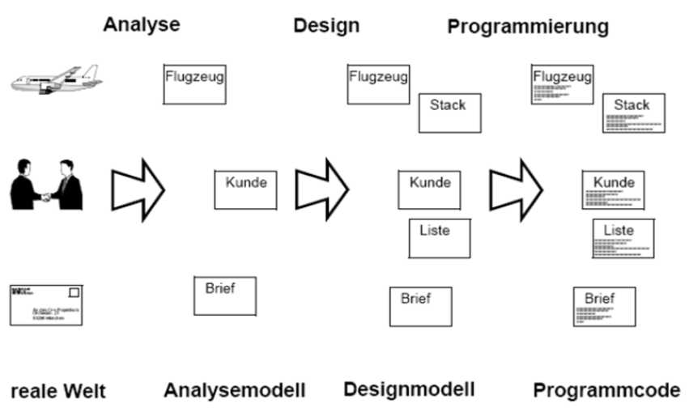

### Vorlesung 4: OOA und OOD mit UML-Diagrammen

#### Grundlagen der objektorientierten Modellierung

### OOA / OOD mit UML

#### Analyemethoden
* Analyemethoden sind Richtlinien zur Vorgehensweise in der Analysephase
* Beispiele für Analysemethoden:
  * Strukturierte Analyse (SA) (wird nicht in der Vorlesung behandelt)
  * Objektorientierte Analyse (OOA)

#### OOA / OOD
* Die objektorientierte Analyse und das objektorientierte Design zerlegt das Softwaresystem mit objektorientierten Verfahren in handhabbare Teile
* Vorteilhaft ist die durchgängige und konsistente Beschreibung über alle Phasen der Softwareentwicklung hinweg
  * Nutzung der gleichen Konzepte für Analyse, Design und Implementierung (bei Nutzung von objektorientierten Programmiersprachen)
* Erhöht Verständlichkeit
  * Objekte als Konzept aus der realen Welt intuitiv verständlich
* Erhöht Wiederverwendbarkeit
  * Relativ abgeschlossene Objektdefinitionen und –implementierungen lassen sich leicht wiederverwenden

#### Objektorientierte Analyse (OOA)
* Fachliche Beschreibung der Systemanforderungen und Präzisierung des Problems
* Was soll das System machen und nicht, wie es implementiert werden soll
* Untersuchung und Beschreibung des Systembereichs unabhängig von der Programmiersprache
* Verringerung der Komplexität: Herausfiltern der für die Aufgabe wichtigen Aspekte
* Kommunikation mit Problemexperten, Anwendern oder Kunden über eine eindeutige Notation
* Testen von Einheiten bereits vor ihrer Fertigstellung (Beispiel: Durchspielen von Szenarien in Simulationen)
* Ableitung eines Prototypen

#### Objektorientierte
* Erweiterung des OOA-Modells zu einem OOD-Modell
* Abbilden des Realitätsmodells auf den Lösungsbereich
* Erweiterung um systemnahe Klassen
  * Schnittstellen
  * Benutzungsoberfläche
  * Datenhaltung
  * Verteilung
* Das OOD-Modell soll als Vorstufe der Umsetzung direkt in einer Programmiersprache implementierbar sein
* Hinzufügen von Klassen, Attributen und Methoden, die für die Realisierung gebraucht werden (z.B. Datenhaltung in Form einer verketteten Liste)
* Einbeziehung bestehender Entwürfe und Klassenbibliotheken (z.B.UI-Library) in das Design

#### Kommunikation über UML-Modelle

