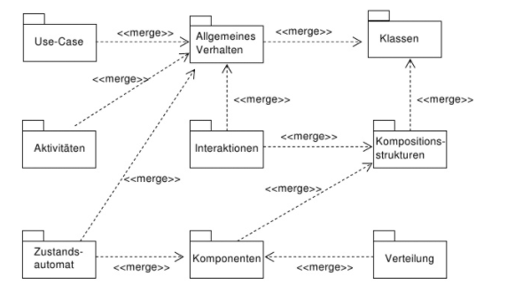

## Vorlesung 5: OOA/OOD mit UML-Diagrammen

### OOA / OOD mit UML

#### Grundlagen der objektorientierten Modellierung

#### Analysemethoden
* Analysemethoden sind Richtlinien zur Vorgehensweise in der Analysephase
* Beispiele für Analysemethoden:
  * Strukturierte Analyse (SA) (wird nicht in der Vorlesung behandelt)
  * Objektorientierte Analyse (OOA)

#### OOA / OOD
* Die objektorientierte Analyse und das objektorientierte Design zerlegt das Softwaresystem mit objektorientierten Verfahren in handhabbare Teile
* Vorteilhaft ist die durchgängige und konsistente Beschreibung über alle Phasen der Softwareentwicklung hinweg
  * Nutzung der gleichen Konzepte für Analyse, Design und Implementierung (bei Nutzung von objektorientierten Programmiersprachen)
* Erhöht Verständlichkeit
  * Objekte als Konzept aus der realen Welt intuitiv verständlich
* Erhöht Wiederverwendbarkeit
  * Relativ abgeschlossene Objektdefinitionen und –implementierungen lassen sich leicht wiederverwenden

#### Objektorientierte Analyse (OOA)
* Fachliche Beschreibung der Systemanforderungen und Präzisierung des Problems
* Was soll das System machen und nicht, wie es implementiert werden soll
* Untersuchung und Beschreibung des Systembereichs unabhängig von der Programmiersprache
* Verringerung der Komplexität: Herausfiltern der für die Aufgabe wichtigen Aspekte
* Kommunikation mit Problemexperten, Anwendern oder Kunden über eine eindeutige Notation
* Testen von Einheiten bereits vor ihrer Fertigstellung (Beispiel: Durchspielen von Szenarien in Simulationen)
* Ableitung eines Prototypen

#### Objektorientierte
* Erweiterung des OOA-Modells zu einem OOD-Modell
* Abbilden des Realitätsmodells auf den Lösungsbereich
* Erweiterung um systemnahe Klassen
  * Schnittstellen
  * Benutzungsoberfläche
  * Datenhaltung
  * Verteilung
* Das OOD-Modell soll als Vorstufe der Umsetzung direkt in einer Programmiersprache implementierbar sein
* Hinzufügen von Klassen, Attributen und Methoden, die für die Realisierung gebraucht werden (z.B. Datenhaltung in Form einer verketteten Liste)
* Einbeziehung bestehender Entwürfe und Klassenbibliotheken (z.B.UI-Library) in das Design

### Modelle und UML-Diagramme
Mit UML lassen sich Software-Systeme modellieren und darstellen. Diese Modelle und Darstellungen lassen sich wie folgt unterteilen:
* __Funktionale Modellierung__
	* Menge von Funktionen, Anwendungsfällen und Diensten
* __Prozessorientierte Darstellung__
	* Menge von Prozessen, Abläufen, Vorgängen und Workflows
* __Daten und Objekt Darstellung__
	* Beziehungen untereinander und Strukturen

Ein Softwaresystem soll immer in solche Subsysteme zerlegt werden und anschließend aus unabhängigen Komponenten bestehen.

Außerdem gibt es noch die Unterscheidung von __statischen__ und __dynamischen__ Modellen, die in den folgenden Grafiken veranschaulicht wird.

Die Diagramme verfeinern sich von oben nach unten und lassen sich wie oben erwähnt in statisch und dynamisch einteilen.
* Das __statische Modell__ stellt eine allgemeine Gesamtansicht auf ein Problemfeld dar
* Das __dynamische Modell__ stellt Systemverhalten, zeitliche Abläufe, Zustände und Übergänge dar

Im folgendem werden die _wichtigsten_ Diagramme erklärt:
* __Use-Case__(Anwendungsfall)
	* beschreibt Anforderung
	* Außensicht auf das Produkt
	* Testgrundlagen

* __Dynamisches Aktivitätsdiagramm__
	* beschreibt einen Workflow/Szenario
	* Klassen,Objekte und Beziehungen lassen sich hieraus extrahieren

* __Statisches Paketdiagramm__
	* besteht aus zusammenhängenden Klassen
	* verständlich ohne tiefgehende Untersuchung der Klassen

* __Paket- und Klassendiagramm__
	* guter Überblick über die Ergebnisse des statischen Software-Entwurfs

* __Sequenz- und Kommunikationsdiagramm__
	* sind dynamisch
	* beschreibt den Nachrichtenaustausch in einem System
	* Verhalten steht im Vordergrund

* __Zustandsübergangsdiagramm__
	* sehr kleinteilig
	* beschreibt Zustand eines Objekts im Verlauf
	* gut zum Ermitteln neuer Attribute und Methoden

