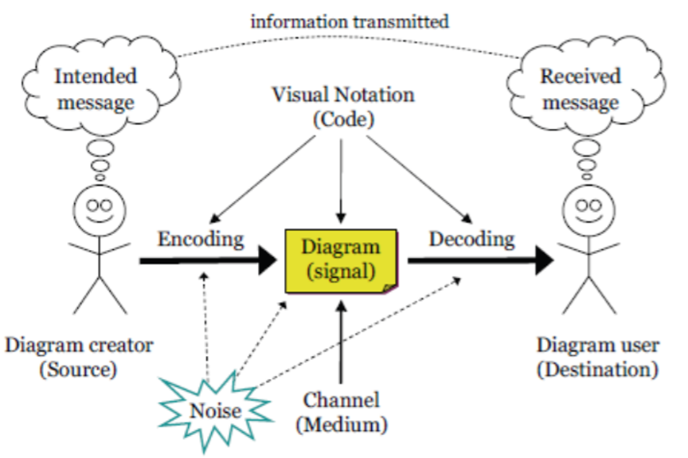
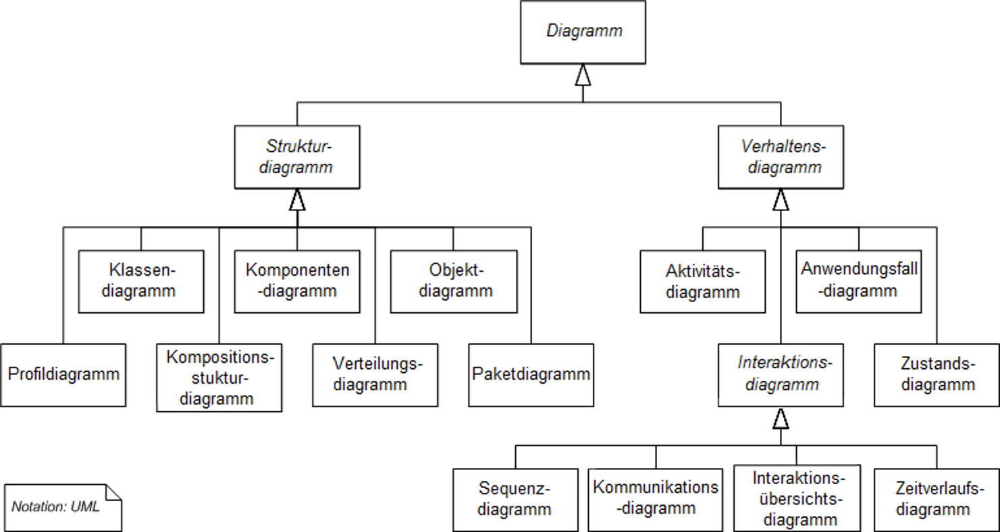
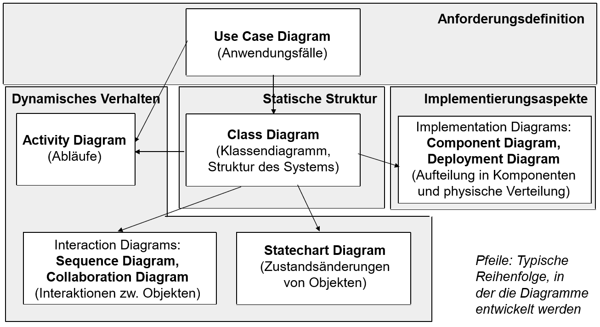
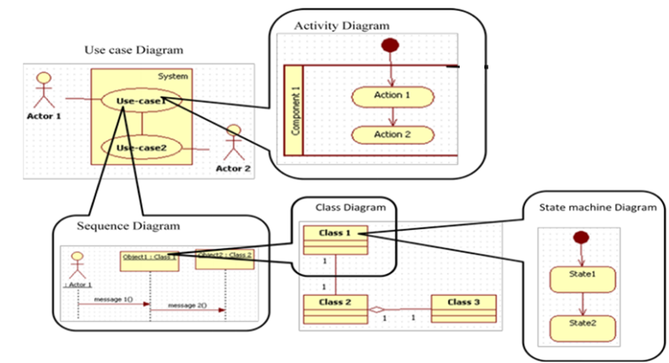
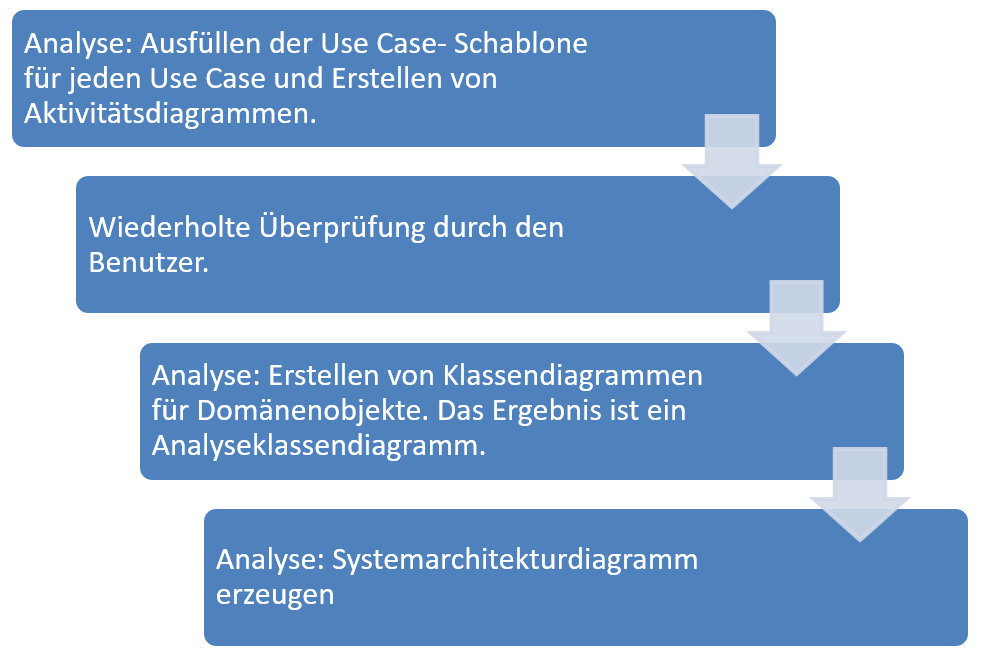
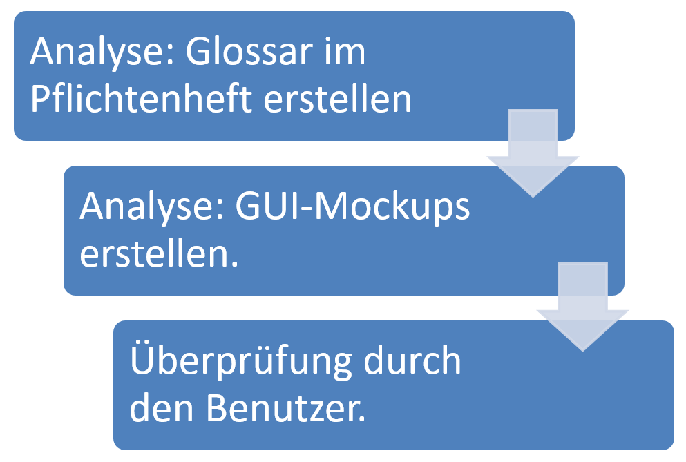
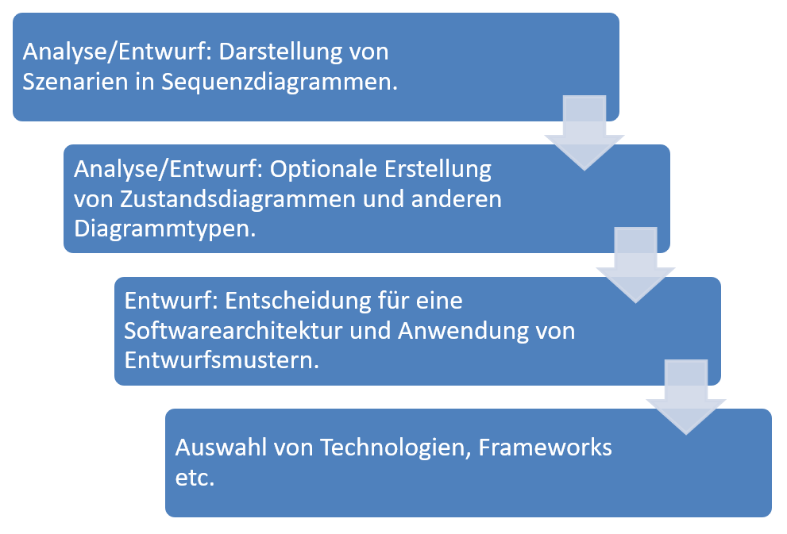
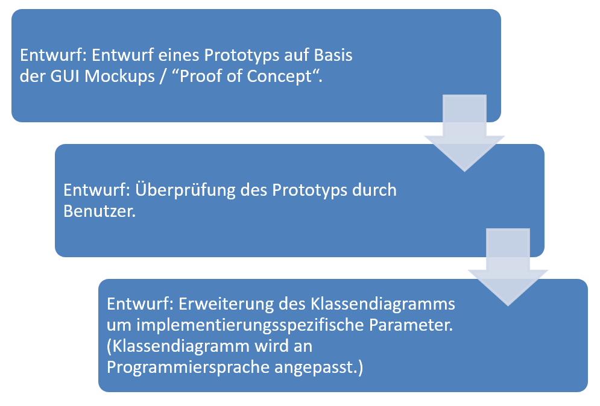
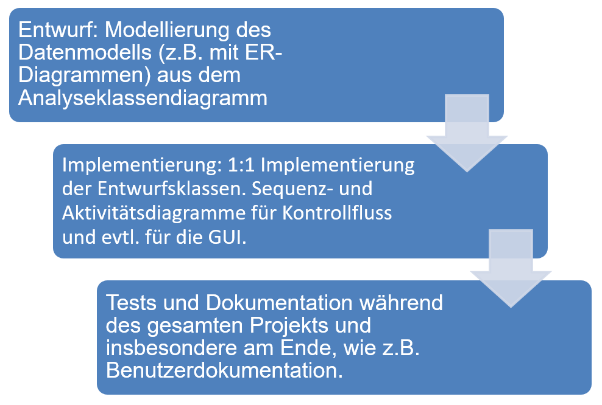

## Vorlesung 5: OOA/OOD mit UML-Diagrammen

### UML

### Kommunikation über UML-Modelle

#### UML (Unified Modeling Language)
* ist eine grafische Modellierungssprache zur Spezifikation, Konstruktion und Dokumentation von u.a. Softwaresystemen, speziell in den frühen Phasen der Softwareentwicklung.
* ermöglicht Kommunikation unter Entwicklern, aber auch zwischen Entwicklern und Benutzern.
* bildet analog zu einem Bauplan den Problembereich möglichst genau auf einem Modell ab.
* bietet viele Freiheiten bei der Modellierung.

### UML - Diagrammtypen

Vorlesungsrelevant: Klassendiagramm, Paketdiagramm, Objektdiagramm, Komponentendiagramm, Verteilungsdiagramm, Aktivitätsdiagramm, Anwendungsfalldiagramm, Sequenzdiagramm, Zustandsdiagramm

### Modelle und UML-Diagramme
Mit UML lassen sich Software-Systeme modellieren und darstellen. Diese Modelle und Darstellungen lassen sich wie folgt unterteilen:
* __Funktionale Modellierung__
	* Menge von Funktionen, Anwendungsfällen und Diensten
* __Prozessorientierte Darstellung__
	* Menge von Prozessen, Abläufen, Vorgängen und Workflows
* __Daten und Objekt Darstellung__
	* Beziehungen untereinander und Strukturen

Ein Softwaresystem soll immer in solche Subsysteme zerlegt werden und anschließend aus unabhängigen Komponenten bestehen.

Außerdem gibt es noch die Unterscheidung von __statischen__ und __dynamischen__ Modellen, die in den folgenden Grafiken veranschaulicht wird.

Die Diagramme verfeinern sich von oben nach unten und lassen sich wie oben erwähnt in statisch und dynamisch einteilen.
* Das __statische Modell__ stellt eine allgemeine Gesamtansicht auf ein Problemfeld dar
* Das __dynamische Modell__ stellt Systemverhalten, zeitliche Abläufe, Zustände und Übergänge dar

Im folgendem werden die _wichtigsten_ Diagramme erklärt:
* __Use-Case__(Anwendungsfall)
	* beschreibt Anforderung
	* Außensicht auf das Produkt
	* Testgrundlagen

* __Dynamisches Aktivitätsdiagramm__
	* beschreibt einen Workflow/Szenario
	* Klassen,Objekte und Beziehungen lassen sich hieraus extrahieren

* __Statisches Paketdiagramm__
	* besteht aus zusammenhängenden Klassen
	* verständlich ohne tiefgehende Untersuchung der Klassen

* __Paket- und Klassendiagramm__
	* guter Überblick über die Ergebnisse des statischen Software-Entwurfs

* __Sequenz- und Kommunikationsdiagramm__
	* sind dynamisch
	* beschreibt den Nachrichtenaustausch in einem System
	* Verhalten steht im Vordergrund

* __Zustandsübergangsdiagramm__
	* sehr kleinteilig
	* beschreibt Zustand eines Objekts im Verlauf
	* gut zum Ermitteln neuer Attribute und Methoden

### Zuordnung der UML-Diagrammtypen zu Phasen der Softwareentwicklung

#### Einsatzgebiete der UML - Diagrammtypen
* Anforderungen
    * Use-Case-Diagramm
* Geschäftsprozesse
    * Aktivitätsdiagramm
* Statische Softwarestruktur
    * Klassendiagramm
* Dynamisches Verhalten der Software
    * Squenzdiagramm, Zustandsdiagramm
* Struktur von Softwarekomponenten / Bibliotheken
    * Komponentendiagramm
* Zuordnung von Software auf Rechnersystemen
    * Verteilungsdiagramm

In der Grafik sind einige der oben genannten Zugehörigkeiten anschaulich dargestellt.

* Der Ablauf eines Use-Cases wird durch ein Aktivitätsdiagramm modelliert.
* Szenarien eines Use-Cases werden durch Interaktionsdiagramme modelliert.
* Klassendiagramme strukturieren den Use-Case.
    * Klassen werden in Interaktionsdiagrammen verwendet.
* Das Verhalten einer Klasse wird in einem Zustandsdiagramm modelliert.
* Ein Paketdiagramm strukturiert Klassen zu größeren Einheiten.

### Pragmatisches "Schritt für Schritt" Vorgehensmodell

