## Vorlesung 6: Anforderungsanalyse mit UML-Use Case Diagramm, Satzschablone und textueller Use Case Definition

## Anforderungsanalyse

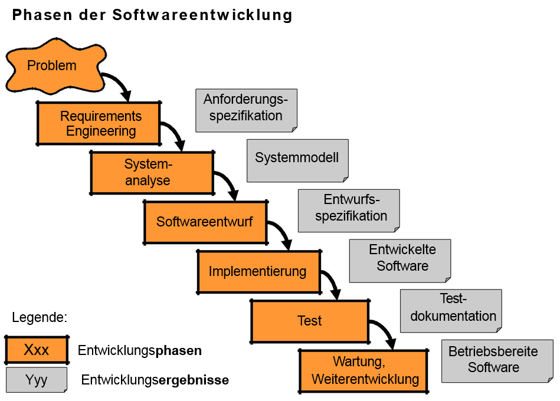

#### Der Stakeholder 

* wichtigste und gute Quelle für Anforderungen 

* Stakeholder eines Systems = Person oder Organisation, die Einfluss auf die Anforderungen des betrachteten Systems hat

* Stakeholder übersehen = lückenhafte Anforderungen 

* Wichtige Stakeholder: Kunde, Mitarbeiter, Gesellschafter, Eigentümer, Zulieferer, andere Dienstleister 

  ​

  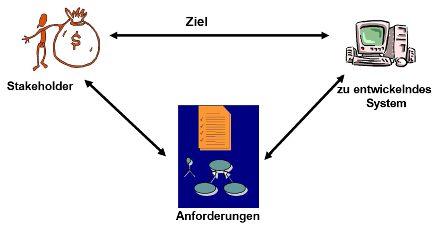

#### Arten der Anforderungsanalyse

* Lastenheft:

  * Problembeschreibung aus der Sicht des Nutzers/Kunden 
  * "Das will ich haben"

* Pflichtenheft:

  * Problembeschreibung aus der Sicht des "Realisierer"

  * "So will ich es machen"

    ​

  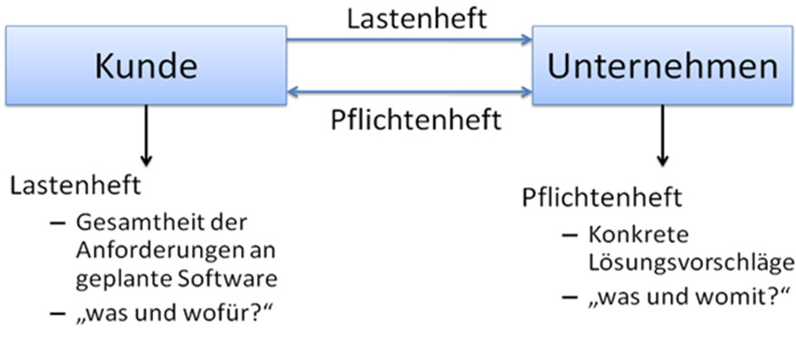

#### Hinweise zur Dokumentation:

* Pflichtenheft und Lastenheft sind Möglichkeiten zur Dokumentation
* In der Praxis werden auch andere Dokumentarten erzeugt 
* Dokumentation muss in großen Projekten mit vielen Beteiligten erstellt werden 

#### Anforderungsanalyse ist ein systematischer Ansatz ...

* ... zur Ermittlung und Dokumentation von Anforderungen an ein System 
* ... zur Festsetzung von Verträgen zwischen Kunden und IT-Dienstleister 
* ... zur Pflege von Verträgen bei Änderungen an den Anforderungen 
* ... zur Herstellung der Prüfbarkeit des Systems gegenüber den Anforderungen des Kunden 

#### Ziele der Anforderungsanalyse

* Unterstützung des Arbeitgebers bei der Ermittlung der Anforderungen 
* Unterstützung des Anforderungsanalytikers bei der Aufbereitung der Anforderungen 
  * Formulieren, Klassifizieren, Hierarchisieren, Präzisieren, Priorisieren

### Was sind Anforderungen? 

Anforderungen legen die qualitativen und quantitativen Eigenschaften eines Softwareproduckts fest

##### Was beschreiben Anforderungen?

* Eigenschaften / Bedingungen, um ein Problem zu lösen oder ein Ziel zu erreichen 
* Eigenschaften / Bedingungen, die ein System / eine Systemkomponente erfüllen muss, um einen Vertrag, eine Norm, eine Spezifikation oder andere formal festgelegte Dokuemte zu erfüllen 
* Die Anforderungsbeschreibung legt fest, was ein Produkt "können soll / muss", nicht wie es realisiert werden soll

##### Wege zu und Quellen von Anforderungen 

* Workshops mit Befragungen zentraler Stakeholder 
* Beobachtung des Kunden bzw. des Endnutzers 
* Fragebögen und Interviews 
* Analyse von Altsystemen 
* Dokumente des Kunden 
* Vorgängersystem im Betrieb 
* Gesetze und Normen 

##### Arten von Anforderungen 

* Funktionale Anforderungen: 
  * Was soll das zu entwickelnde Softwaresystem tun?
* Nichtfunktionale Anforderungen: 
  * Welche Eigenschaften soll das zu entwickelnde Softwaresystem zusätzlich zur Funktionalität aufweisen?

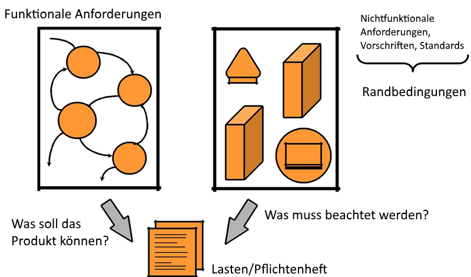

| Funktionale Anforderungen                | Nichtfunktionale Anforderungen           |
| :--------------------------------------- | :--------------------------------------- |
| Funktionalitäten:  Algorithmen,  Abläufe | Leistungsanforderungen:  Benutzerzahl, Datenumfang, Antwortzeiten |
| Daten:  Eingaben, Ausgaben, Datenmodelle | Qualitätsanforderungen:  Zuverlässigkeit, Sicherheit, Robustheit, Portierbarkeit |
| Schnittstellen:  Benutzungsschnittstellen, Schnittstellen zu anderen Systemen | Realisierungsanforderungen:  Entwicklungsmethoden, Richtlinien, Abnahme, Wartung, Dokumentation |

#### Nichtfunktionale Anforderungen

### Probleme bei der Anforderungsanalyse 

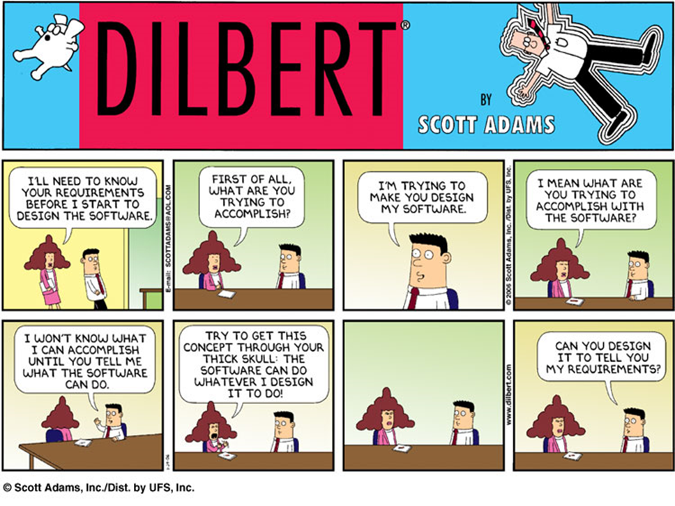

* Kunde weiß nicht, was er will 
* Anforderungsbeschreibungen sind nicht maschinell verarbeitbar und daher oft unverständlich und inkonsistent 
* Auftraggeber, Nutzer, Betreiber etc. sind häufig verschiedene Personen und unterschiedliche Personen haben teilweise widersprüchliche Anforderungen 
* Unterschiede und Widersprüche werden nicht erkannt 
* Zu viele Anforderungen 
* Anforderungen ändern sich im Laufe der Entwicklungszeit - Änderungsmanagement der Anforderungen 
* Auslassungen bzw. implizite Annahmen, da etwas für Experten "offensichtlich" ist 
* Keine klaren Enscheidungen im Konfliktfall
* Mögliche Auswirkungen werden nicht aufgezeigt 
* Systemumgebung ist nicht klar beschireben oder ändert sich 

#### Problematik bei der Festlegung

| Anforderungen sind | Beispiele                 |
| ------------------ | ------------------------- |
| mehrdeutig         | ein Fahrrad wie Kaus      |
| nicht erfüllbar    | Sandmännchen kennenlernen |
| überbestimmt       | ein runder Ball           |
| inkonsistent       | ein schnelles Auto        |
| unvollständig      |                           |

### Vorgehensweise bei der Anforderungsanalyse

#### Tätigkeiten bei der Anforderungsanalyse 

​	Prozess nach Summerville 

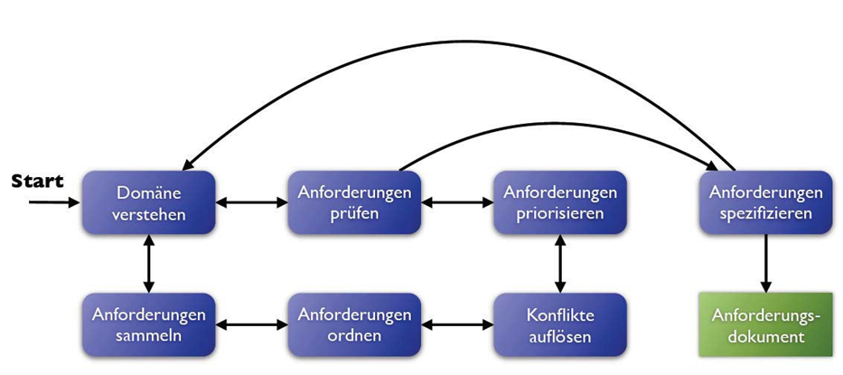

#### UML in der Anforderungsanalyse 

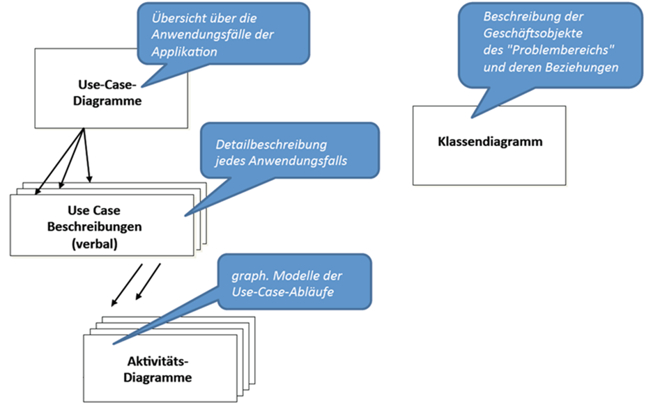

* Use Case Satzschablone:
  * Präzisierung der natürlichsprachlichen Anforderungen. 
  * Hilft, die Anforderungen mit dem Kunden in eindeutiger und konsistenter Weise zu formulieren
* Textuelle Use Case Definition:
  * Natürlichsprachliche Beschreibung der Arbeitsläufe durch größere Use Cases. D.h. nähere Beschreibung der Interaktionen von Aktueren mit einem System. Häufig ergänzt um Zustand- und Aktivitätsdiagramme 
* Use Case Diagramme 
  * Zeigt das externe Verhalten eines Systems gegenüber seinen Akteuren und stellt strukturelle Abhängigkeiten zwischen den Anwendungsfällen und den Akteuren dar	

### Satzschablonen für die Anforderungsermittlung

#### Visualisierung der Systemaktivitäten
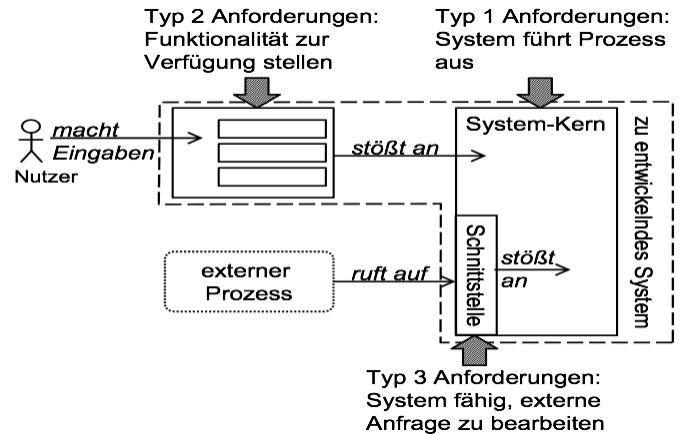

#### Charakterisierung der Systemaktivitäten
1. Selbstständige Systemaktivität
  Das System **führt** den Prozess selbstständig durch.
2. Benutzerinteraktion
  Das System **stellt** dem Nutzer die Prozessfunktionalität zur Verfügung.
3. Schnittstellenanforderung:
  Das System führt einen Prozess in Abhängigkeit von einem Dritten (zum Beispiel einem Fremdsystem) aus, ist an sich passiv und wartet auf ein externes Ereignis.

#### Satzschablone nach Rupp

##### Selbstständige Systemaktivität Beispiele
* Nach der Eingabe eines neuen Teilprojekts und nach der Aktualisierung des Aufwandes eines Teilprojekts oder einer neuen Projektaufgabe muss das System die **Aufwandsangaben auf Plausibilität** prüfen.
* Falls der eingegebene Bibliothekskunde bereits im System vorhanden ist, muss das System die Fehlermeldung "Kunde vorhanden" ausgeben.

##### Benutzer Interaktion Beispiele
* In der Projektbearbeitung muss das System dem Nutzer die Möglichkeit bieten, ein **neues Projekt** mit Projektausgangsdaten anzulegen.
* Nach der Projektauswahl muss das System dem Nutzer die Möglichkeit bieten, für **existierende Projekte** neue Teilprojekte anzulegen.
* Nachdem das System die Geschäftsdaten gespeichert hat, muss das System dem Mitarbeiter die Möglichkeit bieten, einen **Genehmigungsantrag auf dem Netzwerkdrucker zu drucken**.
* Das System muss dem Sachbearbeiter die Möglichkeit bieten, **neue Dozenten zu erfassen**.

##### Schnittstellenanforderung
* Nach der Kontaktaufnahme durch die Software „Globalview“ muss das System fähig sein, Anfragen nach den Projektnamen, deren Gesamtaufwänden und Fertigstellungsgraden anzunehmen.
* Das Personalmodul wird fähig sein, Personendaten aus der Datenbank zu importieren.

#### Verbindlichkeit
| Rechtliche Verbindlichkeit               | Schlüsselwort |
| ---------------------------------------- | :-----------: |
| Der Ausdruck *muss*, wird benutzt um verpflichtende Anforderungen zu definieren. |   **muss**    |
| Der Ausdruck *sollte*, wird benutzt um wünschenswerte Anforderungen zu definieren. |  **sollte**   |
| Der Ausdruck *wird*, wird benutzt, um Anforderungen zu definieren, die in der Zukunft integriert werden. |   **wird**    |

#### Prozesse
| Prozesswort | Semantische Definition des Prozesswortes | Synonyme               |
| :---------: | ---------------------------------------- | ---------------------- |
|  speichern  | Im Bibliothekssystem muss *speichern* den Prozess bedeuten, Informationen persistent aufzubewahren. | sammeln, aufbewahren   |
|  auswählen  | Im Bibliothekssystem muss *auswählen* den Prozess bedeuten, eines oder mehrere Elemente aus einer endlichen Menge von Elementen zu bestimmen. | selektieren, markieren |
|  anzeigen   | Im Bibliothekssystem muss *anzeigen* den Prozess bedeuten, dem Benutzer Informationen auf dem Bildschirm darzustellen. | darstellen, ausgeben   |
|  einfügen   | Im Bibliothekssystem muss *einfügen* den Prozess bedeuten, neue Daten einzugeben oder vorhandene Daten zu überschreiben. | eingeben, einsetzen    |

#### Bedingungen
| Bedingung | Logische Bedingung | Zeitliche Bedingung | Semantische Definition der Bedingung     |
| :-------: | :----------------: | :-----------------: | ---------------------------------------- |
|   FALLS   |         X          |          -          | Das Wort *falls* bedeutet, dass das System eine Aufgabe bearbeitet, falls bestimmte Logische Bedingungen wahr sind. |
|  NACHDEM  |         -          |          X          | Das Wort *nachdem* bedeutet, dass ein System eine gestartete Aufgabe erst vollständig abgearbeitet haben muss, bevor das System eine neue Aufgabe beginnt. |
|  SOBALD   |         -          |          X          | Das Wort *sobald* bedeutet, dass ein System eine gestartete Aufgabe **nicht** vollständig abgearbeitet haben muss, bevor das System eine neue Aufgabe beginnt. |
|  SOLANGE  |         -          |          X          | Das Wort *solange* bedeutet, dass das System eine bereits gestartete Aufgabe **nicht** vollständig abgearbeitet haben muss, bevor das System eine weitere Aufgabe beginnt. Die neu gestartete Aufgabe wird exakt solange ausgeführt, wie die vorher bereits gestartete Aufgabe andauert. |

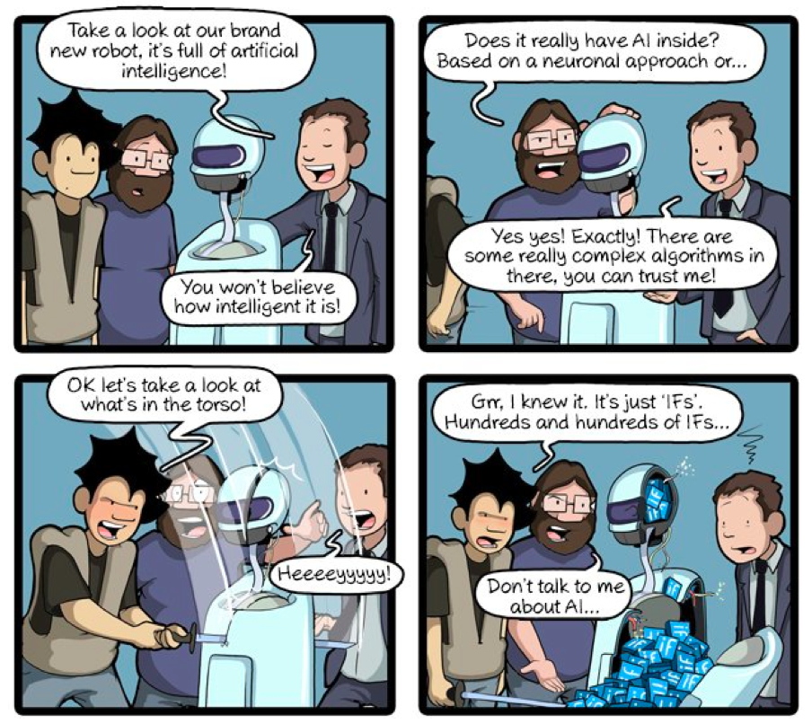

### Was ist ein Anwendungsfall(Use Case)?

#### Definition
* Eine Use Case
 * definiert die funktionalen Hauptaufgaben eines Systems
 * beschreibt in der Sprache der Stakeholder eine konsistente und zielgerichtete Interaktion des Benutzers mit einem System
 * beschreibt das gewünschte Systemverhalten aus der Sicht des Anwenders und somit Anforderungen, die das System erfüllen soll
 * beschreibt, was das System leisten muss, aber nicht, wie es dies leisten soll
 * besteht aus mehreren zusammenhängenden Aufgaben, die von einem Akteur durchgeführt werden, um ein Ziel zu erreichen bzw. ein gewünschtes Ergebnis zu erstellen

* Alle Anwendungsfälle zusammen dokumentieren die Möglichkeiten der Benutzung des Softwaresystems und werden in einem Use Case Diagramm dargestellt.

#### Use Case vs. User Story
* Eine User Story ist eine einfache kurze Beschreibung eines Benutzerziels, um einen Nutzen zu generieren
* Ein Use Case ist die detaillierte Spezifikation von Funktionalität (Reihenfolge von Systemaktivitäten), um ein gewünschtes Resultat zu erzielen
* Use Cases fokussieren auf Nutzerinteraktionen mit einem System, so dass das Ziel der Nutzer klar wird
* Use Cases können mit include- und extends-Beziehungen strukturiert werden
* User Stories eignen sich für inkrementelles Vorgehen, während Use Cases sich gut für eine Neuentwicklung eignen
* User Stories werden im Gegensatz zu Use Cases nicht als Instrument zur  Dokumentation eingesetzt, sondern als Basis, um über Anforderungen zu reden
* User Stories werden als Planungsinstrument eingesetzt und so lange kompakt „kleingeschnitten“, bis sie in einem festgelegten Zeitraum einer Iteration umgesetzt werden können

### Notationselemente für Use Case Diagramme

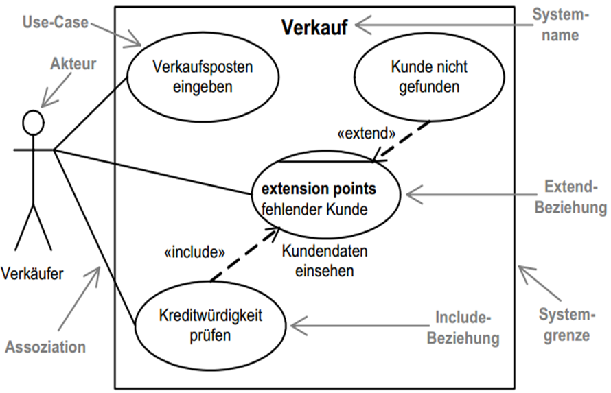

* Achtung: Kunde nicht gefunden ist kein geeigneter Use Case
* UC-Name wie „Kundendaten einsehen“ immer in den Use Case schreiben

#### Was ist ein Akteur(Aktor) ?

* Rolle, die Benutzer eines Systems spielt
* Häufig eine Person
* Kann auch eine Organisationsheit oder ein System sein
* Befindet sich immer außerhalb des Systems

** Notation:** 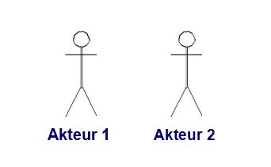

#### Arten von Aktoren

* Meschlich: Anfänger, geübter Benutzer, Admin
* Nicht-Menschlich: Messaging-System, E-Mail System
* Primär: Hauptnutzer des Systems
* Sekundär: notwendig für das Funktionieren des Systems
* Aktiv: stößt selbst Anwendungsfälle an
* Passiv: stößt keine Anwendungsfälle an

Beispiel: 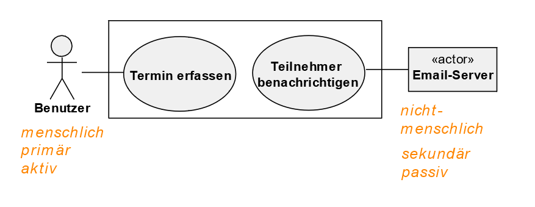

#### Notation

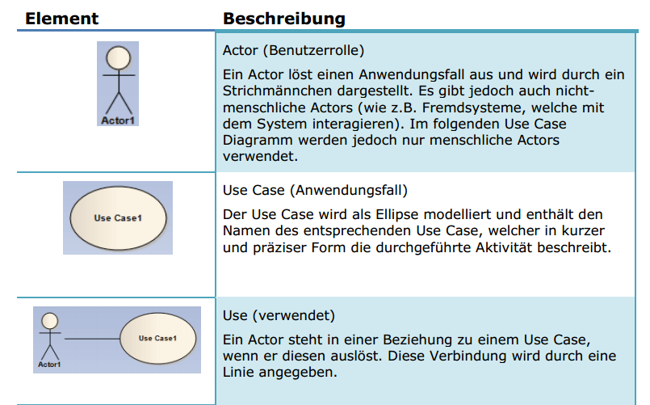

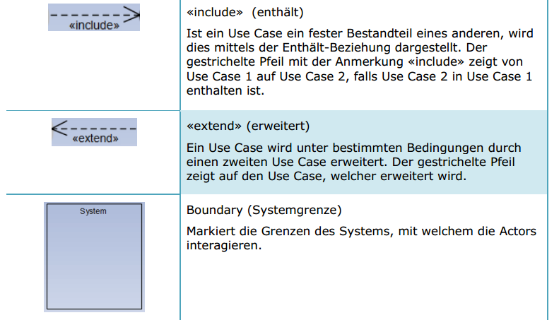

#### Vererbung bei Akteuren und Kardinalitäten

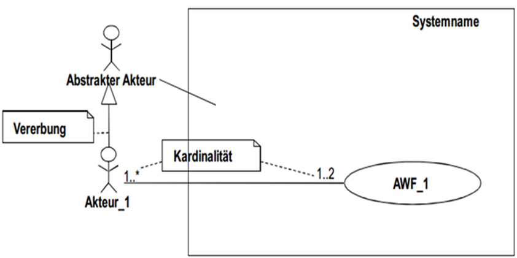

#### Use-Case Diagramm: Generalisierung

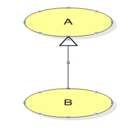

Use-Case B erbt alle Aktionen und Eigenschaften von Use- Case A. Auch die Beziehungen zu verschiedenen Akteuren werden vererbt.

Use-Case B kann Aktionen von Use-Case-A verfeinern, indem bestimmte Aktionen überschrieben werden

#### Use-Case Diagramm: Include

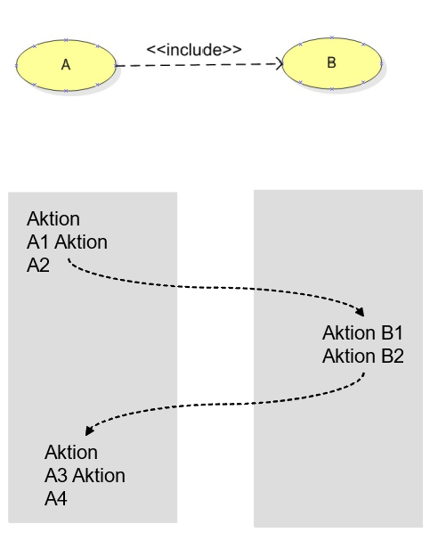

Die «include»-Beziehung visualisiert, dass ein Use-Case (A) das Verhalten eines anderen Use-Case (B) importiert. Die Beziehung ist nicht optional, so dass  das Verhalten immer importiert wird

Erst die Beschreibung der Aktionen definiert, an welcher Stelle der Use-Case B inkludiert wird.

#### Use-Case Diagramm: Extend

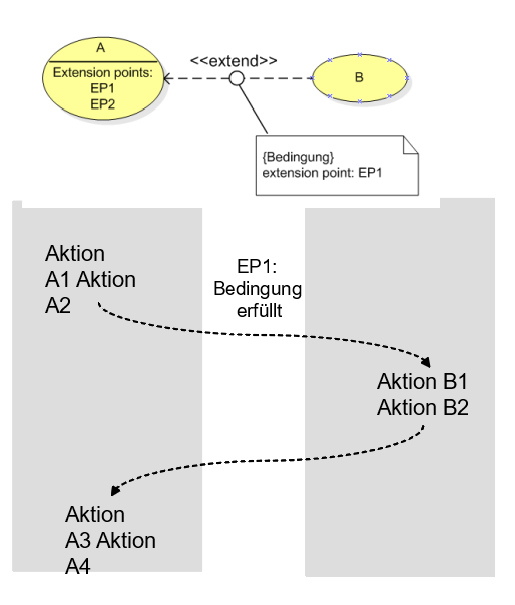

Die «extend»-Beziehung zeigt an, dass das Verhalten eines Use-Case (A) durch einen anderen Use-Case (B) erweitert werden kann, aber nicht muss.

Den Zeitpunkt, an dem ein Verhalten eines Use-Case erweitert werden kann, bezeichnet man als Erweiterungspunkt (engl. extension point). Ein Use-Case darf mehrere Erweiterungspunkte besitzen.

Eine Erweiterung kann noch um eine optionale Bedingung ergänzt werden. D.h. nur wenn die Bedigung erfüllt ist, wird die Erweiterung tatsächlich ausgeführt

Beispiele

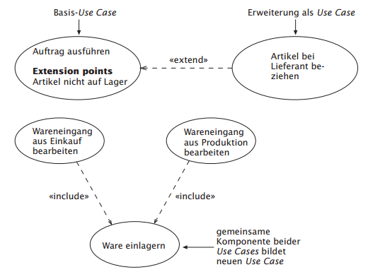

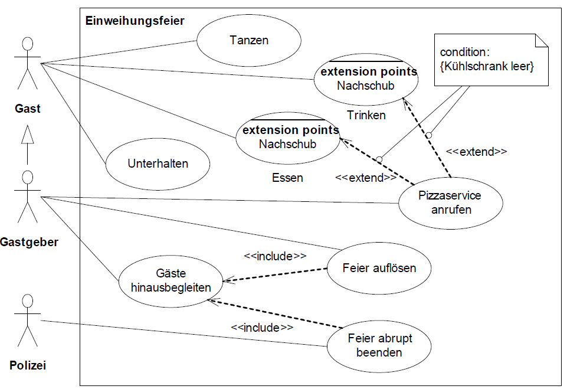

### Best Practices

* Use Cases sollen eine Sinvolle Bezeichnung, die aus einem Substantiv und aktivem Verb bestehen.
* Die Sprache soll standardisiert sein und Konsistenz haben.
* Keine Abläufe modellieren
* Aktor immer Außerhalb des Systems
* Keine Unterschiedlichen Benutzer mit Zuständen ("Benutzer" & "Registrierter Benutzer")
* Use Cases nicht zu umfangreich
* Auf die wichtigsten **include** und **extends** konzentrieren
* Große Diagramme in mehrere aufteilen
* Use Case mit mehreren Akteuren
   * Hat ein Use Case mehrere Akteure, so führen diese ihn gemeinsam aus
   * Soll ein Use Case von unterschiedlichen Akteuren jeweils alleine ausgeführt werden, so erstellt man einen generalisierten Akteur.
* So abstrakt wie möglich und konkret wie nötig
* Use Cases nicht zu klein gestalten (Button drücken, Name eingeben)
* Use Cases nicht zu groß gestalten
