# Systemanalyse mit Aktivitaetsdiagrammen

## Vorlesungsaufgabe

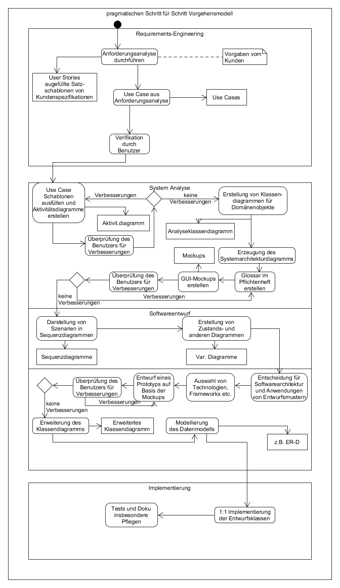

## Grundlagen

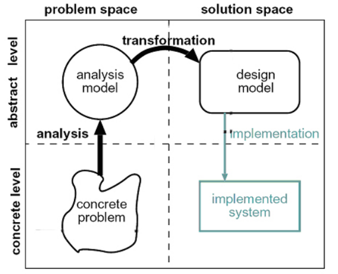

### Die Anforderungsanalyse
  - beschreibt Anwendungsfälle und Akteure
  - spezifiziert Geschäftsvorfälle mit Text
  - definiert die GUI

### Die Systemanalyse
- detailliertes Verständnis des Softwaresystems -> Probleme entdecken, bevor das System realisiert wird
- untersucht Problemgebiet -> vollständige Formulierung und Verständnis von gewünschtem Verhalten
- präzisiert Anforderungsdefinition -> Herausfinden, was Auftraggeber und Anwender wirklich wollen
    - Aspekte der Implementierung ausgeklammern, klare Trennung zwischen Anforderungen und Umsetzung
          - Betrachtung der reinen Anforderungen (Was will der Benutzer/Auftraggeber tatsächlich?), Untersctellung einer „perfekten Technik“ (keine Performance- oder Speicherbeschränkungen, keine Verteilungsproblematik etc.)
          - Softwareentwurf: Definition der technischen Lösung, Umsetzung der Anforderungen
- Einheitliches Verständnis zwischen Kunden und Entwicklern sowie innerhalb des Entwicklungsteams
- stellt sicher, dass Sachverhalte des Problemgebiets korrekt umgesetzt werden
- beherrscht die Komplexität und entdeckt Gemeinsamkeiten
- Priorisierung der Anforderungen und Entscheidung über ihre Realisierung

#### Die Systemarchitektur als Beispiel für ein Systemanalysemodell
- Die Systemarchitektur anhand von Beschreibungen (Source Code, natürliche Sprache) zu verstehen, ist schwer und kostet Zeit
- Daher wird die Systemarchitektur visuell auf abstraktem Niveau zum Beispiel als Client-Server-Architektur oder als Peer-to-Peer Architektur in Form eines „Box-and-arrows“-Diagramms
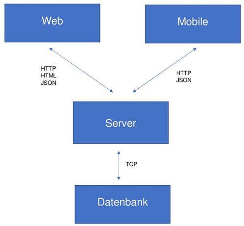
- !!!Benutzen Sie dieselben Symbole für die gleichen Dinge | Fügen Sie eine Legende hinzu!!!

#### Einordnung der Systemanalyse in Analogie zu einem Hausbau
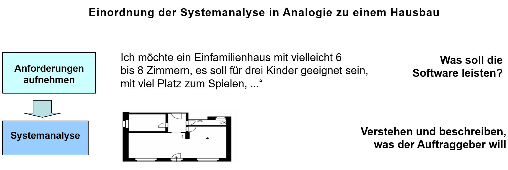
- Das Wesentliche einer (Software)-Architektur lässt sich in der Regel nicht in einer Sicht allein darstellen, sondern man verwendet verschiedene Sichten
- Für ein konkretes Softwaresystem wählt man „passende“ Sichten, um die Architektur darzustellen.
- Die Architekturdokumentation hilft anderen und auch einem selbst, eine Software-Architektur zu verstehen und zu analysieren
- In folgenden Projekten wird Wissen über den Architekturentwurf weitergegeben
- Eine Methode, Softwarearchitektur darzustellen, ist über die objektorientierte Analyse mit UML-Diagrammen 

#### UML-Modelle in der Objektorientierten Systemanalyse
- Ausgangspunkt der OOA ist die Anforderungsdefinition (insbesondere Use Cases)
- Bestandteil des OOA-Modells ist das Analyseklassendiagramm (Domain Object Model)
    - Vollständige Darstellung der fachlichen Daten-Anforderungen an das System
    - Ausgangsmodell für die Entwicklung des OOD-Klassendiagramms
- Ausgangspunkt der Aktivitätsdiagramme sind Use Case-Diagramme und textuelle Use Case–Beschreibungen
- Textuelle Use Cases Definitionen werden mittels Aktivitätsdiagrammen visualisiert  
    - Sie dienen auch der Spezifikation von Testfällen und damit zur Systemvalidierung
- Spezifikation der zeitlich-logische Abläufe (z.B. Geschäftsvorfälle) mit Aktivitätsdiagrammen zur Beschreibung der dynamischen Aspekte
- Mögliche Einsatzgebiete von Aktivitätsdiagrammen sind 
    - die Beschreibung Use Case-übergreifender Abläufe
    - die Spezifikation des Ablaufs innerhalb eines Use Cases
    - die Dokumentation des Kontrollflusses einer Operation
  
## Aktivitätsdiagramme
### Aufgaben, Zwecke und Einsatzgebiete von Aktivitätsdiagrammen
- Visualisierung von Use Cases zur Verbesserung des Verständnisses und der Analyse des Ablaufs von komplexen Szenarios 
- Modellierung von Abläufen Datenflüssen in einem System
- Generierung von Testfällen
- Dienen auch zur Geschäftsprozessmodellierung 
- Darstellung übergreifender Abläufe über Use Cases hinweg (Geschäftsvorfall)
- Es können sowohl sequentielle als auch parallele Abläufe modelliert werden
- Darstellung von zeitlich-logischen Abläufen in Form von aufeinanderfolgenden Aktivitäten inklusive Verzweigungen und parallelen Vorgängen
- Algorithmus einer Operation
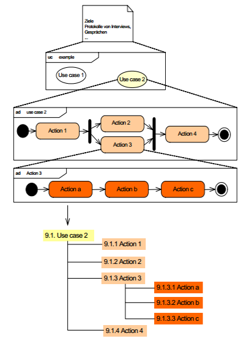

#### Zu jedem Use Case genau ein Aktivitätsdiagramm modellieren
- Erzeugen Sie aus den Use Case-Schritten Aktionen.
- Zerlegen Sie die Aktionen ggfs. mit einem Aktivitätsdiagramm, so dass sie stets genau einen fachlichen Arbeitsschritt repräsentieren.
- Ergänzen Sie den Ablauf um alle bekannten fachlichen Ausnahmen und fachlichen Ablaufvarianten, so dass das Diagramm eine vollständige Beschreibung aller zulässigen Ablaufmöglichkeiten darstellt.
#### Modellierung des Objektflusses
- Beschreiben Sie zu jeder Aktion die zu verarbeitenden und die resultierenden  Geschäftsobjekte.
- Beschreiben Sie, bei welchen ausgehenden Transitionen bzw. Bedingungen welche Objekte bzw. Objektzustände resultieren.

## Notationselemente für Aktivitätsdiagramme
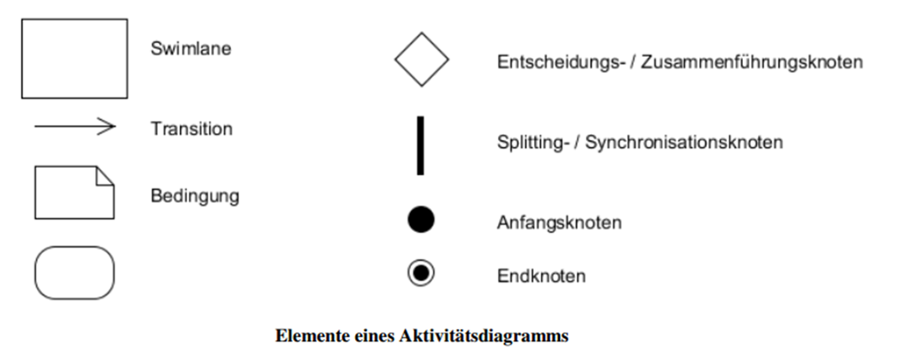
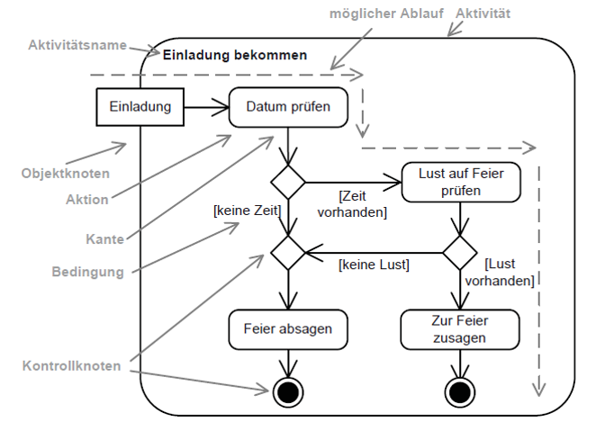
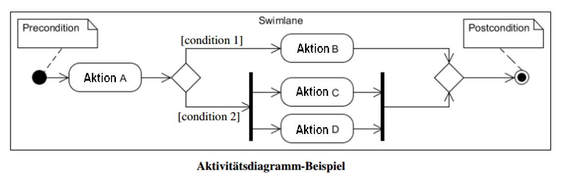
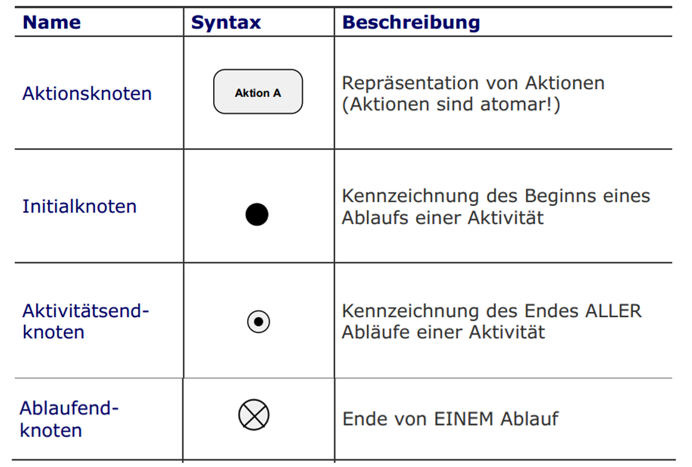
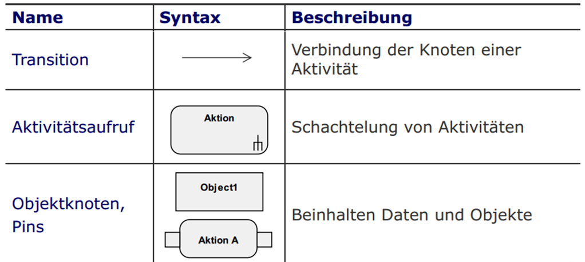

### Grundlegende Elemente
#### Aktion
- Zentrales Element innerhalb eines Aktivitätsdiagramms
- Modelliert einen einzelnen Schritt einer Aktivität
- Können über Kanten mit anderen Elementen verbunden werden.
- Falls bei Aktionsstart oder Aktionsende Bedingungen zu beachten sind, können Notizzettel verwendet werden.

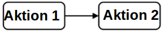
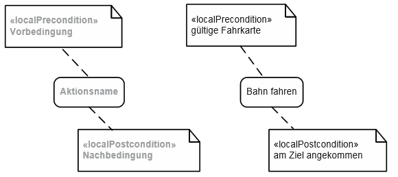

#### Initialknoten
- Startpunkt eines Ablaufes
- Es muss mindestens ein Initialknoten vorhanden sein
- Es darf mehrere Initialknoten geben

#### Aktivitätsendknoten
- Beendet alle Aktionen und Kontrollflüsse
- Es muss mindestend einen Aktivitätsknoten geben

#### Ablaufendknoten
- Beendet einen einzelnen Kontrollfluss
- Konsumiert ein einzelnes Token

#### Decision
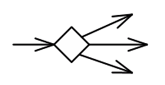

- Verzweigung des Kontrollflusses
- Besitzt ein oder mehrere Ausgänge, die jeweils mit bestimmten Bedingungen verknüpft sind (Guards)
- Besitzt exakt einen Eingang

#### Merge 
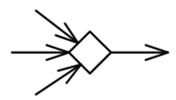

- Führt mehrere eingehende Kanten zu einer Ausgehenden Kante zusammen
- Decision und Merge treten paarweise auf
- Alle ausgehenden Kanten einer Decision müssen im selben Merge-Knoten zusammengeführt werden

#### Fork
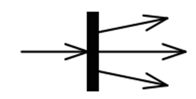

- Der eingehende Kontrollfluss wird auf mehrere ausgehende, nebenläufige Kontrollflüsse aufgeteilt
- Keine Bedingung
- Erlaubt die parallele Ausführung mehrer verschiedener Kontrollflüsse

#### Join
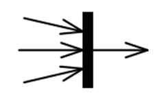

- Wartet auf alle eingehenden Kontrollflüsse bevor es weiter geht
- Synchronisiert parallele Kontrollflüsse und vereint sie

#### Kontrollknoten im Überblick
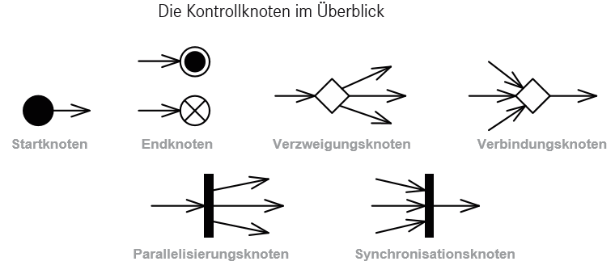

#### Waschmaschinen Beispiel
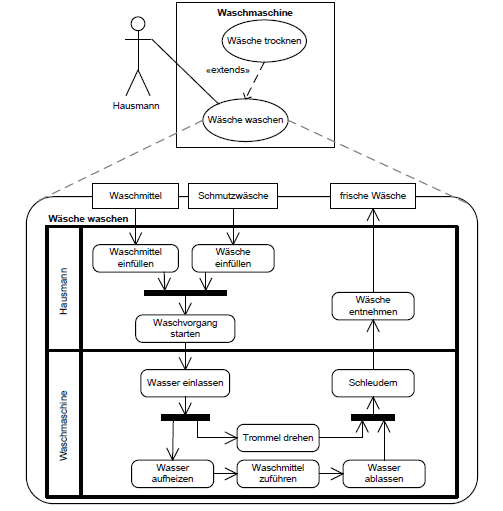

#### Objektknoten
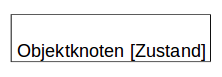

#### Objektknoten Beispiel
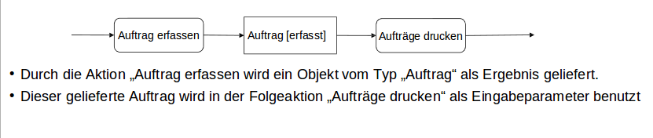

### Kanten (Kontrollfluss / Objektfluss)
#### Kontrollfluss
- Kante zwischen zwei Aktionen oder zwischen Aktion und Kontrollelement
- Token dienen hier nur der Aktionsausführung und besitzen keine Daten

#### Objektfluss
- Kante mit mindestens einem Objektknoten
- Kante hat ein Token, der Daten von oder zu Objektknoten transportiert

#### Objektfluss Beispiel
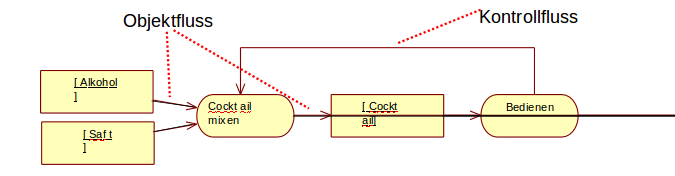

#### Pin-Notation 
- Kurzschreibweise für einen Objektfluss
- Der Objektknoten wird direkt an die Aktion angehängt
- Die Ausgabe einer Aktion ist die Eingabe der nächsten Aktion
- Beschriftung eines Pins: name:typ
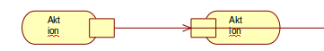

### Ablaufmodell von Aktivitätsdiagrammen mit Token
- Die Steuerung der Abläufe in einem Aktivitätsdiagramm erfolgt durch Token. (Kontrolltoken / Datentoken)
- Ein Token definiert den aktuellen Zustand der Verarbeitung
- Tokens werden erzeugt, wandern und verarbeitet Wanderung

#### Erzeugung
- Bei eingangslosen Knoten wird ein Token erzeugt (Startknoten, Signalempfangsknoten)
- Ein Token pro ausgehenden Fluss

#### Wanderung
- Aktion startet, bei eintreffen des Tokens
- Wenn die Aktion beendet wurde, wandert der Token weiter
- Token wählt einen ausgehenden Fluss

#### Verarbeiten
- Bei einem Endknoten oder Aufspaltung / Synchronisation werden alle eingehenden Knoten verarbeitet

#### Ablaufmodell von Aktivitätsdiagrammen mit Token - Beispiel
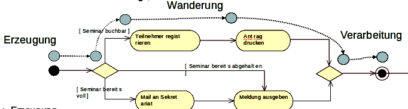

#### Schachtelung von Aktivitäten - Beispiel
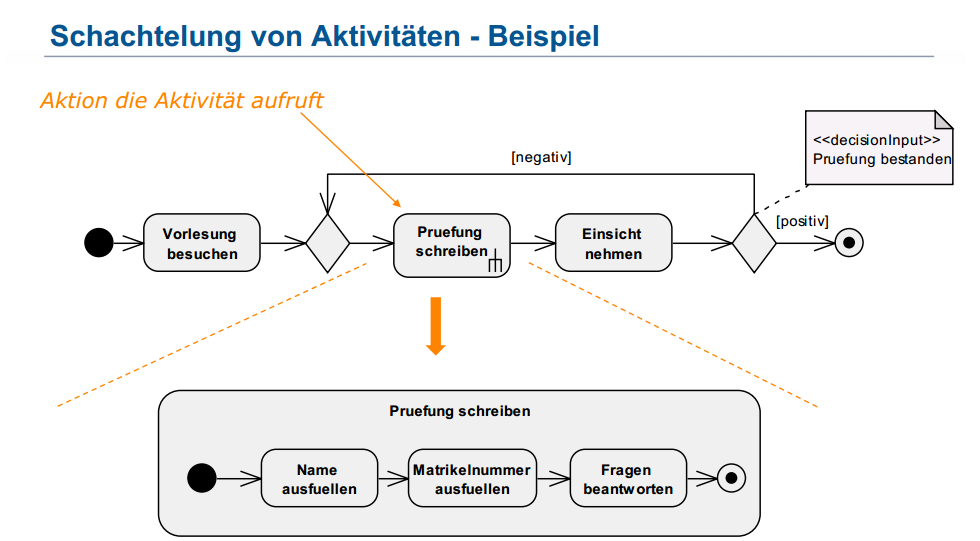

#### Gewicht einer Kante
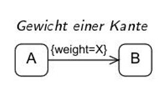

#### Gewicht einer Kante - Beispiel
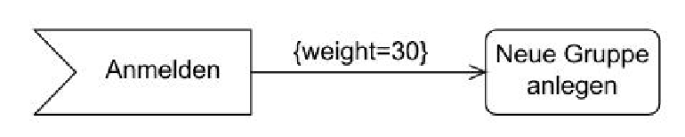

#### Konnektor
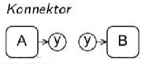

#### Konnektor - Beispiel
##### Beispiel1
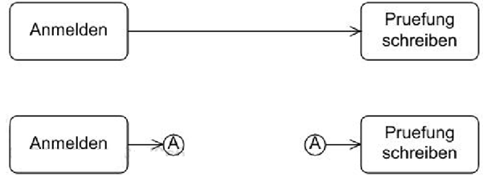

##### Beispiel2
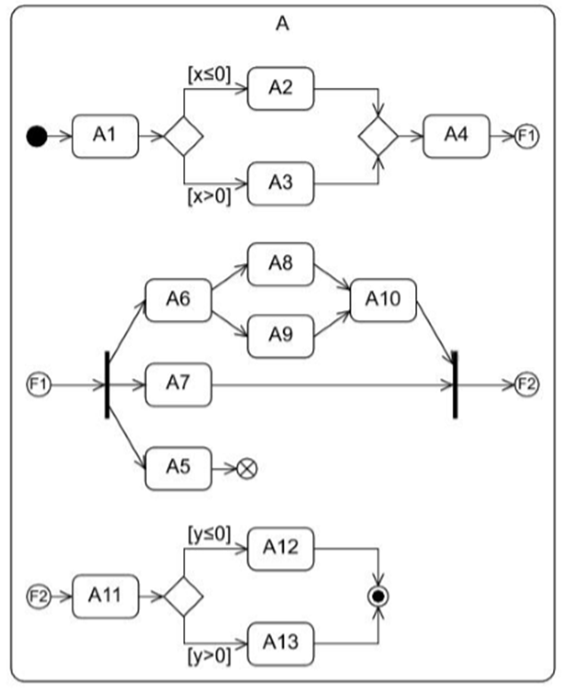

### Softwareentwicklungsprozess
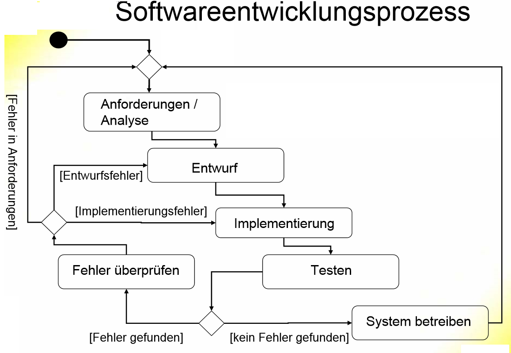

### Partition, Signal und asynchrones Ereignis/Zeitereignis
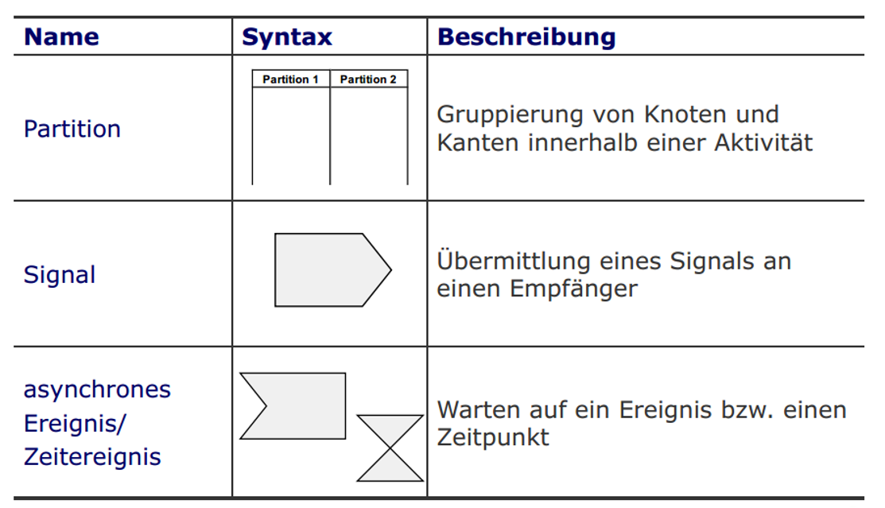

### Aktivitätsbereiche
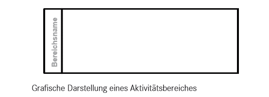

- Die Aktionen werden in gekennzeichneten Bereichen angeordnet
- Die Bereiche beschreiben wer oder was für eine Menge von Knoten verantworlich ist bzw. welche gemeinsame Eigenschaft sie kennzeichnet
- Beispiel: Verschiedene Abteilungen innerhalb eines Geschäftsprozesses
- Die Darstellung erfolgt horizontal und vertikal sowie durch eine Matrix oder hierarchisch

#### Einspruchsgesetze vermitteln
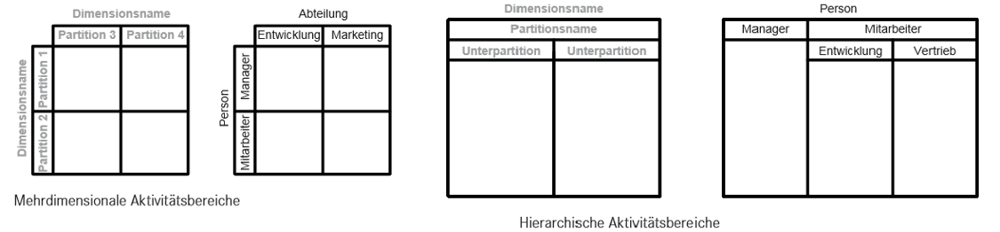

#### Auftragsbearbeitung
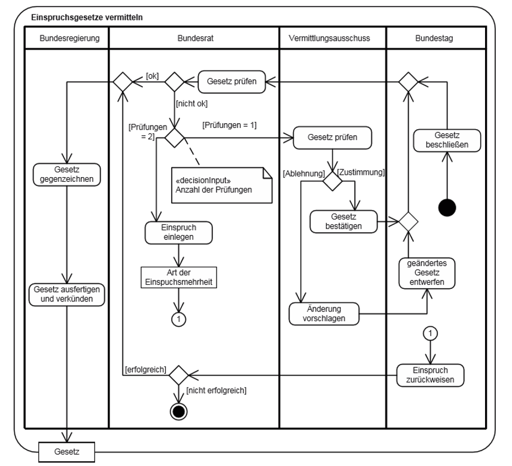

### Signale und Ereignisse (Sonderform einer Aktion)
#### Signal Senden
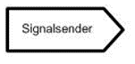

- Beispiel:

- Aktion die unabhängig vom Zeitpunkt des Auftretens ein Signal sendet

#### Signal empfangen
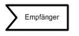

- Beispiel:

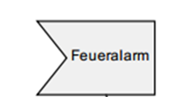

- Aktion die unabhängig vom Zeitpunkt des Auftretens auf ein Signal wartet
- Bei nicht existierendem einlaufendem Fluss können beliebig oft Signale empfangen werden

#### Zeitereignis empfangen
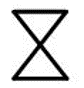

- Aktion die unabhängig vom Zeitpunkt des Auftretens ein Signal sendet

#### Beispiele
##### Geldausgabe/Deckung bestätigen
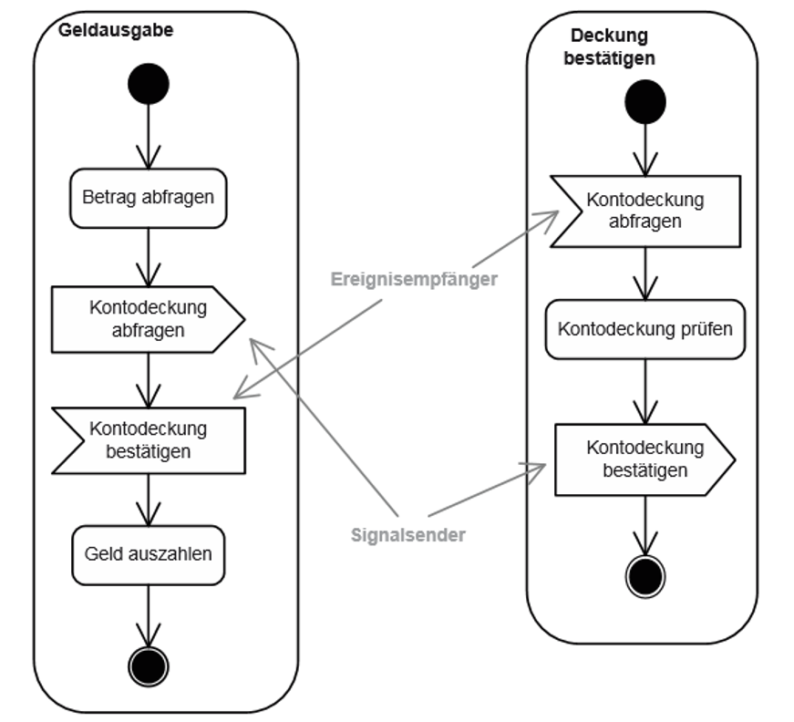

##### Asynchrones Ereignis/Asynchrones Zeitereignis
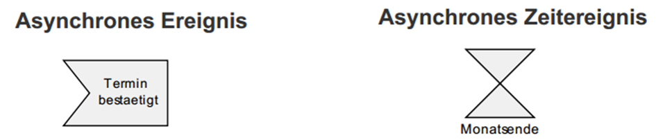

##### Ereignisse
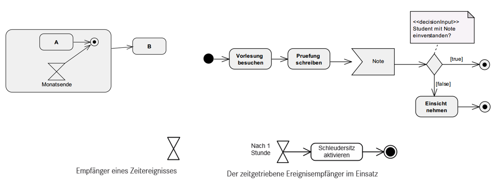
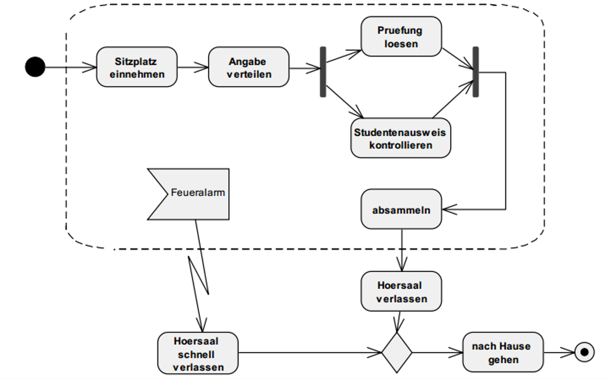
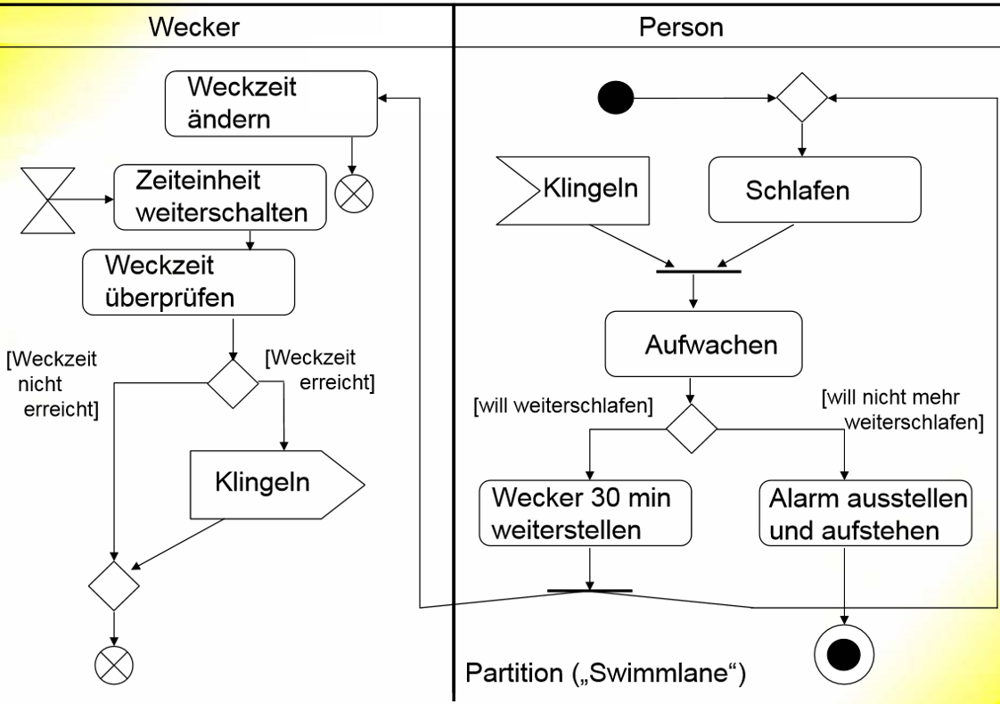

#### Exception Handler/Unterbrechungsbereich

### Unterbrechungsbereich
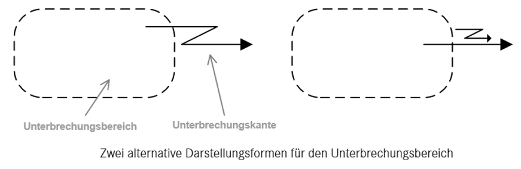

- Motivation
	- Man möchte Unterbrechungen modellieren (z.B. Exceptions)
	- Und das Verhalten in einem Fehlerzustand beschreiben
- Ein Unterbrechungsbereich umschließt eine oder mehrere Aktionen
- Beim verlassen eines Bereiches über eine Unterbrechungskante...
	- werden sämtliche Aktionen in dem Bereich unterbrochen
	- werden alle vorhandenen Token verworfen
	- wird der Aktivitätsablauf an dem jeweiligen Zielknoten fortgesetzt

### Exception Handler
- Bearbeitungselement für Ausnahmen, die bei Aktionsausführung auftreten
- Auftreten von Exception: Prüfung ob Exception-Handler vorhanden ist
- Exception-Handler ist dann für die Exception passend, wenn der Datenknoten der jeweiligen Aktion kompatibel zum Typ des Eingabeknotens (des Exception-Handlers) ist
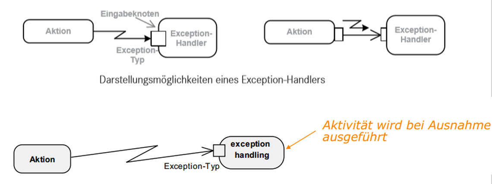

### CentralBuffer und Datastore
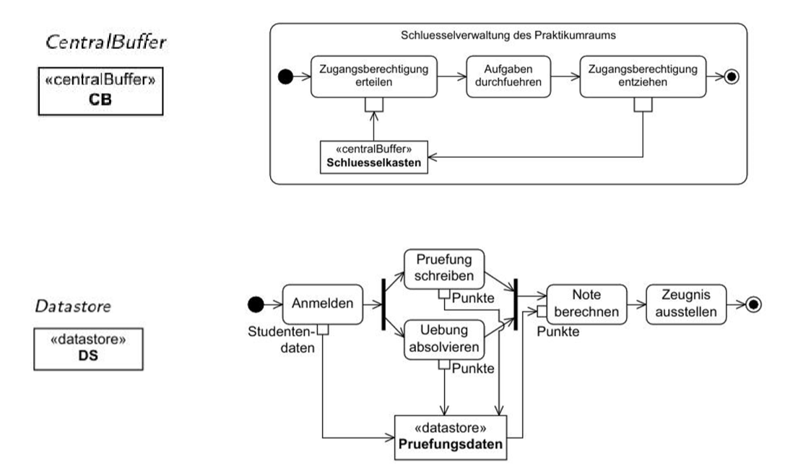

## Aktivitätsdiagramme Beispiele

### Aktivitätsdiagramme mit Objektfluss

## Aktivitätsdiagramme Beispiele
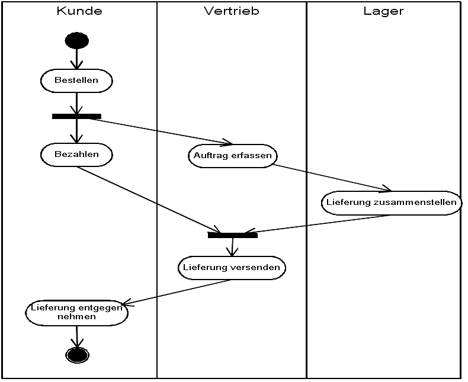
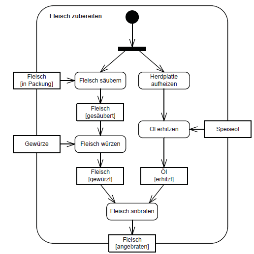
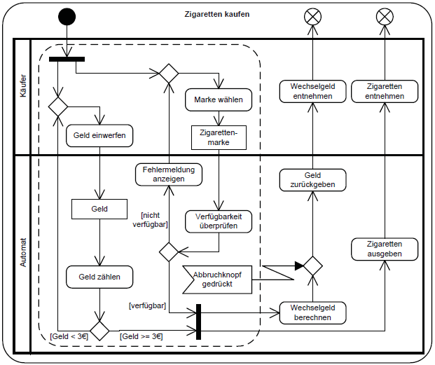
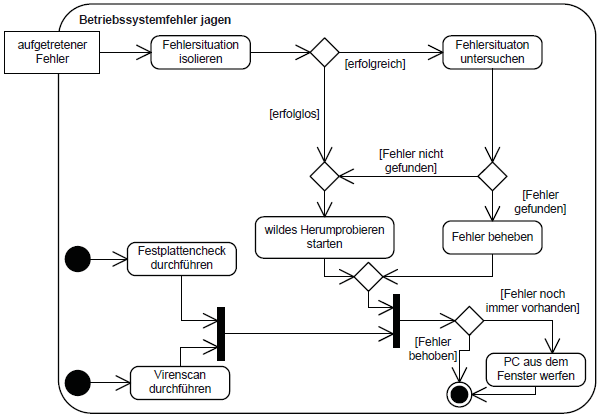


## Best Practices

### UML:
- Startknoten links oben und Endknoten rechts unten
- sinnvoller Aktionsname
    - Aktionsname soll ein Verb enthalten
    - Aktionsnamen sollen (im Kontext der Aktivität) verständlich und eindeutig sein
- keine Aktionen, die keine Ausgabepfeile besitzen (black holes)
- keine Aktionen, die keine Eingabepfeile besitzen (miracles)
- eindeutige Entscheidungen
    - Sind die Bedingungen eindeutig identifiziert?
    - Ist die Menge der Bedingungen vollständig und eindeutig?
	
### UML-Beispiele:


"Parallele Kanten immer wieder "synchronisieren"

Aktivität wird durchgeführt, wenn über einen der eingehenden Kontrollflüsse die kontrolle ankommt (OR)

Token werden, sobald möglich, an den Nachfolgerknoten weitergereicht


## Zusammenfassung

