## Vorlesung 8: Systemanalyse mit Analyseklassendiagrammen

### Lernziele

- Klassendiagramme mit UML modellieren können
- Analyseklassendiagramme aus Anforderungen ableiten können
- Ermitteln von Klassen, Attributen und Beziehungen fürAnalyseklassendiagramme

### Klassendiagramme

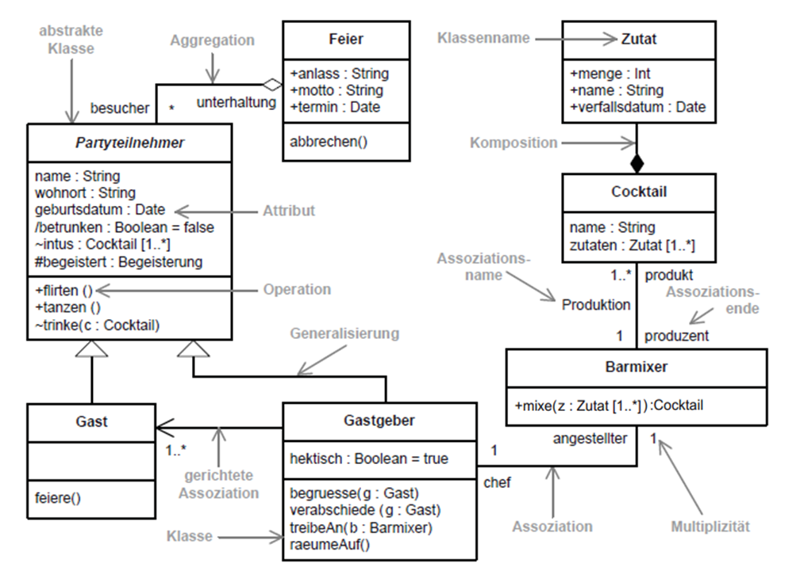

#### Sichtbarkeit
Definiert die Sichtbarkeit des Attributes fürandere Elemente

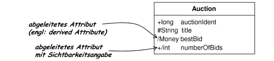

- Beispielfür berechnetes Attribut: Klasse mit Attribut für Preis. Abgeleitetes Attribut: Preis mit Mehrwertsteuer.
- Keine Angabe der Sichtbarkeit = default. Default = package.
- Statische Attribute & Methoden sind unterstrichen
- Abstrakte Methoden und Klassen sind kursiv

#### Generalisierung und Spezialisierung

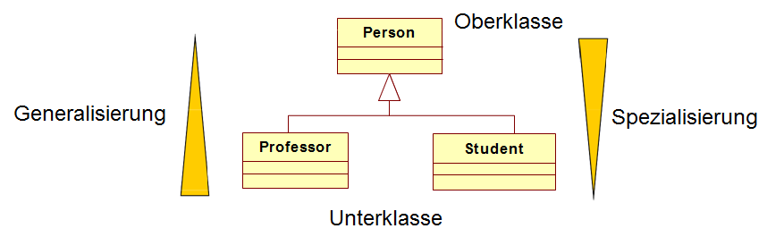

**Hinweis:** Mehrfacherbung ist in UML zulässig

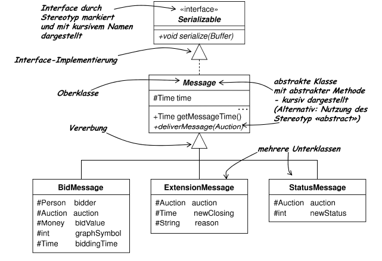

#### Stereotypen
- Ein Stereotypklassifiziert Modellelemente wie Klassen oder Attribute.
- Durch einen Stereotyp wird die Bedeutung des  Modellelements spezialisiert  und kann so beispielsweise bei der Codegenerierung spezifischer behandelt werden.

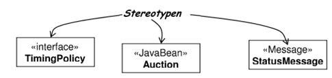

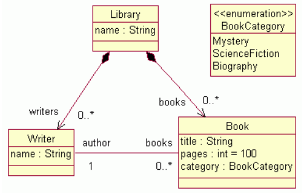

#### Merkmale
- Ein Merkmal wird normalerweise in der Form {name = wert} notiert
- {abstract} = {abstract = true}
- Eigene Merkmale können für Klassen und Attribute definiert werden

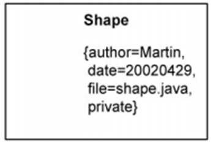

#### Verantwortlichkeiten
- Ein Vertrag oder eine Verpflichtung einer Klasse, einen bestimmten Dienst auszuführen
- Verantwortlichkeiten stehen im Klassendiagramm bei einer Klasse unter den Operationen
- Werden selten verwendet

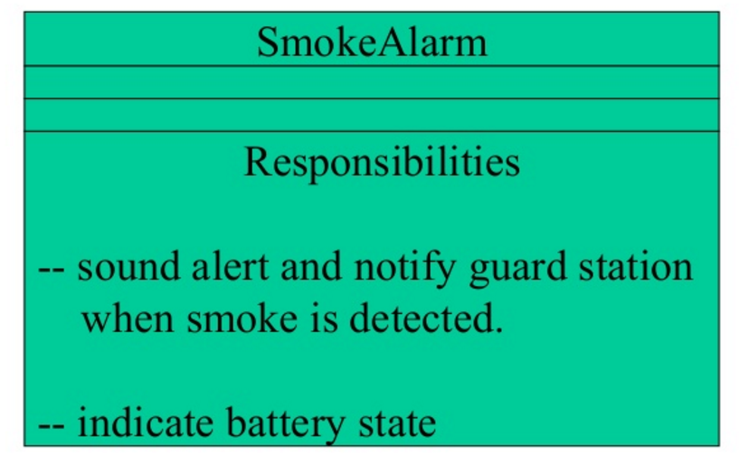

### Assoziationen

#### Arten von Assoziationen

Eine Modellierung der Assoziationen zeigt die Zusammenhänge zwischen Objekten von Klasse. Wichtig dabei ist, dass sich alle Assoziationen 
außer der Vererbung auf Objekte bezieht und nicht auf deren Klassen.

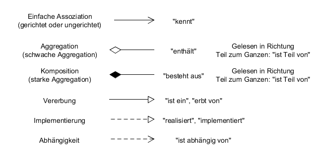

#### Navigierbarkeit

Die Art der Assoziation bestimmt die Richtung, in der die Objekte miteinander interagieren.

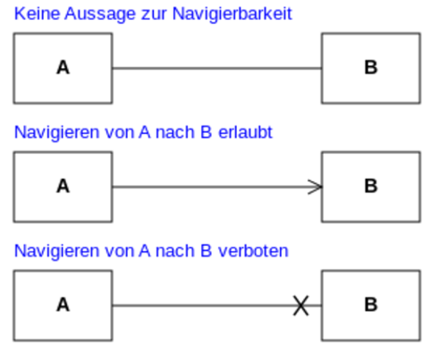

#### Kardinalität (= Multiplizität)

Definiert die Anzahl der Instanzen, die unter diesem Attribut abgelegt werden können.

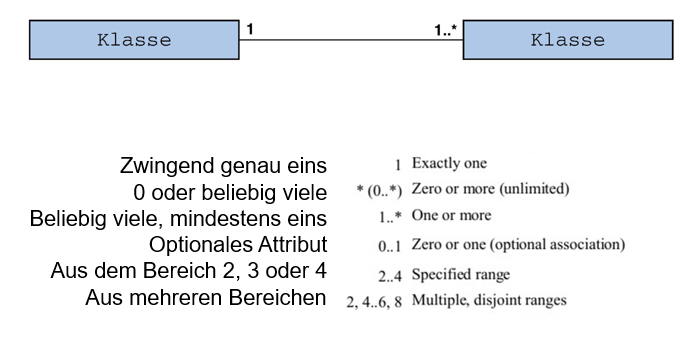

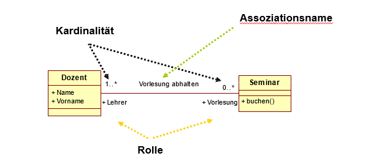

##### Kardinalität
* Anzahl der Objekte in einer Beziehung

##### Assoziationsname
* Optionaler Name der Assoziation

##### Rolle
* Definition der Verwendung einer Klasse
* Beispiel:
    * Ein Dozent ist ein Lehrer und ein Seminar wird als Vorlesung abgehalten
* Kardinalität sagt:
    * Ein Dozent kann 0 oder mehr Seminare als Form einer Vorlesung halten
    * Ein Seminar wird von einem oder mehr Dozenten gehalten werden

#### Rollenname

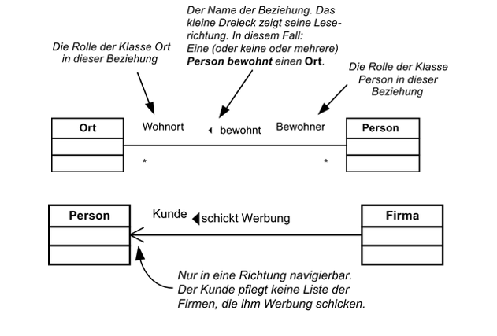

#### Assoziationen mit xor-Einschränkung

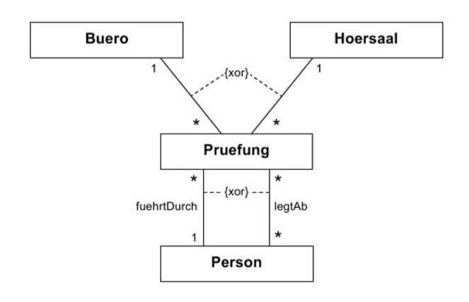

#### Assoziationsklassen

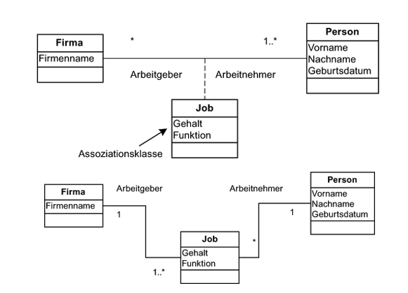

#### Aggregation
* eine Aggregation stellt eine schwache Beziehung zwischen dem "Ganzen" und einem "Teil" dar
* die Navigierbarkeit geht nur in die Richtug "Ganz" -> "Teil"
* keine Einschränkung der Multiplizität
    * Angabe der Multiplizität ist beliebig möglich
    * ein "Teil" kann in mehreren "Ganzen" vorhanden sein
    * bei keiner Angabe der Multiplizität wird sie auf "1" gesetzt

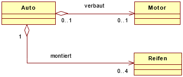

* In dem Beispiel hat ein Auto einen Motor, der Motor kann aber ausgetauscht werden. Das Auto wird als "Ganzes" gesehen, der Motor als "Teil", kann aber ohne das Ganze existieren

#### Komposition
* eine Komposition stellt eine starke Beziehung zwischen einem "Ganzen" und einem "Teil" dar
    * diese Assoziation ist "untrennbar"
* bei der Zerstörung des Ganzen, wird das Teil auch zerstört
    * das Zeil kann ohne dem Ganzen nicht existieren
* die Navigierbarkeit geht nur in die Richtung "Ganz" -> "Teil"
* die Multiplizität ist beschränkt
    * ein Ganzes kann belibig viele Teile haben
    * ein Teil kann zur zu einem Ganzen gehören
    * die Erlaubten Multiplizitäten sind 0, 0..1, 1
    * bei keiner Angabe wird die Multiplizität auf 1 gesetzt

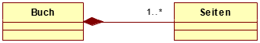
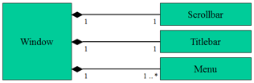

#### Zusammenfassende Tabelle für UML-Klassendiagramme

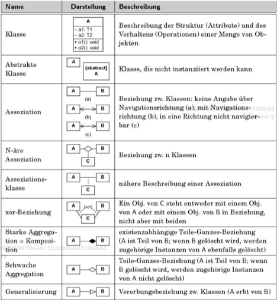

### Logisch-statische Sicht auf ein Softwaresystem mit Analyseklassendiagrammen in der Systemanalyse

#### Einordnung in den Entwicklungsprozess

&nbsp;
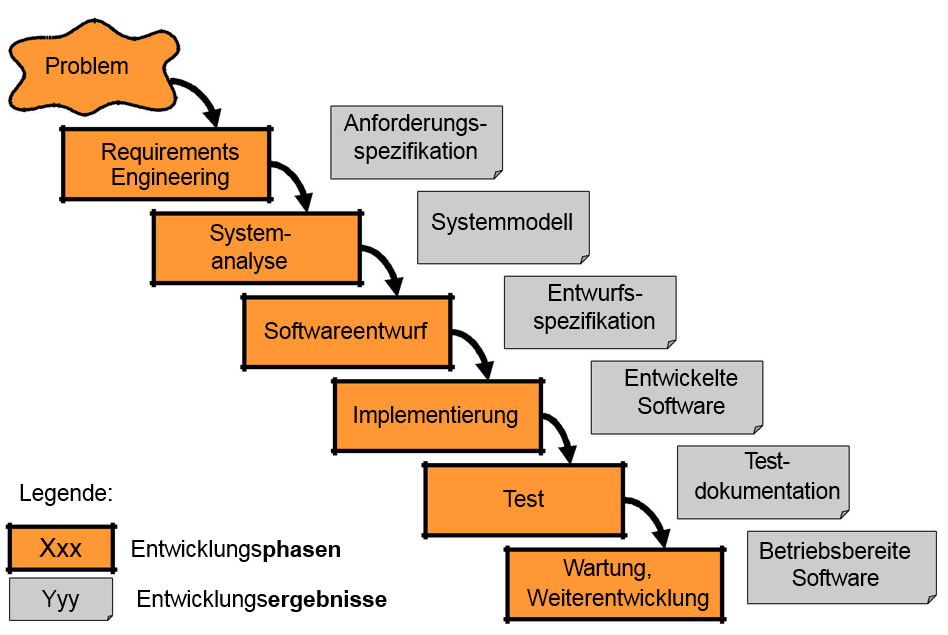

&nbsp;

- Beschreibung der Anwendungsfälle -> Anforderungsanalyse.
- Beschreibung der Akteure -> Anforderungsanalyse.
- Spezifikation der Geschäftsvorfälle mit Text -> Anforderungsanalyse.
- Spezifikation der Abläufe (z.B. Geschäftsvorfälle) mit Aktivitätsdiagrammen -> Letze Vorlesung.
- Ermitteln von Analyseklassendiagramm mit Klassen, Attribute und Beziehungen und Methoden -> Heute.

&nbsp;
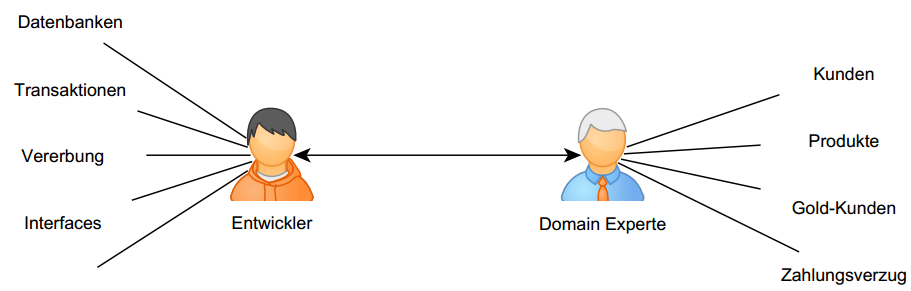

&nbsp;

#### Das Domain Object Model(=Analyseklassendiagramm)

- illustriert wichtige Konzepte der realen Welt und deren Beziehungen der Anwendungsdomäne
- ist ein Modell von realen Konzepten und nicht von Software Komponenten, weil es „Dinge“ aus der realen Welt beschreibt und daher keine Beschreibung eines Software Designs ist
- besteht aus statischen Elementen, in denen manchmal Attribute, aber keine Methoden definiert werden

&nbsp;
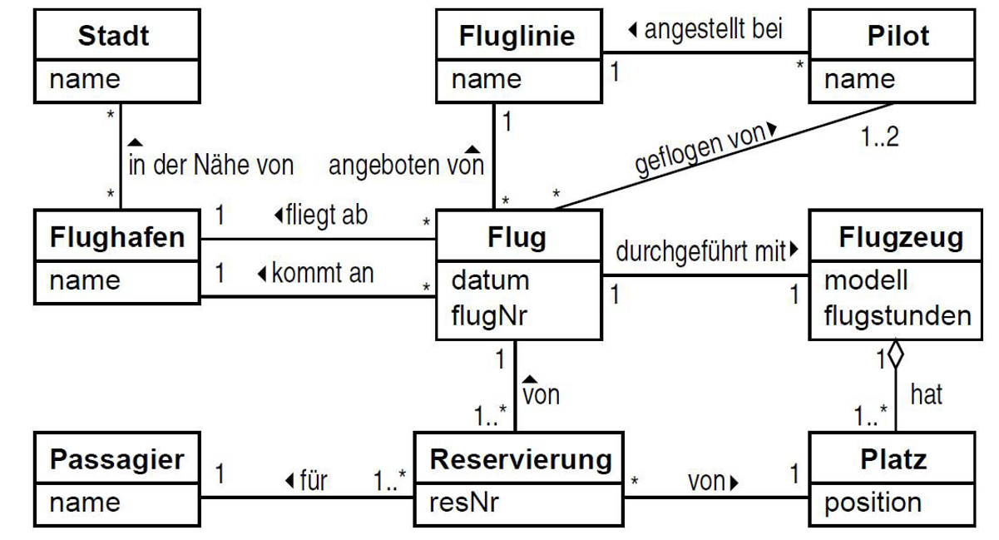

&nbsp;

#### Strategien, um Klassen für Analyseklassendiagramm zu finden:

1. Substantivmethode
2. CRC-Methode (Class, Responsibility, Collaboration)

- In der Vorlesung wird die Substantivmethode betrachtet,
    - Dabei werden die Klassen auch durch Analyse des Glossars gefunden
    - Beispiel für ein Glossar:

**Benutzer**  
&nbsp;&nbsp;&nbsp;&nbsp;&nbsp; Angemeldeter „Kunde“ mit Account  
**Account**  
&nbsp;&nbsp;&nbsp;&nbsp;&nbsp; Bei der Registrierung wird für den „Kunden“ ein „Account“ angelegt, der ihn identifiziert  
**Profil**  
&nbsp;&nbsp;&nbsp;&nbsp;&nbsp; Persönliche Seite, die ein Benutzer für sich anlegen kann/muss.  
**Postfach**  
&nbsp;&nbsp;&nbsp;&nbsp;&nbsp; Jeder Account verfügt über ein Postfach zum Empfangen und Senden von Nachrichten.  
**Präferenzen**  
&nbsp;&nbsp;&nbsp;&nbsp;&nbsp; Eine Liste von Vorlieben, die ein Benutzer für die Suche nach anderen Benutzern anlegt.  
**Präferenzliste**  
&nbsp;&nbsp;&nbsp;&nbsp;&nbsp; Eine vom System bereitgestellte Liste, die auf die Präferenzen des Benutzers zutreffende andere Benutzer anzeigt.  
**Vorschläge**  
&nbsp;&nbsp;&nbsp;&nbsp;&nbsp; Eine vom System bereitgestellte Liste mit möglicherweise für den Benutzer interessanten anderen Benutzern.  
**Freunde**  
&nbsp;&nbsp;&nbsp;&nbsp;&nbsp; Andere Benutzer, die der Benutzer als Freunde deklariert hat.  
**Freundesliste**  
&nbsp;&nbsp;&nbsp;&nbsp;&nbsp; Eine Liste aller „Freunde“ des Benutzers  
**Admin**  
&nbsp;&nbsp;&nbsp;&nbsp;&nbsp; Jemand der administrative Arbeiten am System durchführt.  
**Fakeuser**  
&nbsp;&nbsp;&nbsp;&nbsp;&nbsp; Eine Art Super-Admin, der mehrere Benutzer löschen und beliebig viele Postfächer einsehen kann.  

#### Analyseklassendiagramme - Konstruktion

- Grammatische Analyse anhand von Beschreibungen (Glossar, Use-Cases-Beschreibungen, sonstige Dokumente) des zu erstellenden Systems in natürlicher Sprache

##### Finden von
- Klassen
- Attribute
- Assoziation
- Vererbung
- (Operationen)

#### Klassen

- Text der Anforderungen ist Grundlage zum Finden erster Klassen
- Substantive in Anforderungen und Glossar ansehen
- Substantive können Klassen oder Attribute sein

1. Substantive, die komplexe Dinge mit wichtigen Eigenschaften und Fähigkeiten beschreiben, werden als Klassen abgebildet 
    - Personen, Gegenstände, komplexe Vorgänge (z. B. Bestellung)
2. Substantive, die einfach strukturierte Dinge mit nur einer vorherrschenden Eigenschaft beschreiben, werden als Attribute abgebildet
    - Name einer Person, Farbe eines Gegenstandes, Datum einer Bestellung

#### Instanzvariablen und Methoden

- Adjektive können auf Eigenschaften hindeuten -> Instanzvariablen
- Verben können auf Operationen hinweisen
- Wähle geeignete Datentyp für Instanzvariablen
  - Bei komplexen Instanzvariablen kann man auch Klassen als Typ verwenden

- Fehlerquellen
  - Instanzvariablen beschreibt Implementierungs- und Entwurfsdetails
  - Methoden oder Instanzvariablen enthalten keine Sichtbarkeiten

- Anmerkung: Im zu analysierenden Text können auch Objekte identifiziert werden, die zur Veranschaulichung in einem Objektdiagramm dargestellt werden können.

#### Assoziation

- Welche Kardinalität haben die beteiligten Klassen?
- Welche Rollen spielen die beteiligten Klassen?
- Richtung und Navigierbarkeit beachten
- Assoziationen und Rollen benennen
- Welche Art von Beziehung (Aggregation oder Komposition) liegt vor?
- Kardinalitäten 1..* oder 0..*?

#### Vererbung

- Wenn Objekte verschiedener Klassen große Gemeinsamkeiten haben, kann Vererbung genutzt werden
- Aus gleichartigen Klassen eine neue Oberklasse bilden
- Prüfen auf eine gute Vererbung
  - Wird das Verständnis des Modells verbessert?
  - Liegt eine „is-a“-Beziehung vor?
  - Maximal drei bis fünf Hierarchiestufen
  - Überlegen, ob Komposition oder Vererbung sinnvoll ist

### Best Practices

- Weniger ist mehr: nur das Notwendige. Verständlich für den Auftraggeber
- Gute Analysenklassendiagramme besitzen folgende Merkmale:
  - Klassen repräsentieren die fachlichen Konzepte der Anwendungsdomäne
  - Keine Entwurfs- oder Implementierungsdetails
  - Nicht aus jedem Detail eine Klasse modellieren
- Aussagefähige Klassenname: Substantiv im Singular
- Keine überkreuzenden Assoziationslinien
- Orthogonalität: Nur gerade (horizontal, vertikal) Assoziationslinien
- Oberklassen nach oben
- Fachlich hängt die grafische Benutzeroberfläche (GUI, Graphical User Interface) eng mit dem unterliegendem Geschäftsklassenmodell zusammen
- Möglicher Ansatz: „Mache alle Objekte an der Oberfläche sichtbar, die ein Nutzer ändern oder für dessen Inhalte er sich interessieren kann.“

### Beispiel

#### Vorgaben
* In einer Hochschulverwaltung sind mehrere Personengruppen tätig.
* Die Hochschule hat Angestellte, die Professoren, Labor-Ingenieure, Lehrbeauftragte, Sekretärinnen oder Tutoren sein können. 
* An einer Hochschule studieren Studenten, die auch als Tutoren in einzelnen Lehrveranstaltungen eingesetzt werden können.
* Jede Person hat einen Namen, Geburtsdatum und Geburtsort. 
* Alle Angestellten verfügen über ein Gehaltskonto.
* Dozenten haben einen akademischen Titel und leisten pro Semester eine bestimmte Anzahl Semesterwochenstunden (SWS).
* Jeder Student hat eine identifizierende Matrikelnummer

#### Erste Klassenstruktur

* erstellung einer Liste, mit allen Substantiven der Problembeschreibung zur Identifizierung des Klassenkandidaten
> Hochschulverwaltung, Personengruppen, Hochschule, Angestellte, Professoren, Labor-Ingenieure, Lehrbeauftragte, Sekretärinnen, Tutoren, Studenten, Person, Namen, Geburtsdatum, Geburtsort, Gehaltskonto, Dozenten, Titel, Semester, Anzahl, Semesterwochenstunden, Matrikelnummer.
* Eliminierung aller überflüssigen (redundante oder irrelevante) Begriffe
> Hochschulverwaltung, Personengruppen, Hochschule, Semester, Anzahl
* Eliminierung aller Substantiven, die eine Eigenschaft anderer Substantiven bezeichnen
> Namen, Geburtsdatum, Geburtsort, Gehaltskonto, Titel, Semesterwochenstunden, Matrikelnummer.

| Klasse | Attribute |
|:-------|:----------|
| Person | Name, Geburtsdatum, Geburtsort |
| Student | Matrikelnummer |
| Angestellter | Gehaltskonto |
| Tutor |  |
| Dozent | Titel, Semesterwochenstunden |
| Sekretärin |  |
| Labor-Ingenieur |  |
| Professor |  |
| Lehrbeauftragter |  |
| Studentischer Tutor | &nbsp; |

Alle Klassen haben Attribute, die sind aber von den vorliegenden Anforderungen noch nicht zu entnehmen. Diese werden zunächst offen gelassen und in späteren Projektphasen ergänzt (iterativer Entwicklungsprozess).

#### Klassendiagramm aus den Anforderungen 

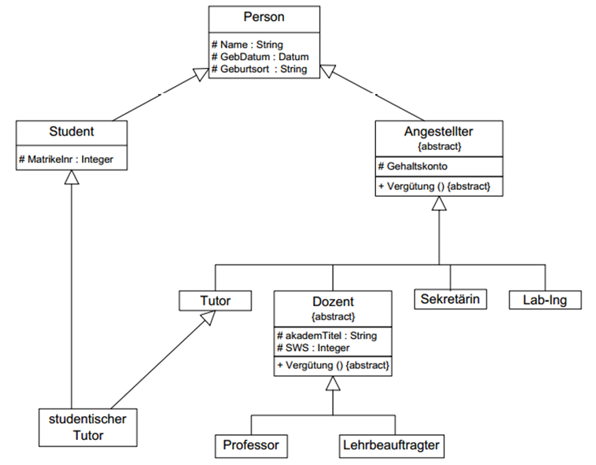

