# Vorlesung 9: Sequenzdiagramme

## Einordnung Sequenzdiagramme

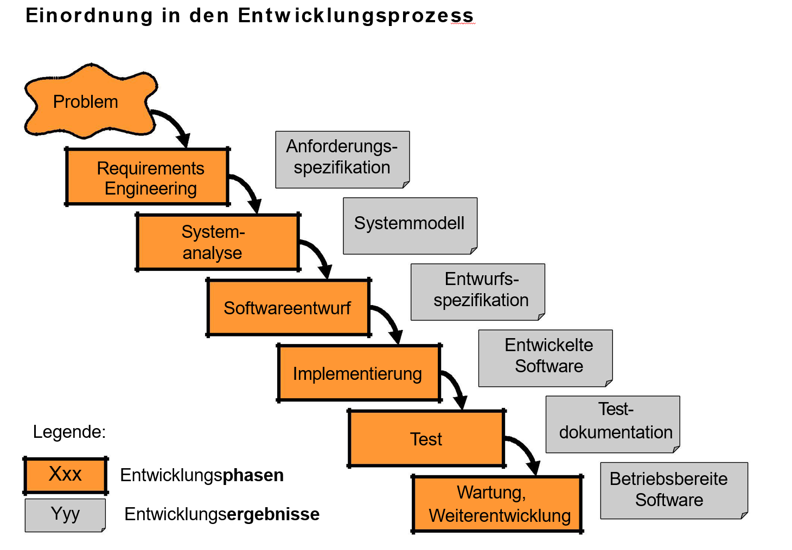

- Klassendiagramme werden auf grammatikalischer Basis analysiert
	- Substantive werden zu Klassen
	- Adjektive werden zu Attributen
	- Verben werden zu Methoden
- Analyseklassendiagramm wird mit Methoden verfeinert
- Mit Sequenzdiagrammen wird überprüft, ob die im Aktivitätsdiagramm beschriebenen Abläufe mit den Methoden der 
Klassen realisierbar sind
- Klassen- und Sequenzdiagramme optimieren sich gegenseitig, während der Entwicklung

### Erstellen eines Sequenzdiagramms für jedes Szenario

- Ein _Szenario_ beschreibt eine beispielhafte Folge von Interaktionen eines Akteurs, um einen Anwendungsfall 
zu erläutern
- Szenarien werden genutzt um Testfälle aufzudecken und passende Tests zu schreiben
- Es wird zwischen Normalfällen und Ausnahmefällen unterschieden
	- Ein Normalfall oder Alternativ-Szenario wird in der Diskussion mit Anwendern genutzt
	- Ein Ausnahmefall Szenario dient zur Erkennung von Fehlerquellen
- Sequenzdiagramme werden aus Szenarien abgeleitet, man kann:
	- Beteiligte Klassen ermitteln
	- Aufgaben in Methoden zerlegen
	- Reihenfolge der Operationen prüfen

### Sequenzdiagramme

- Sequenzdiagramme werden dafür genutzt, um die Kommunikation und Interaktion zwischen Objekten aufzudeuten, 
damit die Erfüllung der Anforderungen geprüft werden kann
- Dokumentieren, welche Methoden für die Kommunikation zwischen ausgewählten Objekten zuständig sind
- Dokumentieren den zeitlichen Ablauf von methodenaufrufen zwischen ausgewählten Objekten
- Dokumentieren, welche Objekte in einer Sequenz neu erstellt und/oder zerstört werden
- Zeigen den Kontrollfluss zwischen Objekten

## Notationselemente für Sequenzdiagramme

- Implizite Zeitachse führt vertikal von oben nach unten
- Horizontal werden die Objekte eingetragen
- Objekt wird dargestellt mittels gestrichelter Linie
	- Objektsymbol ist über der Linie
- Wenn Objekt gelöscht wird, steht am Ende X
- Jede Botschaft wird mit Pfeil dargestellt
- Beschriftung mit Methodennamen
	- bei Bedingung: [condition] operation
	- bei Wiederholung: *operation oder *[condition]operation
- Wird ein Objekt erst zur Laufzeit erzeugt, zeigt die Botschaft direkt auf das Objektsymbol
- Abarbeitung einer Methode wird durch Balken dargestellt, bei einer Botschaft an das gleiche Objekt: 
versetzter Balken

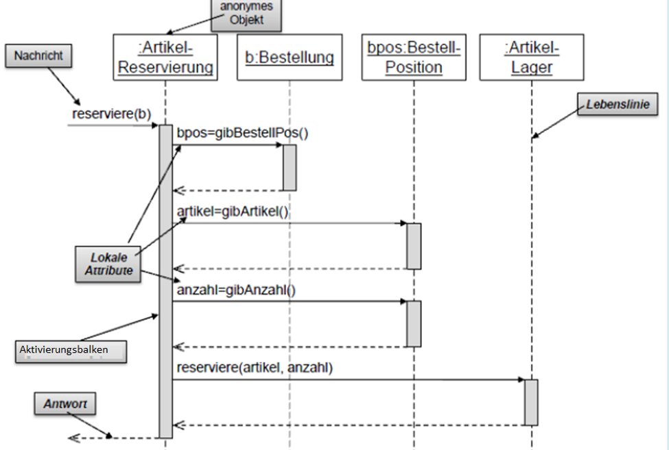
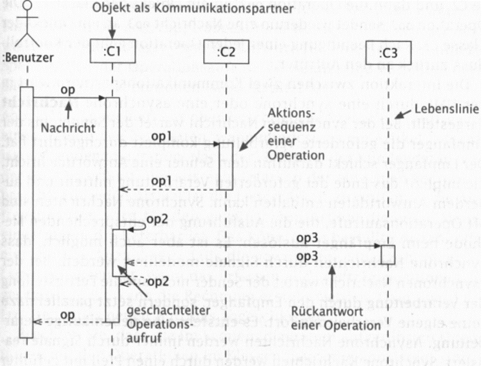

### Objekte

- Objekte werden oben angeordnet
- Die Zeitlinie schreitet für alle Objekte gleich voran
- Wird ein neues Objekt erstellt, wird es an der Erzeugungsstelle angegeben
	- Eine new()-Nachricht zeigt auf das neue Objekt
- Objektlöschung wird durch ein Kreutz am Ende der Zeitlinie angezeigt

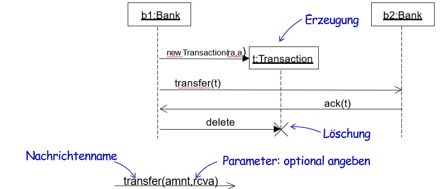

### Aktivierungsbalken

- Zeigt an, wann ein Objekt aktiv ist
- Sind der Kontrollfluss in einem System
- Können verschachtelt werden (zB rekursive Aufrufe)

### Lebenslinien

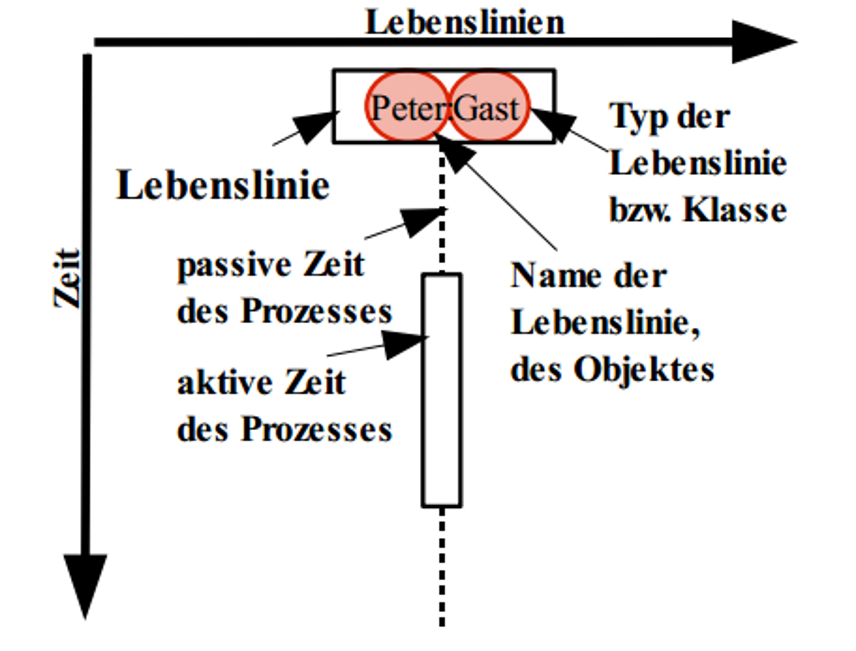

### Nachrichten
  
- **Synchrone Nachricht**
	- Die Interaktion ist ein gemeinsames Ereignis zwischen Sender und Empfänger
	- Keine Verzögerung
- **Asynchrone Nachricht**
	- Eigene Ereignisse für das Senden und Empfangen einer Nachricht
	- Es gibt für gewöhnlich Verzögerungen (zB SMS)
	- Der Empfänger muss die Nachricht nicht sofort empfangen

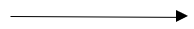
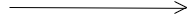
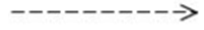

### Methodenaufrufe

- Objekte kommunizieren über Methodenaufrufe, die als gerichtete Pfeile mit geschlossener Spitze und 
Markierung dargestellt werden
	- ['[' Bedingung ']'] [Variable :=] NameBotschaft '('[Argumente]') : Typ
	- Die Bedingung muss erfüllt sein, damit die Nachricht gesendet wird
	- Die Variable nimmt das Ergebnis auf
- Returns stellen die Antwort an den Aufrufer dar und zeigen das Ergebnis, das übertragen wird, an
- Asynchrone Nachrichten erlauben keine Returns

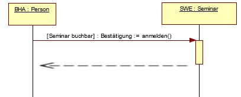  
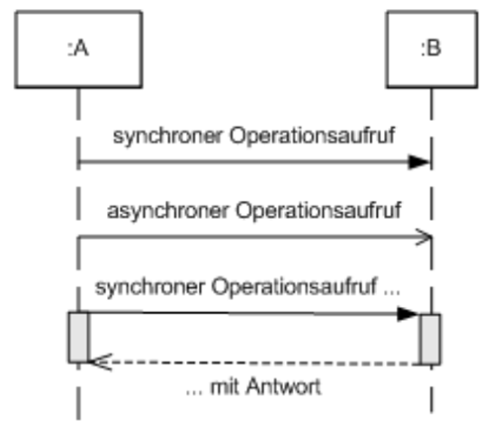
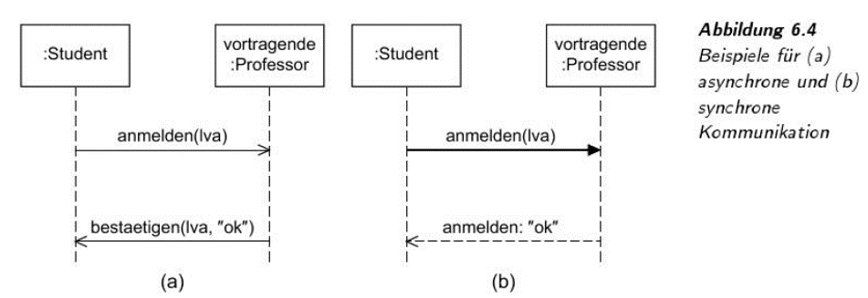

### Übersicht aller Steuerungsoperatoren

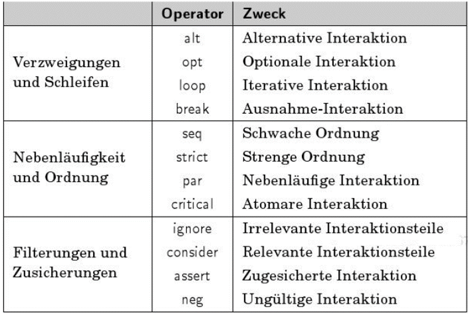

- Mit kombinierten Fragmenten können in Sequenzdiagrammen die Kontrollstrukturen höherer Programmiersprachen ausgedrückt werden. 
- Jedes kombinierte Fragment wird als rechteckiger Block dargestellt. 
- In der linken, oberen Ecke trägt er eine Bezeichnung, die den Typ der Kontrollstruktur angibt.

- **Die wichtigsten kom­binierte Fragmente:**
	- Parallele Ausführung: Nebenläufige Abläufe.
	- Iterative Ausführung: die Operationen werden wiederholt.
	- Bedingte Ausführung: das Rechteck wird durch gestrichelte Linien in eine oder mehrere Bereiche aufgeteilt und enthält eine Bedingung in eckigen Klammern. Wenn mehrere Bedingungen wahr sind, werden alle ausgeführt. Falls alle Bedingungen falsch sind, werden die Ausführungen des Operators übergangen.
	- Optionale Ausführung: eine Vereinfachung der bedingten Ausführung mit nur einem Unterbereich.

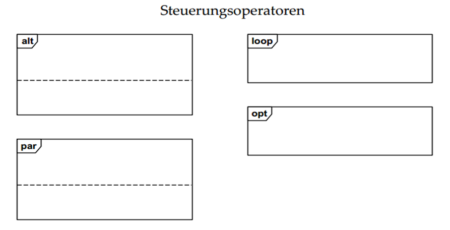

- **Best Practices**
	- In dem Sequenzdiagramm steht die zeitliche Abfolge und die Dynamik im Vordergrund.
	- Objekte mit den Lebenslinien und Nachrichten werden so angeordnet, dass das Diagramm von oben nach unten (wegen der Zeit) und von links nach rechts (wegen der Schachtelung der Aufrufe) gelesen werden kann -> bessere Lesbarkeit
	- Steuerungsoperatoren nur dann verwenden, wenn der Ablauf kompliziert ist und Wiederholungen bzw. optionale oder parallele Ausführungen enthält

### Kommunikationsdiagramme

- als Alternative zum Sequenzdiagramm
- Interaktion zwischen den Objekten der Rollen, die Lebenslinien zugeordnet sind, sowie die Nachrichten, die zwischen Lebenslinien übergeben werden.

**Beispiel: Kommunikationsdiagramm**  

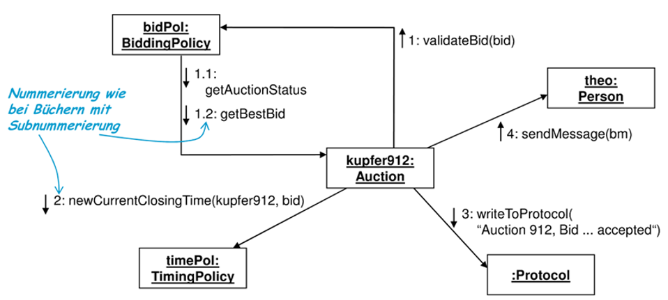

### Zusammenfassung

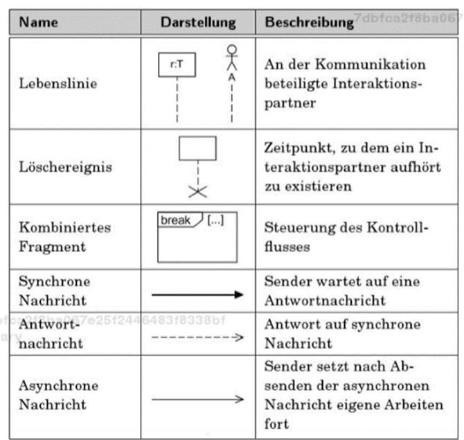
